# Spring AI Alibaba JManus 系统设计文档

## 1. 项目概述

### 1.1 项目简介

Spring AI Alibaba JManus 是一个基于 Java 的多智能体协作系统，专门设计用于处理需要高度确定性的探索性任务。该系统采用 Plan-Act 模式，提供完整的 HTTP 调用接口，适合 Java 开发者进行二次集成。

### 1.2 核心特性

- **🤖 纯Java多智能体协作实现**：完整的多智能体协作系统，提供HTTP调用接口
- **🛠️ Plan-Act模式**：精确控制每个执行细节，提供极高的执行确定性
- **🔗 MCP集成**：原生支持模型上下文协议(MCP)，无缝集成外部服务和工具
- **📜 Web界面配置**：通过直观的Web管理界面轻松配置智能体
- **🌊 无限上下文处理**：支持从海量内容中精确提取目标信息

### 1.3 技术栈

- **后端**: Java 17+, Spring Boot 3.x, Spring AI
- **前端**: Vue 3, TypeScript, Vite
- **数据库**: H2/MySQL/PostgreSQL
- **AI模型**: 阿里云DashScope API（可配置其他AI模型提供商）
- **容器**: Docker支持

## 2. 系统架构

### 2.1 整体架构

```
┌─────────────────────────────────────────────────────────────────┐
│                        Web 前端 (Vue3)                          │
├─────────────────────────────────────────────────────────────────┤
│                        REST API 层                             │
├─────────────────────────────────────────────────────────────────┤
│  规划协调层  │  智能体管理层  │  工具系统层  │  MCP集成层      │
├─────────────────────────────────────────────────────────────────┤
│                        核心业务层                              │
│  Plan-Act执行引擎  │  动态智能体  │  执行记录器  │  状态管理    │
├─────────────────────────────────────────────────────────────────┤
│                        数据访问层                              │
│        JPA/Hibernate        │       数据库 (H2/MySQL/PG)      │
└─────────────────────────────────────────────────────────────────┘
```

#### 2.1.1 系统组件图

```mermaid
graph TB
    subgraph "前端层"
        Vue3[Vue3 前端应用]
        AgentConfig[智能体配置页面]
        McpConfig[MCP配置页面]
        ToolSelection[工具选择组件]
    end
    
    subgraph "API层"
        AgentController[AgentController]
        McpController[McpController]
        PlanController[PlanController]
    end
    
    subgraph "业务逻辑层"
        subgraph "规划协调层"
            PlanningCoordinator[PlanningCoordinator]
            PlanCreator[PlanCreator]
            PlanFinalizer[PlanFinalizer]
        end
        
        subgraph "智能体管理层"
            AgentService[AgentService]
            DynamicAgentLoader[DynamicAgentLoader]
            AgentScanner[DynamicAgentScanner]
        end
        
        subgraph "工具系统层"
            PlanningFactory[PlanningFactory]
            ToolCallbackManager[ToolCallbackManager]
            BuiltinTools[内置工具集]
        end
        
        subgraph "MCP集成层"
            McpService[McpService]
            McpTool[McpTool]
            McpClient[McpAsyncClient]
        end
    end
    
    subgraph "执行引擎层"
        PlanExecutorFactory[PlanExecutorFactory]
        PlanExecutor[PlanExecutor]
        MapReduceExecutor[MapReducePlanExecutor]
        BaseAgent[BaseAgent]
        DynamicAgent[DynamicAgent]
    end
    
    subgraph "数据访问层"
        AgentRepo[DynamicAgentRepository]
        McpRepo[McpConfigRepository]
        RecordRepo[PlanExecutionRepository]
        Database[(数据库)]
    end
    
    Vue3 --> AgentController
    Vue3 --> McpController
    Vue3 --> PlanController
    
    AgentController --> AgentService
    McpController --> McpService
    PlanController --> PlanningCoordinator
    
    PlanningCoordinator --> PlanCreator
    PlanningCoordinator --> PlanExecutorFactory
    PlanningCoordinator --> PlanFinalizer
    
    AgentService --> DynamicAgentLoader
    AgentService --> AgentScanner
    
    PlanExecutorFactory --> PlanExecutor
    PlanExecutorFactory --> MapReduceExecutor
    
    PlanExecutor --> BaseAgent
    PlanExecutor --> DynamicAgent
    
    DynamicAgentLoader --> PlanningFactory
    PlanningFactory --> BuiltinTools
    PlanningFactory --> McpService
    
    McpService --> McpTool
    McpService --> McpClient
    
    AgentService --> AgentRepo
    McpService --> McpRepo
    PlanningCoordinator --> RecordRepo
    
    AgentRepo --> Database
    McpRepo --> Database
    RecordRepo --> Database
```



### 2.2 核心模块

#### 2.2.1 Plan-Act 执行架构

Plan-Act模式是系统的核心执行机制，包含以下组件：

- **PlanType**: 定义计划类型（SIMPLE、MAPREDUCE）
- **PlanCreator**: 基于用户需求和LLM创建执行计划
- **PlanExecutor**: 执行计划的具体实现
- **PlanningCoordinator**: 协调整个计划生命周期

#### 2.2.2 智能体系统

- **BaseAgent**: 智能体抽象基类，定义基本行为
- **DynamicAgent**: 动态可配置的智能体实现
- **AgentService**: 智能体管理服务
- **DynamicAgentLoader**: 智能体加载器

#### 2.2.3 工具系统

- **ToolCallBiFunctionDef**: 工具调用接口定义
- **内置工具**: 浏览器工具、Bash工具、Python执行器、文件操作等
- **MCP工具**: 通过MCP协议集成的外部工具
- **工具回调管理**: 统一的工具调用和状态管理

## 3. 核心组件详细设计

### 3.1 Plan-Act 执行引擎

#### 3.1.1 计划类型 (PlanType)

```java
public enum PlanType {
    SIMPLE("简单计划", "适用于基本的任务执行，步骤按顺序进行"),
    MAPREDUCE("MapReduce计划", "适用于复杂的分布式任务，支持并行处理和结果聚合");
}
```

**设计说明**:
- SIMPLE模式：顺序执行，适用于线性任务流程
- MAPREDUCE模式：支持并行处理和结果聚合，适用于大数据处理场景

#### 3.1.2 计划执行器 (PlanExecutor)

**接口定义**:
```java
public interface PlanExecutorInterface {
    void executeAllSteps(ExecutionContext context);
}
```

**实现类**:
- `PlanExecutor`: 简单计划执行器
- `MapReducePlanExecutor`: MapReduce计划执行器

**核心功能**:
- 执行上下文管理
- 步骤状态跟踪
- 错误处理和恢复
- 执行记录和日志

#### 3.1.3 规划协调器 (PlanningCoordinator)

**职责**:
- 协调计划创建、执行、最终化的完整生命周期
- 管理执行上下文和状态
- 处理异常和错误恢复

#### 3.1.4 Plan-Act执行时序图

```mermaid
sequenceDiagram
    participant User as 用户
    participant PC as PlanningCoordinator
    participant PCreator as PlanCreator
    participant PFactory as PlanExecutorFactory
    participant PE as PlanExecutor
    participant Agent as DynamicAgent
    participant Tool as 工具
    participant PFinalizer as PlanFinalizer
    
    User->>PC: 提交执行请求
    PC->>PCreator: 创建执行计划
    PCreator->>PCreator: 调用LLM生成计划
    PCreator-->>PC: 返回ExecutionPlan
    
    PC->>PFactory: 创建执行器
    PFactory-->>PC: 返回PlanExecutor
    
    PC->>PE: 开始执行计划
    
    loop 执行所有步骤
        PE->>Agent: 执行步骤
        Agent->>Agent: Think (思考)
        Agent->>Tool: Act (调用工具)
        Tool-->>Agent: 返回执行结果
        Agent-->>PE: 返回步骤结果
        PE->>PE: 记录执行状态
    end
    
    PE-->>PC: 执行完成
    PC->>PFinalizer: 最终化处理
    PFinalizer->>PFinalizer: 生成最终结果
    PFinalizer-->>PC: 返回最终结果
    PC-->>User: 返回执行结果
```



### 3.2 智能体系统

#### 3.2.1 智能体基类 (BaseAgent)

**核心属性**:
```java
public abstract class BaseAgent {
    private String currentPlanId;
    private String rootPlanId;
    private AgentState state;
    protected ILlmService llmService;
    protected PlanExecutionRecorder planExecutionRecorder;
    private Map<String, Object> envData;
}
```

**关键方法**:
- `getName()`: 获取智能体名称
- `clearUp(String planId)`: 清理资源

#### 3.2.2 动态智能体 (DynamicAgent)

**特性**:
- 继承自ReActAgent，支持思考-行动循环
- 动态配置名称、描述、提示词
- 可配置的工具集合
- 支持用户输入交互

**数据库实体 (DynamicAgentEntity)**:
```java
@Entity
@Table(name = "dynamic_agent")
public class DynamicAgentEntity {
    private String agentName;
    private String agentDescription;
    private String nextStepPrompt;
    private List<String> availableToolKeys;
    private DynamicModelEntity model;
    private String namespace;
}
```

#### 3.2.3 智能体服务 (AgentService)

**API接口**:
- `getAllAgents()`: 获取所有智能体
- `createAgent(AgentConfig)`: 创建智能体
- `updateAgent(AgentConfig)`: 更新智能体
- `deleteAgent(String id)`: 删除智能体
- `getAvailableTools()`: 获取可用工具列表

#### 3.2.4 智能体类图


#### 3.2.5 智能体状态机图

```mermaid
stateDiagram-v2
    [*] --> NOT_STARTED
    NOT_STARTED --> RUNNING : execute()
    RUNNING --> RUNNING : think() & act()
    RUNNING --> FINISHED : 完成所有步骤
    RUNNING --> ERROR : 执行异常
    ERROR --> RUNNING : 重试成功
    ERROR --> FINISHED : 达到最大重试次数
    FINISHED --> [*]
    ERROR --> [*]
```



### 3.3 工具系统

#### 3.3.1 工具接口定义

```java
public interface ToolCallBiFunctionDef<T> {
    String getName();
    String getDescription();
    String getParameters();
    Class<T> getInputType();
    ToolExecuteResult run(T input);
    String getCurrentToolStateString();
    void cleanup(String planId);
}
```

#### 3.3.2 内置工具

| 工具名称 | 功能描述 | 实现类 |
|---------|---------|--------|
| BrowserUseTool | 浏览器自动化工具 | `BrowserUseTool` |
| Bash | 命令行执行工具 | `Bash` |
| PythonExecute | Python代码执行 | `PythonExecute` |
| TextFileOperator | 文件操作工具 | `TextFileOperator` |
| GoogleSearch | 网络搜索工具 | `GoogleSearch` |
| MapReduceTool | MapReduce处理工具 | `MapReduceTool` |
| TerminateTool | 任务终止工具 | `TerminateTool` |

#### 3.3.3 工具回调管理

**PlanningFactory**负责创建和管理工具回调映射：
```java
public Map<String, ToolCallBackContext> toolCallbackMap(String planId, String rootPlanId, List<String> terminateColumns)
```

**工具注册流程**:
1. 创建工具定义列表
2. 为每个工具创建FunctionToolCallback
3. 设置工具元数据和参数
4. 建立工具名称到回调的映射关系

#### 3.3.4 工具系统类图


### 3.4 MCP集成系统

#### 3.4.1 MCP服务接口

```java
public interface IMcpService {
    void addMcpServer(McpConfigRequestVO mcpConfig);
    void removeMcpServer(long id);
    List<McpConfigEntity> getMcpServers();
    List<McpServiceEntity> getFunctionCallbacks(String planId);
    void close(String planId);
}
```

#### 3.4.2 MCP工具封装

**McpTool实现**:
- 封装MCP协议的工具调用
- JSON参数序列化和反序列化
- 状态管理和清理
- 错误处理和重试机制

#### 3.4.3 连接类型支持

- **SSE**: Server-Sent Events连接
- **STUDIO**: 本地STDIO连接
- **STREAMING**: 流式连接

#### 3.4.4 重试机制

- 最大3次重试
- 递增等待时间（1s, 2s, 3s）
- 超时配置（60秒）
- 连接状态监控

#### 3.4.5 MCP集成时序图

```mermaid
sequenceDiagram
    participant User as 用户
    participant McpController as McpController
    participant McpService as McpService
    participant McpClient as McpAsyncClient
    participant McpServer as MCP服务器
    participant Agent as DynamicAgent
    participant McpTool as McpTool
    
    User->>McpController: 添加MCP服务器配置
    McpController->>McpService: addMcpServer(config)
    
    McpService->>McpService: 验证配置格式
    McpService->>McpClient: 创建客户端连接
    
    loop 重试机制 (最多3次)
        McpClient->>McpServer: 初始化连接
        alt 连接成功
            McpServer-->>McpClient: 连接确认
            McpClient-->>McpService: 初始化完成
        else 连接失败
            McpServer-->>McpClient: 连接错误
            McpClient->>McpClient: 等待重试 (1s,2s,3s)
        end
    end
    
    McpService->>McpService: 缓存工具回调
    McpService-->>McpController: 配置完成
    McpController-->>User: 返回结果
    
    Note over McpService: 执行阶段
    Agent->>McpService: 获取工具回调
    McpService-->>Agent: 返回McpTool列表
    
    Agent->>McpTool: 调用工具
    McpTool->>McpTool: 序列化参数为JSON
    McpTool->>McpClient: 发送工具调用请求
    McpClient->>McpServer: 执行工具
    McpServer-->>McpClient: 返回执行结果
    McpClient-->>McpTool: 返回结果
    McpTool->>McpTool: 更新工具状态
    McpTool-->>Agent: 返回ToolExecuteResult
```



## 4. 数据模型设计

### 4.1 智能体相关

#### 4.1.1 DynamicAgentEntity
```sql
CREATE TABLE dynamic_agent (
    id BIGINT PRIMARY KEY AUTO_INCREMENT,
    agent_name VARCHAR(255) NOT NULL UNIQUE,
    agent_description VARCHAR(1000) NOT NULL,
    system_prompt TEXT,  -- 已废弃
    next_step_prompt TEXT NOT NULL,
    class_name VARCHAR(255) NOT NULL,
    model_id BIGINT,
    namespace VARCHAR(255)
);

CREATE TABLE dynamic_agent_tools (
    agent_id BIGINT,
    tool_key VARCHAR(255),
    FOREIGN KEY (agent_id) REFERENCES dynamic_agent(id)
);
```

### 4.2 MCP配置相关

#### 4.2.1 McpConfigEntity
```sql
CREATE TABLE mcp_config (
    id BIGINT PRIMARY KEY AUTO_INCREMENT,
    mcp_server_name VARCHAR(255) NOT NULL,
    connection_type ENUM('SSE', 'STUDIO', 'STREAMING'),
    config_json TEXT NOT NULL,
    created_at TIMESTAMP DEFAULT CURRENT_TIMESTAMP
);
```

### 4.3 执行记录相关

#### 4.3.1 PlanExecutionRecord
```sql
CREATE TABLE plan_execution_record (
    id BIGINT PRIMARY KEY AUTO_INCREMENT,
    plan_id VARCHAR(255) NOT NULL,
    conversation_id VARCHAR(255),
    user_request TEXT,
    status VARCHAR(50),
    start_time TIMESTAMP,
    end_time TIMESTAMP,
    result TEXT,
    error_message TEXT
);
```

### 4.4 数据库ER图


## 5. API设计

### 5.1 智能体管理API

#### 5.1.1 获取所有智能体
```http
GET /api/agents
Response: List<AgentConfig>
```

#### 5.1.2 创建智能体
```http
POST /api/agents
Body: AgentConfig
Response: AgentConfig
```

#### 5.1.3 更新智能体
```http
PUT /api/agents/{id}
Body: AgentConfig
Response: AgentConfig
```

#### 5.1.4 删除智能体
```http
DELETE /api/agents/{id}
Response: 204 No Content
```

#### 5.1.5 获取可用工具
```http
GET /api/agents/tools
Response: List<Tool>
```

### 5.2 MCP管理API

#### 5.2.1 添加MCP服务器
```http
POST /api/mcp/servers
Body: McpConfigRequestVO
Response: McpConfigResponseVO
```

#### 5.2.2 删除MCP服务器
```http
DELETE /api/mcp/servers/{id}
Response: 204 No Content
```

#### 5.2.3 获取MCP服务器列表
```http
GET /api/mcp/servers
Response: List<McpConfigEntity>
```

### 5.3 计划执行API

#### 5.3.1 执行计划
```http
POST /api/plans/execute
Body: ExecutionRequest
Response: ExecutionResult
```

#### 5.3.2 查询执行状态
```http
GET /api/plans/{planId}/status
Response: ExecutionStatus
```

## 6. 前端设计

### 6.1 技术栈

- **Vue 3**: 响应式框架
- **TypeScript**: 类型安全
- **Vite**: 构建工具
- **Element Plus**: UI组件库

### 6.2 主要页面

#### 6.2.1 智能体配置页面 (agentConfig.vue)

**功能特性**:
- 智能体列表展示
- 创建/编辑智能体
- 工具分配管理
- 模型配置

**组件结构**:
```
AgentConfig
├── AgentList (智能体列表)
├── AgentDetail (智能体详情)
├── ToolSelectionModal (工具选择弹窗)
└── ModelConfig (模型配置)
```

#### 6.2.2 MCP配置页面 (mcpConfig.vue)

**功能特性**:
- MCP服务器管理
- 连接类型配置
- JSON配置编辑
- 连接状态监控

#### 6.2.3 工具选择组件 (tool-selection-modal)

**功能特性**:
- 按服务组分类显示工具
- 搜索和过滤功能
- 批量选择和取消
- 工具状态管理

### 6.3 状态管理

**智能体状态**:
```typescript
interface AgentState {
  agents: Agent[]
  currentAgent: Agent | null
  availableTools: Tool[]
  loading: boolean
}
```

**MCP状态**:
```typescript
interface McpState {
  servers: McpServer[]
  connectionStates: Map<string, ConnectionState>
  loading: boolean
}
```

### 6.4 前端架构图

```mermaid
graph TB
    subgraph "Vue3 前端应用"
        subgraph "路由层"
            Router[Vue Router]
        end
        
        subgraph "页面组件"
            AgentConfigPage[智能体配置页面]
            McpConfigPage[MCP配置页面]
            PlanExecutionPage[计划执行页面]
        end
        
        subgraph "公共组件"
            ToolSelectionModal[工具选择弹窗]
            Modal[通用弹窗组件]
            LoadingComponent[加载组件]
        end
        
        subgraph "状态管理"
            AgentStore[智能体状态]
            McpStore[MCP状态]
            ToolStore[工具状态]
        end
        
        subgraph "API服务层"
            AgentApiService[智能体API服务]
            McpApiService[MCP API服务]
            PlanApiService[计划API服务]
        end
        
        subgraph "工具库"
            ElementPlus[Element Plus UI]
            Iconify[Iconify 图标]
            TypeScript[TypeScript 类型定义]
        end
    end
    
    Router --> AgentConfigPage
    Router --> McpConfigPage
    Router --> PlanExecutionPage
    
    AgentConfigPage --> ToolSelectionModal
    AgentConfigPage --> Modal
    McpConfigPage --> Modal
    
    AgentConfigPage --> AgentStore
    McpConfigPage --> McpStore
    ToolSelectionModal --> ToolStore
    
    AgentStore --> AgentApiService
    McpStore --> McpApiService
    PlanExecutionPage --> PlanApiService
    
    AgentConfigPage --> ElementPlus
    McpConfigPage --> ElementPlus
    ToolSelectionModal --> Iconify
```



## 7. 部署和配置

### 7.1 环境要求

- Java 17+
- Node.js 16+
- 数据库：H2/MySQL 8.0+/PostgreSQL 12+

### 7.2 配置文件

#### 7.2.1 应用配置 (application.yml)
```yaml
spring:
  profiles:
    active: h2  # h2/mysql/postgres
  
  ai:
    dashscope:
      api-key: ${DASHSCOPE_API_KEY}
      chat:
        model: qwen-max

  datasource:
    url: jdbc:h2:file:./h2-data/jmanus
    username: sa
    password:

  jpa:
    hibernate:
      ddl-auto: update
    show-sql: false

server:
  port: 18080

manus:
  max-steps: 10
  enable-browser: true
  chrome-driver-path: /usr/bin/chromedriver

namespace:
  value: default
```

#### 7.2.2 数据库配置

**MySQL配置 (application-mysql.yml)**:
```yaml
spring:
  datasource:
    url: jdbc:mysql://localhost:3306/jmanus
    username: root
    password: password
  jpa:
    database-platform: org.hibernate.dialect.MySQLDialect
```

**PostgreSQL配置 (application-postgres.yml)**:
```yaml
spring:
  datasource:
    url: jdbc:postgresql://localhost:5432/jmanus
    username: postgres
    password: password
  jpa:
    database-platform: org.hibernate.dialect.PostgreSQLDialect
```

### 7.3 Docker部署

#### 7.3.1 Dockerfile
```dockerfile
FROM openjdk:17-jdk-slim

WORKDIR /app
COPY target/jmanus.jar app.jar

EXPOSE 18080

ENV DASHSCOPE_API_KEY=""
ENV SPRING_PROFILES_ACTIVE=h2

CMD ["java", "-jar", "app.jar"]
```

#### 7.3.2 docker-compose.yml
```yaml
version: '3.8'
services:
  jmanus:
    build: .
    ports:
      - "18080:18080"
    environment:
      - DASHSCOPE_API_KEY=${DASHSCOPE_API_KEY}
      - SPRING_PROFILES_ACTIVE=mysql
    depends_on:
      - mysql
  
  mysql:
    image: mysql:8.0
    environment:
      MYSQL_ROOT_PASSWORD: password
      MYSQL_DATABASE: jmanus
    ports:
      - "3306:3306"
```

### 7.4 部署流程图

```mermaid
flowchart TD
    Start([开始部署]) --> CheckEnv{检查环境要求}
    CheckEnv -->|Java 17+| CheckNode{检查Node.js}
    CheckNode -->|Node.js 16+| CheckDB{选择数据库}
    
    CheckDB -->|H2| H2Config[配置H2数据库]
    CheckDB -->|MySQL| MySQLConfig[配置MySQL数据库]
    CheckDB -->|PostgreSQL| PGConfig[配置PostgreSQL数据库]
    
    H2Config --> BuildBackend[构建后端应用]
    MySQLConfig --> BuildBackend
    PGConfig --> BuildBackend
    
    BuildBackend --> BuildFrontend[构建前端应用]
    BuildFrontend --> ConfigAPI[配置API密钥]
    ConfigAPI --> StartApp[启动应用]
    StartApp --> HealthCheck{健康检查}
    
    HealthCheck -->|成功| Complete([部署完成])
    HealthCheck -->|失败| Debug[调试问题]
    Debug --> StartApp
    
    CheckEnv -->|环境不满足| InstallEnv[安装环境]
    CheckNode -->|版本不符| InstallEnv
    InstallEnv --> CheckEnv
```



## 8. 扩展和定制

### 8.1 自定义智能体

#### 8.1.1 继承BaseAgent
```java
@Component
public class CustomAgent extends BaseAgent {
    @Override
    public String getName() {
        return "CustomAgent";
    }
    
    @Override
    public void clearUp(String planId) {
        // 清理逻辑
    }
}
```

#### 8.1.2 注册智能体
```java
@DynamicAgentDefinition(
    name = "CustomAgent",
    description = "自定义智能体",
    availableTools = {"tool1", "tool2"}
)
public class CustomAgentConfig {
    // 配置逻辑
}
```

### 8.2 自定义工具

#### 8.2.1 实现工具接口
```java
public class CustomTool implements ToolCallBiFunctionDef<CustomInput> {
    @Override
    public String getName() {
        return "custom-tool";
    }
    
    @Override
    public ToolExecuteResult run(CustomInput input) {
        // 工具执行逻辑
        return new ToolExecuteResult("result");
    }
    
    // 其他必需方法...
}
```

#### 8.2.2 注册工具
在PlanningFactory中添加工具注册：
```java
toolDefinitions.add(new CustomTool());
```

### 8.3 MCP集成

#### 8.3.1 配置MCP服务器

**本地MCP服务器 (STUDIO模式)**:
```json
{
  "command": "node",
  "args": ["/path/to/mcp-server.js"],
  "env": {
    "API_KEY": "your-api-key"
  }
}
```

**远程MCP服务器 (SSE/STREAMING模式)**:
```json
{
  "url": "https://mcp.example.com/api/v1",
  "headers": {
    "Authorization": "Bearer token"
  }
}
```

### 8.4 扩展架构图

```mermaid
graph LR
    subgraph "扩展点"
        CustomAgent[自定义智能体]
        CustomTool[自定义工具]
        McpIntegration[MCP集成]
        CustomPrompt[自定义提示词]
    end
    
    subgraph "核心系统"
        BaseAgent[BaseAgent基类]
        ToolInterface[工具接口]
        McpService[MCP服务]
        PromptService[提示词服务]
    end
    
    CustomAgent -.继承.-> BaseAgent
    CustomTool -.实现.-> ToolInterface
    McpIntegration -.集成.-> McpService
    CustomPrompt -.扩展.-> PromptService
```



## 9. 监控和日志

### 9.1 执行记录

系统自动记录所有执行过程：
- 计划创建和执行状态
- 智能体思考和行动记录
- 工具调用和结果
- 错误和异常信息

### 9.2 日志配置 (logback-spring.xml)

```xml
<configuration>
    <appender name="STDOUT" class="ch.qos.logback.core.ConsoleAppender">
        <encoder>
            <pattern>%d{HH:mm:ss.SSS} [%thread] %-5level %logger{36} - %msg%n</pattern>
        </encoder>
    </appender>
    
    <appender name="FILE" class="ch.qos.logback.core.rolling.RollingFileAppender">
        <file>logs/jmanus.log</file>
        <rollingPolicy class="ch.qos.logback.core.rolling.TimeBasedRollingPolicy">
            <fileNamePattern>logs/jmanus.%d{yyyy-MM-dd}.log</fileNamePattern>
            <maxHistory>30</maxHistory>
        </rollingPolicy>
        <encoder>
            <pattern>%d{yyyy-MM-dd HH:mm:ss.SSS} [%thread] %-5level %logger{36} - %msg%n</pattern>
        </encoder>
    </appender>
    
    <logger name="com.alibaba.cloud.ai.example.manus" level="INFO"/>
    
    <root level="INFO">
        <appender-ref ref="STDOUT"/>
        <appender-ref ref="FILE"/>
    </root>
</configuration>
```

### 9.3 监控指标

#### 9.3.1 关键监控指标
- 计划执行成功率
- 智能体响应时间
- 工具调用频次
- MCP连接状态
- 内存和CPU使用率

#### 9.3.2 监控仪表板

```mermaid
graph TB
    subgraph "监控指标"
        ExecutionMetrics[执行指标]
        PerformanceMetrics[性能指标]
        ErrorMetrics[错误指标]
        ResourceMetrics[资源指标]
    end
    
    subgraph "数据收集"
        LogCollector[日志收集器]
        MetricsCollector[指标收集器]
        TraceCollector[追踪收集器]
    end
    
    subgraph "存储和分析"
        LogStorage[日志存储]
        MetricsDB[指标数据库]
        AnalyticsEngine[分析引擎]
    end
    
    subgraph "可视化"
        Dashboard[监控仪表板]
        AlertSystem[告警系统]
        ReportGenerator[报告生成器]
    end
    
    ExecutionMetrics --> MetricsCollector
    PerformanceMetrics --> MetricsCollector
    ErrorMetrics --> LogCollector
    ResourceMetrics --> MetricsCollector
    
    LogCollector --> LogStorage
    MetricsCollector --> MetricsDB
    TraceCollector --> AnalyticsEngine
    
    LogStorage --> Dashboard
    MetricsDB --> Dashboard
    AnalyticsEngine --> AlertSystem
    Dashboard --> ReportGenerator
```



## 10. 安全考虑

### 10.1 API安全

- 跨域配置 (CORS)
- 请求验证和参数校验
- 错误信息脱敏

### 10.2 工具安全

- 工具权限控制
- 命令执行限制
- 文件访问控制

### 10.3 数据安全

- 敏感数据加密存储
- API密钥安全管理
- 执行日志脱敏

### 10.4 安全架构图

```mermaid
graph TB
    subgraph "安全层"
        Authentication[身份认证]
        Authorization[权限控制]
        Encryption[数据加密]
        AuditLog[审计日志]
    end
    
    subgraph "应用层"
        WebInterface[Web界面]
        APIGateway[API网关]
        BusinessLogic[业务逻辑]
    end
    
    subgraph "数据层"
        ConfigDB[配置数据库]
        ExecutionDB[执行数据库]
        LogStorage[日志存储]
    end
    
    Authentication --> WebInterface
    Authorization --> APIGateway
    WebInterface --> APIGateway
    APIGateway --> BusinessLogic
    
    Encryption --> ConfigDB
    Encryption --> ExecutionDB
    AuditLog --> LogStorage
    
    BusinessLogic --> ConfigDB
    BusinessLogic --> ExecutionDB
    BusinessLogic --> AuditLog
```



## 11. 性能优化

### 11.1 缓存策略

- MCP工具回调缓存 (10分钟过期)
- 智能体配置缓存
- 执行结果缓存

### 11.2 异步处理

- 长时间执行任务异步化
- 工具调用超时控制
- 连接池管理

### 11.3 资源管理

- 智能体实例生命周期管理
- 工具资源清理
- 内存使用监控

### 11.4 性能优化架构图


## 12. 故障排除

### 12.1 常见问题

#### 12.1.1 MCP连接失败
- 检查网络连接
- 验证配置JSON格式
- 查看服务器日志

#### 12.1.2 智能体执行异常
- 检查工具配置
- 验证提示词格式
- 查看执行记录

#### 12.1.3 数据库连接问题
- 检查数据库配置
- 验证连接参数
- 查看数据库日志

### 12.2 日志分析

重要日志模式：
```
INFO  PlanningCoordinator - Starting plan execution: {planId}
ERROR DynamicAgent - Agent execution failed: {error}
WARN  McpService - MCP connection timeout: {serverName}
```

### 12.3 故障排除流程图

```mermaid
flowchart TD
    Start([发现问题]) --> CheckLogs{检查日志}
    
    CheckLogs -->|MCP连接错误| McpTrouble[MCP故障排除]
    CheckLogs -->|执行异常| ExecTrouble[执行故障排除]
    CheckLogs -->|数据库错误| DBTrouble[数据库故障排除]
    CheckLogs -->|其他错误| GenericTrouble[通用故障排除]
    
    McpTrouble --> CheckNetwork{检查网络}
    CheckNetwork -->|网络正常| CheckConfig{检查配置}
    CheckConfig -->|配置正确| RestartMcp[重启MCP服务]
    CheckConfig -->|配置错误| FixConfig[修复配置]
    
    ExecTrouble --> CheckAgent{检查智能体配置}
    CheckAgent -->|配置正确| CheckTools{检查工具状态}
    CheckAgent -->|配置错误| FixAgent[修复智能体配置]
    CheckTools -->|工具正常| CheckPrompt{检查提示词}
    
    DBTrouble --> CheckConnection{检查数据库连接}
    CheckConnection -->|连接正常| CheckSchema{检查数据库结构}
    CheckConnection -->|连接异常| FixConnection[修复连接配置]
    
    GenericTrouble --> CheckSystem{检查系统状态}
    CheckSystem --> RestartApp[重启应用]
    
    RestartMcp --> Verify{验证修复}
    FixConfig --> Verify
    FixAgent --> Verify
    CheckPrompt --> Verify
    FixConnection --> Verify
    CheckSchema --> Verify
    RestartApp --> Verify
    
    Verify -->|问题解决| Success([问题解决])
    Verify -->|问题仍存在| Escalate[升级处理]
    
    CheckNetwork -->|网络异常| FixNetwork[修复网络]
    FixNetwork --> CheckNetwork
```



## 13. 未来路线图

### 13.1 短期计划 (3-6个月)

- **增强MCP协议支持**
  - 支持更多MCP工具类型
  - 优化连接稳定性
  - 增加连接池管理

- **优化执行性能**
  - 并行执行优化
  - 内存使用优化
  - 响应时间优化

- **完善监控面板**
  - 实时性能监控
  - 执行统计分析
  - 告警机制完善

### 13.2 中期规划 (6-12个月)

- **AI模型集成扩展**
  - 支持OpenAI GPT系列
  - 支持Claude模型
  - 支持本地开源模型

- **企业级功能**
  - 多租户支持
  - 权限管理系统
  - 审计日志增强

- **工具生态建设**
  - 官方工具库扩展
  - 社区工具插件机制
  - 工具市场平台

### 13.3 长期规划 (1-2年)

- **分布式架构**
  - 微服务架构改造
  - 容器化部署支持
  - 云原生集成

- **智能化增强**
  - 自适应计划生成
  - 智能故障诊断
  - 性能自优化

- **生态系统建设**
  - 开发者社区建设
  - 培训认证体系
  - 商业化支持

### 13.4 技术路线图


---

**文档版本**: 1.0  
**最后更新**: 2025年1月  
**维护者**: Spring AI Alibaba Team

## 附录

### A. 术语表

| 术语 | 定义 |
|------|------|
| Plan-Act | 计划-行动模式，先制定详细计划再逐步执行 |
| MCP | Model Context Protocol，模型上下文协议 |
| ReActAgent | 反应式智能体，支持思考-行动循环 |
| MapReduce | 分布式计算模式，支持并行处理和结果聚合 |
| DashScope | 阿里云大模型服务平台 |

### B. 快速参考

#### B.1 常用API端点
```
GET /api/agents - 获取所有智能体
POST /api/agents - 创建智能体
GET /api/mcp/servers - 获取MCP服务器列表
POST /api/plans/execute - 执行计划
```

#### B.2 配置示例
```yaml
# 基本配置
spring:
  profiles:
    active: h2
  ai:
    dashscope:
      api-key: ${DASHSCOPE_API_KEY}
server:
  port: 18080
```

#### B.3 环境变量
```bash
export DASHSCOPE_API_KEY=your_api_key
export SPRING_PROFILES_ACTIVE=h2
export SERVER_PORT=18080
```