# JManus AI 智能助手平台 - 活动图 (Activity Diagram)

本文档展示 JManus AI 智能助手平台的活动图，模型化业务流程及并行分支，用于业务建模阶段。

## 文档说明

**使用场景**: 模型化业务流程及并行分支  
**应用阶段**: 业务建模  
**关键优势**: 清晰呈现流程逻辑和并行分支  

## 核心业务流程活动图

### 1. 任务提交与执行完整流程

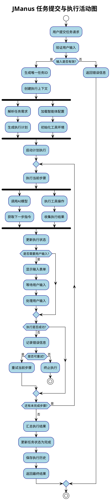

### 2. 智能体动态配置流程

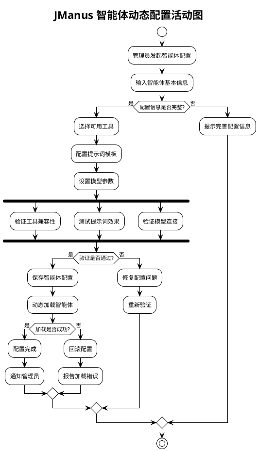

### 3. MCP工具集成流程

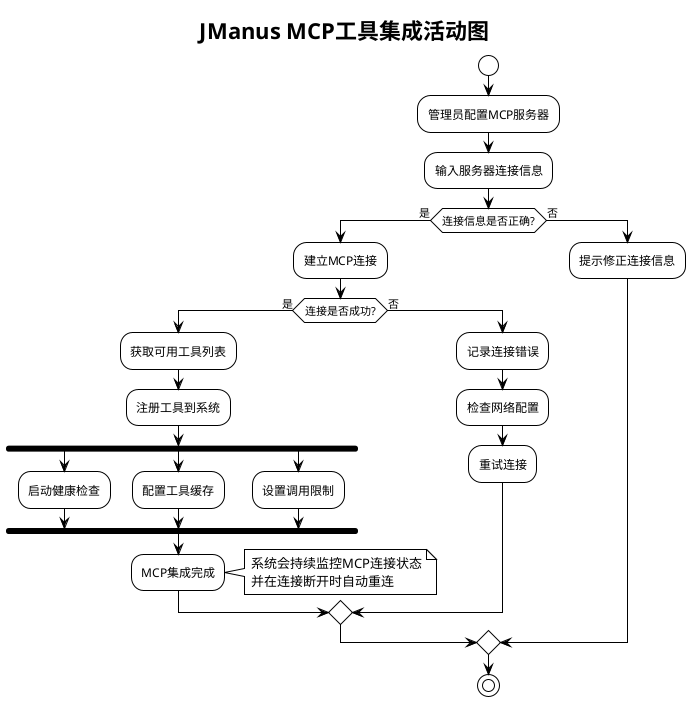

### 4. 计划模板管理流程

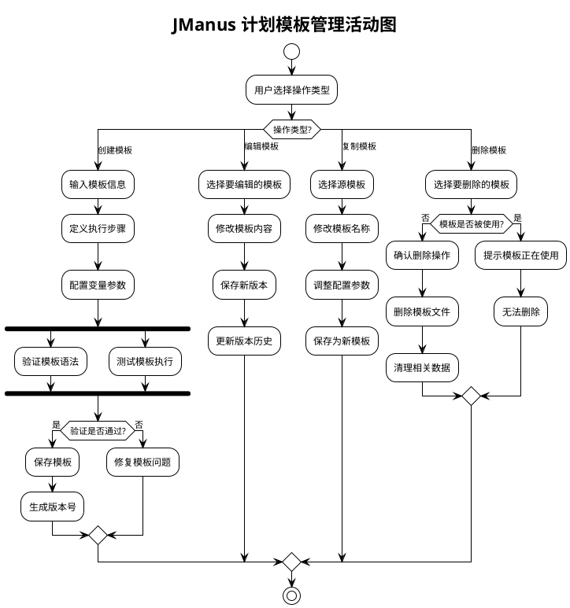

### 5. 系统配置管理流程

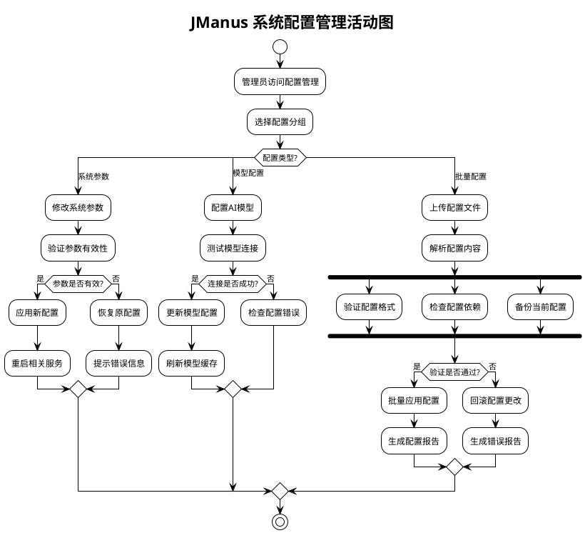

### 6. 错误处理与恢复流程

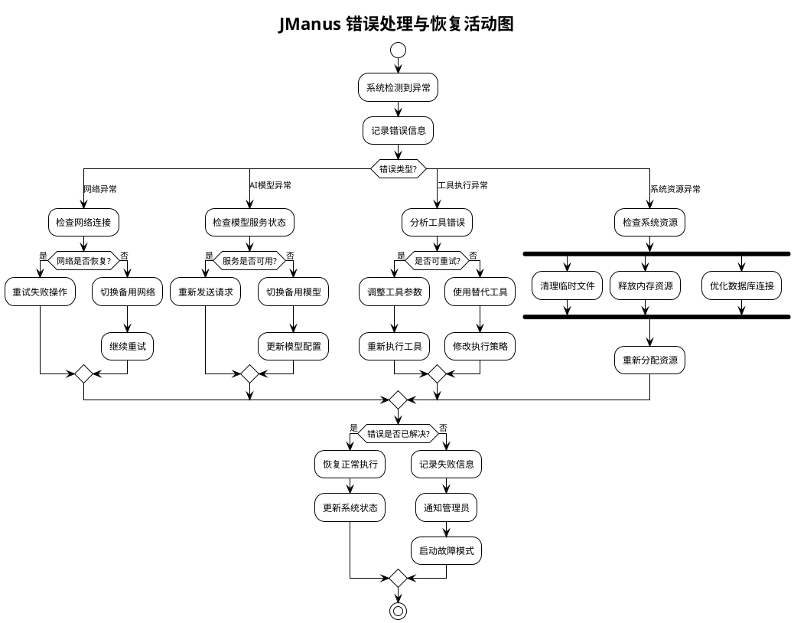

## 并行处理活动图

### 1. MapReduce并行执行流程

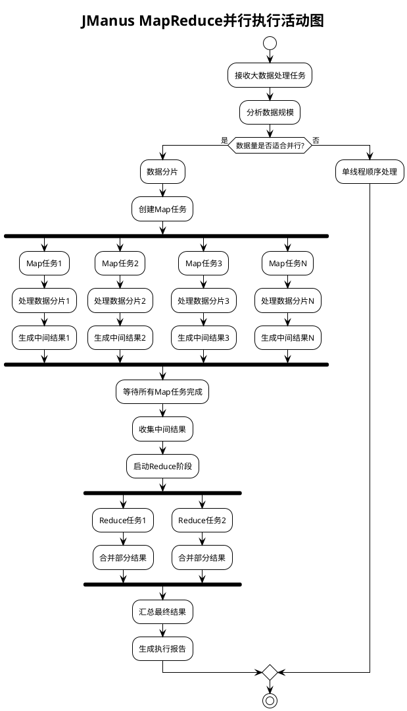

### 2. 多智能体协作流程

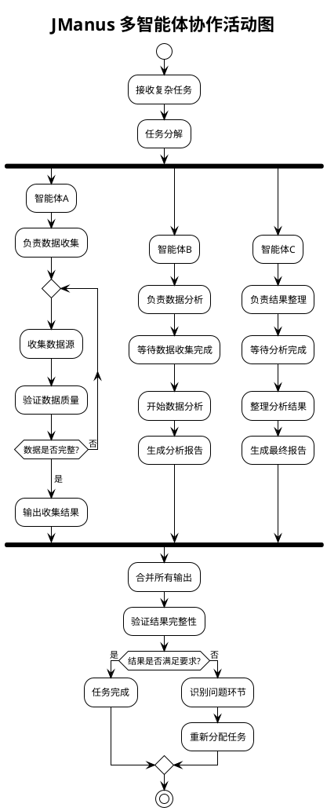

## 用户交互活动图

### 1. Web界面操作流程

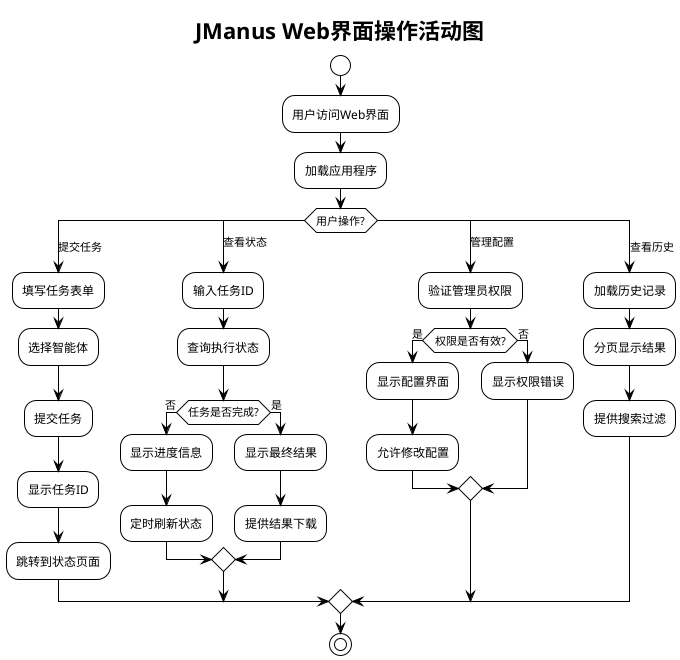

### 2. API调用处理流程

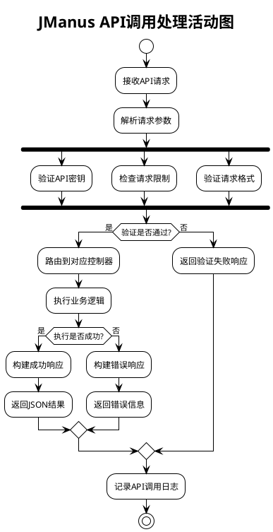

## 系统维护活动图

### 1. 定期维护流程

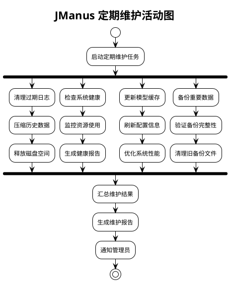

### 2. 系统升级流程

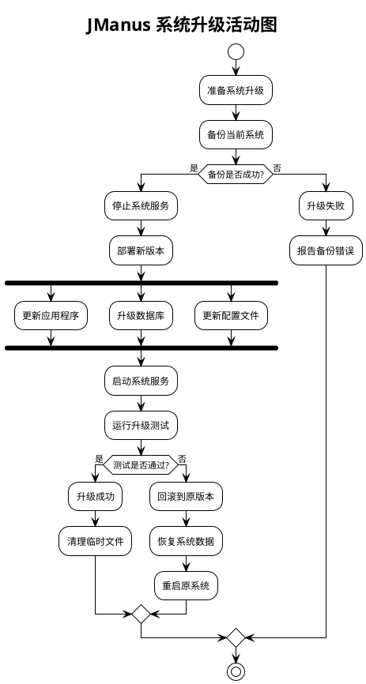

## 关键流程特点

### 业务流程特征
1. **任务驱动**: 以用户任务为核心的端到端流程
2. **智能规划**: 自动生成和优化执行计划
3. **并行处理**: 支持MapReduce和多智能体并行执行
4. **错误恢复**: 完善的异常处理和自动恢复机制

### 并行处理优势
1. **高效执行**: 通过并行处理提升任务执行效率
2. **资源优化**: 合理分配和利用系统资源
3. **可扩展性**: 支持水平扩展和负载均衡
4. **容错能力**: 单点故障不影响整体执行

### 用户体验优化
1. **响应式设计**: 实时状态更新和进度反馈
2. **简化操作**: 最小化用户操作复杂度
3. **智能提示**: 上下文相关的操作指导
4. **结果可视化**: 清晰的结果展示和下载

---

**文档版本**: 1.0  
**创建日期**: 2025年1月  
**活动图数量**: 12个核心活动图  
**涵盖场景**: 任务执行、配置管理、并行处理、用户交互、系统维护等  
**建模工具**: PlantUML