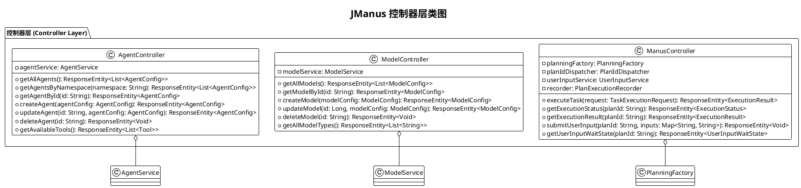
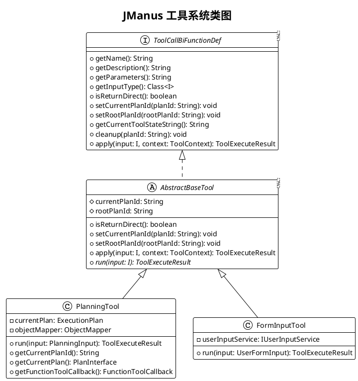

# JManus AI 智能助手平台 - 类图 (Class Diagram)

本文档展示 JManus AI 智能助手平台的类图，描述系统核心类、接口及其关系，明确系统结构、职责、继承与关联关系。

## 文档说明

**使用场景**: 描述类、接口及其关系  
**应用阶段**: 详细设计  
**关键优势**: 明确结构、职责、继承与关联  

## 系统整体类图

```plantuml
@startuml
!theme plain
skinparam linetype ortho
skinparam packageStyle rectangle
skinparam class {
  BackgroundColor lightblue
  BorderColor darkblue
  FontSize 10
}
skinparam interface {
  BackgroundColor lightgreen
  BorderColor darkgreen
  FontSize 10
}
skinparam abstract {
  BackgroundColor lightyellow
  BorderColor orange
  FontSize 10
}

title JManus AI 智能助手平台 - 系统类图

' ===== 核心接口定义 =====
package "核心接口 (Core Interfaces)" {
  interface ILlmService {
    +getChatClient(): ChatClient
    +getPlanningChatClient(): ChatClient
    +getChatModel(): ChatModel
  }
  
  interface ToolCallBiFunctionDef<I> {
    +getName(): String
    +getDescription(): String
    +getParameters(): String
    +getInputType(): Class<I>
    +isReturnDirect(): boolean
    +setCurrentPlanId(planId: String): void
    +setRootPlanId(rootPlanId: String): void
    +getCurrentToolStateString(): String
    +cleanup(planId: String): void
    +apply(input: I, context: ToolContext): ToolExecuteResult
  }
  
  interface PlanningToolInterface {
    +getCurrentPlanId(): String
    +getCurrentPlan(): PlanInterface
    +getFunctionToolCallback(): FunctionToolCallback
  }
  
  interface TerminableTool {
    +canTerminate(): boolean
  }
  
  interface PlanExecutorInterface {
    +executeAllSteps(context: ExecutionContext): void
  }
  
  interface IUnifiedDirectoryManager {
    +getWorkingDirectoryPath(): String
    +getWorkingDirectory(): Path
    +createTaskDirectory(taskId: String): Path
    +createPlanDirectory(planId: String): Path
  }
}

' ===== 配置管理 =====
package "配置管理 (Configuration)" {
  interface IManusProperties {
    +getBrowserHeadless(): Boolean
    +getBrowserRequestTimeout(): Integer
    +getDebugDetail(): Boolean
    +getMaxSteps(): Integer
  }
  
  class ManusProperties {
    -browserHeadless: Boolean
    -browserRequestTimeout: Integer
    -debugDetail: Boolean
    -maxSteps: Integer
    +getBrowserHeadless(): Boolean
    +setBrowserHeadless(value: Boolean): void
  }
}

' ===== 工具层次结构 =====
package "工具体系 (Tool System)" {
  abstract class AbstractBaseTool<I> {
    #currentPlanId: String
    #rootPlanId: String
    +isReturnDirect(): boolean
    +setCurrentPlanId(planId: String): void
    +setRootPlanId(rootPlanId: String): void
    +apply(input: I, context: ToolContext): ToolExecuteResult
    +{abstract} run(input: I): ToolExecuteResult
  }
  
  class PlanningTool {
    -currentPlan: ExecutionPlan
    -objectMapper: ObjectMapper
    +run(input: PlanningInput): ToolExecuteResult
    +getCurrentPlanId(): String
    +getCurrentPlan(): PlanInterface
    +getFunctionToolCallback(): FunctionToolCallback
  }
  
  class FormInputTool {
    -userInputService: IUserInputService
    +run(input: UserFormInput): ToolExecuteResult
  }
  
  class TerminateTool {
    +run(input: Map<String, Object>): ToolExecuteResult
    +canTerminate(): boolean
  }
  
  class DocLoaderTool {
    +run(input: DocLoaderInput): ToolExecuteResult
  }
  
  class MapReducePlanningTool {
    -currentPlan: MapReduceExecutionPlan
    +apply(input: String): ToolExecuteResult
    +getCurrentPlanId(): String
  }
  
  class UnifiedDirectoryManager {
    -manusProperties: ManusProperties
    +getWorkingDirectoryPath(): String
    +getWorkingDirectory(): Path
    +createTaskDirectory(taskId: String): Path
    +createPlanDirectory(planId: String): Path
  }
}

' ===== 智能体系统 =====
package "智能体系统 (Agent System)" {
  abstract class BaseAgent {
    #llmService: ILlmService
    #manusProperties: ManusProperties
    #promptService: PromptService
    #planExecutionRecorder: PlanExecutionRecorder
    -currentPlanId: String
    -rootPlanId: String
    -state: AgentState
    -maxSteps: int
    -currentStep: int
    -envData: Map<String, Object>
    +{abstract} getName(): String
    +{abstract} clearUp(planId: String): void
    +{abstract} getNextStepWithEnvMessage(): Message
    +{abstract} getToolCallList(): List<ToolCallback>
    +{abstract} getToolCallBackContext(toolKey: String): ToolCallBackContext
    +execute(): void
    +setState(state: AgentState): void
  }
  
  enum AgentState {
    NOT_STARTED
    IN_PROGRESS
    COMPLETED
    BLOCKED
    FAILED
  }
}

' ===== 规划系统 =====
package "规划系统 (Planning System)" {
  class PlanningCoordinator {
    -planCreator: PlanCreator
    -planExecutorFactory: PlanExecutorFactory
    -planFinalizer: PlanFinalizer
    +createPlan(context: ExecutionContext): ExecutionContext
    +createAndExecutePlan(context: ExecutionContext): ExecutionContext
    +executePlan(context: ExecutionContext): ExecutionContext
    +finalizePlan(context: ExecutionContext): ExecutionContext
  }
  
  class PlanCreator {
    -agents: List<DynamicAgentEntity>
    -llmService: ILlmService
    -planningTool: PlanningToolInterface
    -recorder: PlanExecutionRecorder
    -promptService: PromptService
    -manusProperties: ManusProperties
    +createPlan(context: ExecutionContext): void
    -buildAgentsInfo(agents: List<DynamicAgentEntity>): String
    -generatePlanPrompt(userRequest: String, agentsInfo: String): String
  }
  
  abstract class AbstractPlanExecutor {
    #recorder: PlanExecutionRecorder
    #agents: List<DynamicAgentEntity>
    #agentService: AgentService
    #llmService: ILlmService
    #manusProperties: ManusProperties
    #pattern: Pattern
    #executeStep(step: ExecutionStep, context: ExecutionContext): BaseAgent
    #getStepFromStepReq(stepRequirement: String): String
    #parseColumns(columnsInString: String): List<String>
    #performCleanup(context: ExecutionContext, lastExecutor: BaseAgent): void
  }
  
  class PlanExecutor {
    +executeAllSteps(context: ExecutionContext): void
  }
  
  class MapReducePlanExecutor {
    -executorService: ExecutorService
    +executeAllSteps(context: ExecutionContext): void
    -executeSequentialNode(node: SequentialNode, context: ExecutionContext, lastExecutor: BaseAgent): BaseAgent
    -executeMapReduceNode(node: MapReduceNode, context: ExecutionContext, lastExecutor: BaseAgent): BaseAgent
    -executeMapPhase(steps: List<ExecutionStep>, context: ExecutionContext, toolContext: ToolCallBackContext): BaseAgent
    -executeReducePhase(steps: List<ExecutionStep>, context: ExecutionContext): BaseAgent
    +shutdown(): void
  }
  
  class PlanFinalizer {
    -llmService: ILlmService
    -recorder: PlanExecutionRecorder
    -promptService: PromptService
    -manusProperties: ManusProperties
    +finalizePlan(context: ExecutionContext): void
  }
}

' ===== 业务服务层 =====
package "业务服务层 (Service Layer)" {
  interface AgentService {
    +getAllAgents(): List<AgentConfig>
    +getAllAgentsByNamespace(namespace: String): List<AgentConfig>
    +getAgentById(id: String): AgentConfig
    +createAgent(agentConfig: AgentConfig): AgentConfig
    +updateAgent(agentConfig: AgentConfig): AgentConfig
    +deleteAgent(id: String): void
    +getAvailableTools(): List<Tool>
    +createDynamicBaseAgent(name: String, planId: String, rootPlanId: String, settings: Map<String, Object>, columns: List<String>): BaseAgent
  }
  
  class AgentServiceImpl {
    -dynamicAgentLoader: IDynamicAgentLoader
    -repository: DynamicAgentRepository
    -planningFactory: IPlanningFactory
    -mcpService: IMcpService
    -llmService: ILlmService
    -toolCallingManager: ToolCallingManager
    +getAllAgents(): List<AgentConfig>
    +createAgent(agentConfig: AgentConfig): AgentConfig
    +createDynamicBaseAgent(name: String, planId: String, rootPlanId: String, settings: Map<String, Object>, columns: List<String>): BaseAgent
  }
  
  interface ModelService {
    +getAllModels(): List<ModelConfig>
    +getModelById(id: String): ModelConfig
    +createModel(modelConfig: ModelConfig): ModelConfig
    +updateModel(modelConfig: ModelConfig): ModelConfig
    +deleteModel(id: String): void
  }
  
  class ModelServiceImpl {
    -repository: DynamicModelRepository
    -agentRepository: DynamicAgentRepository
    +getAllModels(): List<ModelConfig>
    +createModel(modelConfig: ModelConfig): ModelConfig
    +updateModel(modelConfig: ModelConfig): ModelConfig
    +deleteModel(id: String): void
  }
  
  class LlmService {
    -agentExecutionClient: ChatClient
    -planningChatClient: ChatClient
    -chatModel: ChatModel
    +getChatClient(): ChatClient
    +getPlanningChatClient(): ChatClient
    +getChatModel(): ChatModel
  }
  
  interface IUserInputService {
    +storeFormInputTool(planId: String, tool: FormInputTool): void
    +retrieveFormInputTool(planId: String): FormInputTool
    +waitForUserInput(planId: String, timeout: Duration): UserInputWaitState
    +submitUserInput(planId: String, inputs: Map<String, String>): void
  }
  
  class UserInputService {
    -formInputTools: Map<String, FormInputTool>
    -waitStates: Map<String, UserInputWaitState>
    +storeFormInputTool(planId: String, tool: FormInputTool): void
    +waitForUserInput(planId: String, timeout: Duration): UserInputWaitState
    +submitUserInput(planId: String, inputs: Map<String, String>): void
  }
}

' ===== 控制器层 =====
package "控制器层 (Controller Layer)" {
  class AgentController {
    -agentService: AgentService
    +getAllAgents(): ResponseEntity<List<AgentConfig>>
    +getAgentsByNamespace(namespace: String): ResponseEntity<List<AgentConfig>>
    +getAgentById(id: String): ResponseEntity<AgentConfig>
    +createAgent(agentConfig: AgentConfig): ResponseEntity<AgentConfig>
    +updateAgent(id: String, agentConfig: AgentConfig): ResponseEntity<AgentConfig>
    +deleteAgent(id: String): ResponseEntity<Void>
    +getAvailableTools(): ResponseEntity<List<Tool>>
  }
  
  class ModelController {
    -modelService: ModelService
    +getAllModels(): ResponseEntity<List<ModelConfig>>
    +getModelById(id: String): ResponseEntity<ModelConfig>
    +createModel(modelConfig: ModelConfig): ResponseEntity<ModelConfig>
    +updateModel(id: Long, modelConfig: ModelConfig): ResponseEntity<ModelConfig>
    +deleteModel(id: String): ResponseEntity<Void>
    +getAllModelTypes(): ResponseEntity<List<String>>
  }
  
  class ManusController {
    -planningFactory: PlanningFactory
    -planIdDispatcher: PlanIdDispatcher
    -userInputService: UserInputService
    -recorder: PlanExecutionRecorder
    +executeTask(request: TaskExecutionRequest): ResponseEntity<ExecutionResult>
    +getExecutionStatus(planId: String): ResponseEntity<ExecutionStatus>
    +getExecutionResult(planId: String): ResponseEntity<ExecutionResult>
    +submitUserInput(planId: String, inputs: Map<String, String>): ResponseEntity<Void>
    +getUserInputWaitState(planId: String): ResponseEntity<UserInputWaitState>
  }
  
  class PromptController {
    -promptService: PromptService
    +getAll(): ResponseEntity<List<PromptVO>>
    +getAllByNamespace(namespace: String): ResponseEntity<List<PromptVO>>
    +getById(id: Long): ResponseEntity<PromptVO>
    +create(prompt: PromptVO): ResponseEntity<PromptVO>
    +update(id: Long, prompt: PromptVO): ResponseEntity<PromptVO>
    +delete(id: Long): ResponseEntity<Void>
  }
  
  class McpController {
    -mcpService: McpService
    +getAllConfigs(): ResponseEntity<List<McpConfigVO>>
    +createConfig(config: McpConfigRequestVO): ResponseEntity<McpConfigVO>
    +updateConfig(id: Long, config: McpConfigRequestVO): ResponseEntity<McpConfigVO>
    +deleteConfig(id: Long): ResponseEntity<Void>
    +getServerStatus(id: Long): ResponseEntity<Map<String, Object>>
  }
  
  class ConfigController {
    -configService: IConfigService
    +getConfigsByGroup(groupName: String): ResponseEntity<List<ConfigEntity>>
    +batchUpdateConfigs(configs: List<ConfigEntity>): ResponseEntity<Void>
  }
}

' ===== 数据层 =====
package "数据层 (Data Layer)" {
  class DynamicAgentEntity {
    -id: Long
    -name: String
    -description: String
    -namespace: String
    -availableTools: String
    -nextStepPrompt: String
    -model: DynamicModelEntity
    +mapToAgentConfig(): AgentConfig
  }
  
  class DynamicModelEntity {
    -id: Long
    -baseUrl: String
    -apiKey: String
    -modelName: String
    -modelDescription: String
    -type: String
    +mapToModelConfig(): ModelConfig
  }
  
  class PromptEntity {
    -id: Long
    -namespace: String
    -promptName: String
    -content: String
    -variables: String
    -description: String
    +mapToPromptVO(): PromptVO
  }
  
  class McpConfigEntity {
    -id: Long
    -serverName: String
    -command: String
    -args: String
    -env: String
    -cwd: String
    -timeout: Integer
    -enabled: Boolean
    +mapToMcpConfigVO(): McpConfigVO
  }
  
  class ConfigEntity {
    -id: Long
    -groupName: String
    -configKey: String
    -configValue: String
    -description: String
    -inputType: ConfigInputType
  }
  
  class PlanExecutionRecordEntity {
    -id: Long
    -planId: String
    -rootPlanId: String
    -userRequest: String
    -planContent: String
    -executionStatus: String
    -startTime: LocalDateTime
    -endTime: LocalDateTime
    -errorMessage: String
  }
}

' ===== 仓库层 =====
package "仓库层 (Repository Layer)" {
  interface DynamicAgentRepository {
    +findAllByNamespace(namespace: String): List<DynamicAgentEntity>
    +findByName(name: String): DynamicAgentEntity
    +findAllByModel(model: DynamicModelEntity): List<DynamicAgentEntity>
  }
  
  interface DynamicModelRepository {
    +findByModelName(modelName: String): DynamicModelEntity
  }
  
  interface PromptRepository {
    +findAllByNamespace(namespace: String): List<PromptEntity>
    +findByNamespaceAndPromptName(namespace: String, promptName: String): PromptEntity
  }
  
  interface McpConfigRepository {
    +findByServerName(serverName: String): McpConfigEntity
    +findAllByEnabled(enabled: Boolean): List<McpConfigEntity>
  }
  
  interface ConfigRepository {
    +findAllByGroupName(groupName: String): List<ConfigEntity>
    +findByGroupNameAndConfigKey(groupName: String, configKey: String): ConfigEntity
  }
  
  interface PlanExecutionRecordRepository {
    +findByPlanId(planId: String): PlanExecutionRecordEntity
    +findAllByRootPlanId(rootPlanId: String): List<PlanExecutionRecordEntity>
  }
}

' ===== 值对象和DTO =====
package "值对象 (Value Objects)" {
  class AgentConfig {
    -id: String
    -name: String
    -description: String
    -namespace: String
    -availableTools: List<String>
    -nextStepPrompt: String
    -model: ModelConfig
  }
  
  class ModelConfig {
    -id: Long
    -baseUrl: String
    -apiKey: String
    -modelName: String
    -modelDescription: String
    -type: String
  }
  
  class Tool {
    -key: String
    -name: String
    -description: String
    -enabled: boolean
    -serviceGroup: String
  }
  
  class ExecutionContext {
    -currentPlanId: String
    -rootPlanId: String
    -userRequest: String
    -plan: PlanInterface
    -useMemory: boolean
    -success: boolean
    -executionParams: Map<String, Object>
  }
  
  class ExecutionStep {
    -stepIndex: int
    -stepRequirement: String
    -terminateColumns: String
    -agent: BaseAgent
  }
}

' ===== 工厂模式 =====
package "工厂模式 (Factory Pattern)" {
  class PlanningFactory {
    -dynamicAgentLoader: IDynamicAgentLoader
    -llmService: ILlmService
    -recorder: PlanExecutionRecorder
    -promptService: PromptService
    -manusProperties: ManusProperties
    -planExecutorFactory: PlanExecutorFactory
    +createPlanningCoordinator(planId: String): PlanningCoordinator
  }
  
  class PlanExecutorFactory {
    -agents: List<DynamicAgentEntity>
    -recorder: PlanExecutionRecorder
    -agentService: AgentService
    -llmService: ILlmService
    -manusProperties: ManusProperties
    +createExecutor(planType: String): PlanExecutorInterface
  }
}

' ===== 继承关系 =====
ToolCallBiFunctionDef <|.. AbstractBaseTool
AbstractBaseTool <|-- PlanningTool
AbstractBaseTool <|-- FormInputTool
AbstractBaseTool <|-- DocLoaderTool
AbstractBaseTool <|-- TerminateTool
PlanningToolInterface <|.. PlanningTool
PlanningToolInterface <|.. MapReducePlanningTool
TerminableTool <|.. TerminateTool
IUnifiedDirectoryManager <|.. UnifiedDirectoryManager
IManusProperties <|.. ManusProperties
ILlmService <|.. LlmService
AgentService <|.. AgentServiceImpl
ModelService <|.. ModelServiceImpl
IUserInputService <|.. UserInputService
PlanExecutorInterface <|.. AbstractPlanExecutor
AbstractPlanExecutor <|-- PlanExecutor
AbstractPlanExecutor <|-- MapReducePlanExecutor

' ===== 组合关系 =====
PlanningCoordinator *-- PlanCreator
PlanningCoordinator *-- PlanExecutorFactory
PlanningCoordinator *-- PlanFinalizer
PlanCreator *-- PlanningToolInterface
AgentServiceImpl *-- DynamicAgentRepository
ModelServiceImpl *-- DynamicModelRepository
BaseAgent *-- AgentState
AbstractPlanExecutor *-- Pattern

' ===== 聚合关系 =====
PlanningFactory o-- PlanExecutorFactory
AgentController o-- AgentService
ModelController o-- ModelService
ManusController o-- PlanningFactory
BaseAgent o-- ILlmService
BaseAgent o-- ManusProperties
PlanCreator o-- ILlmService
AbstractPlanExecutor o-- PlanExecutionRecorder

' ===== 依赖关系 =====
PlanningCoordinator ..> ExecutionContext
PlanCreator ..> ExecutionContext
AbstractPlanExecutor ..> ExecutionContext
AgentServiceImpl ..> AgentConfig
ModelServiceImpl ..> ModelConfig
DynamicAgentEntity ..> AgentConfig
DynamicModelEntity ..> ModelConfig

@enduml
```

## 分层详细类图

### 1. 控制器层类图



### 2. 工具系统类图



## 设计模式应用

### 1. 策略模式 (Strategy Pattern)
- **PlanExecutorInterface**: 定义执行策略接口
- **PlanExecutor** 和 **MapReducePlanExecutor**: 实现不同执行策略
- **PlanExecutorFactory**: 根据计划类型选择合适的执行器

### 2. 模板方法模式 (Template Method Pattern)
- **AbstractBaseTool**: 定义工具执行模板
- 具体工具类实现 `run()` 方法的具体逻辑
- **AbstractPlanExecutor**: 提供执行框架，子类实现具体执行逻辑

### 3. 工厂模式 (Factory Pattern)
- **PlanningFactory**: 负责创建 `PlanningCoordinator`
- **PlanExecutorFactory**: 负责创建不同类型的执行器

### 4. 组合模式 (Composite Pattern)
- **PlanningCoordinator**: 组合 `PlanCreator`、`PlanExecutorFactory`、`PlanFinalizer`
- 提供统一的计划处理接口

## 核心接口和抽象类

### ToolCallBiFunctionDef<I>
- **职责**: 定义统一的工具调用接口
- **泛型参数**: `I` 表示工具输入类型
- **核心方法**: `apply(input, context)` 执行工具逻辑
- **扩展点**: 通过实现此接口可以集成新的工具

### BaseAgent
- **职责**: 智能体的抽象基类，定义智能体生命周期
- **状态管理**: 通过 `AgentState` 枚举管理执行状态
- **执行控制**: 提供步数限制、执行环境管理
- **扩展机制**: 子类实现具体的智能体行为

### PlanExecutorInterface
- **职责**: 定义计划执行的统一接口
- **实现类**:
  - `PlanExecutor`: 标准顺序执行
  - `MapReducePlanExecutor`: 支持并行 MapReduce 执行

## 系统特性

### 高可扩展性
- 接口驱动设计，易于添加新功能
- 插件化工具系统，支持动态工具注册
- 多种执行策略，适应不同任务需求

### 强类型安全
- 泛型接口设计，编译时类型检查
- 枚举状态管理，避免状态值错误
- 数据传输对象（DTO）清晰定义

### 良好的可维护性
- 清晰的分层架构，职责明确
- 丰富的抽象层，便于理解和修改
- 统一的异常处理和日志记录

---

**文档版本**: 1.0  
**创建日期**: 2025年1月  
**类总数**: 50+ 核心类和接口  
**设计模式**: 策略、模板方法、工厂、组合等  
**建模工具**: PlantUML