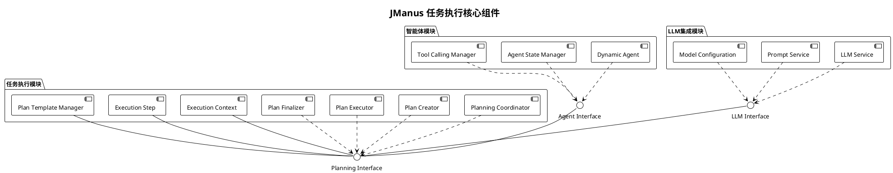
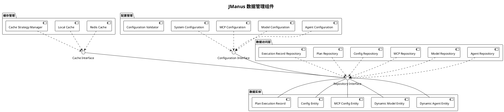
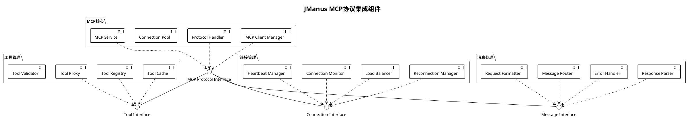
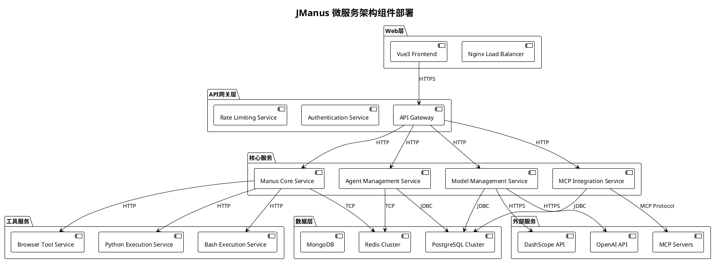
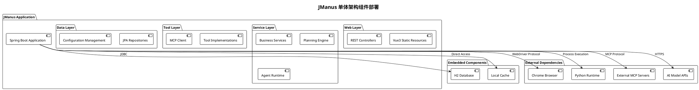
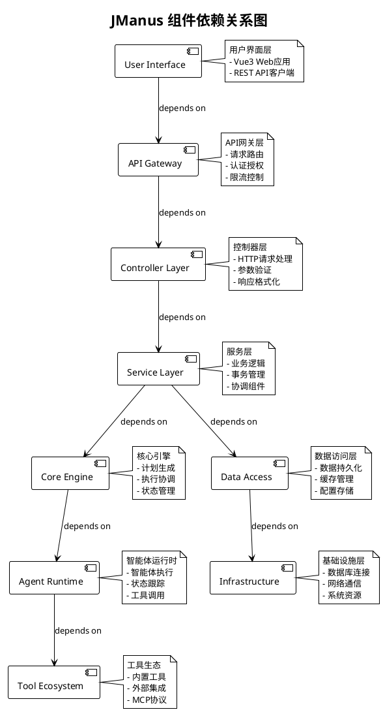
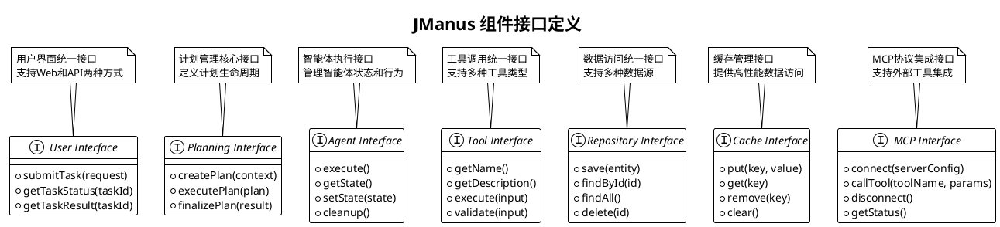

# JManus AI 智能助手平台 - 组件图 (Component Diagram)

本文档展示 JManus AI 智能助手平台的组件图，可视化系统组件及其依赖关系，用于架构设计与重构。

## 文档说明

**使用场景**: 可视化系统组件及其依赖关系  
**应用阶段**: 架构设计与重构  
**关键优势**: 支持模块化，易于演进  

## 系统整体组件图

```plantuml
@startuml
!theme plain
skinparam component {
  BackgroundColor lightblue
  BorderColor darkblue
}
skinparam package {
  BackgroundColor lightyellow
  BorderColor orange
}
skinparam interface {
  BackgroundColor lightgreen
  BorderColor darkgreen
}

title JManus AI 智能助手平台 - 系统组件图

' ===== 用户接口层 =====
package "用户接口层 (Presentation Layer)" {
  component [Vue3 Web UI] as WebUI
  component [REST API Gateway] as APIGateway
  
  interface "HTTP/HTTPS" as HTTP
  interface "WebSocket" as WS
  interface "REST API" as REST
}

' ===== API控制器层 =====
package "API控制器层 (Controller Layer)" {
  component [Agent Controller] as AgentCtrl
  component [Model Controller] as ModelCtrl
  component [Manus Controller] as ManusCtrl
  component [Prompt Controller] as PromptCtrl
  component [MCP Controller] as McpCtrl
  component [Config Controller] as ConfigCtrl
  
  interface "Controller Interface" as CtrlInterface
}

' ===== 业务服务层 =====
package "业务服务层 (Service Layer)" {
  component [Agent Service] as AgentService
  component [Model Service] as ModelService
  component [Prompt Service] as PromptService
  component [MCP Service] as McpService
  component [Config Service] as ConfigService
  component [User Input Service] as UserInputService
  
  interface "Service Interface" as ServiceInterface
}

' ===== 核心组件层 =====
package "核心组件层 (Core Components)" {
  component [Planning Coordinator] as PlanCoordinator
  component [Plan Creator] as PlanCreator
  component [Plan Executor] as PlanExecutor
  component [Plan Finalizer] as PlanFinalizer
  component [Dynamic Agent Loader] as AgentLoader
  component [LLM Service] as LLMService
  
  interface "Planning Interface" as PlanInterface
  interface "Agent Interface" as AgentInterface
  interface "LLM Interface" as LLMInterface
}

' ===== 智能体层 =====
package "智能体层 (Agent Layer)" {
  component [Base Agent] as BaseAgent
  component [Dynamic Agent] as DynamicAgent
  component [Agent State Manager] as AgentStateManager
  component [Tool Calling Manager] as ToolManager
  
  interface "Agent Execution Interface" as AgentExecInterface
}

' ===== 工具生态层 =====
package "工具生态层 (Tool Ecosystem)" {
  component [Planning Tool] as PlanningTool
  component [Browser Tool] as BrowserTool
  component [Python Execute Tool] as PythonTool
  component [Bash Tool] as BashTool
  component [Form Input Tool] as FormTool
  component [MCP Tool Integration] as McpToolIntegration
  component [Doc Loader Tool] as DocTool
  
  interface "Tool Interface" as ToolInterface
}

' ===== 数据访问层 =====
package "数据访问层 (Data Access Layer)" {
  component [Agent Repository] as AgentRepo
  component [Model Repository] as ModelRepo
  component [Prompt Repository] as PromptRepo
  component [MCP Config Repository] as McpRepo
  component [Config Repository] as ConfigRepo
  component [Plan Execution Repository] as PlanRepo
  
  interface "Repository Interface" as RepoInterface
}

' ===== 基础设施层 =====
package "基础设施层 (Infrastructure Layer)" {
  component [Database Connection Pool] as DBPool
  component [HTTP Client Pool] as HTTPPool
  component [Thread Pool Manager] as ThreadPool
  component [Cache Manager] as CacheManager
  component [Log Manager] as LogManager
  
  interface "Infrastructure Interface" as InfraInterface
}

' ===== 外部系统 =====
package "外部系统 (External Systems)" {
  component [AI Model Services] as AIServices
  component [MCP Servers] as McpServers
  component [Browser Engine] as BrowserEngine
  component [Python Runtime] as PythonRuntime
  component [Database Systems] as DatabaseSystems
  
  interface "External API" as ExtAPI
  interface "MCP Protocol" as MCPProtocol
  interface "WebDriver Protocol" as WebDriverProtocol
}

' ===== 接口连接 =====
WebUI ..> HTTP
APIGateway ..> REST
APIGateway ..> WS

HTTP -- AgentCtrl
REST -- ManusCtrl
REST -- ModelCtrl
REST -- PromptCtrl
REST -- McpCtrl
REST -- ConfigCtrl

AgentCtrl ..> CtrlInterface
ManusCtrl ..> CtrlInterface
ModelCtrl ..> CtrlInterface
PromptCtrl ..> CtrlInterface
McpCtrl ..> CtrlInterface
ConfigCtrl ..> CtrlInterface

CtrlInterface -- AgentService
CtrlInterface -- ModelService
CtrlInterface -- PromptService
CtrlInterface -- McpService
CtrlInterface -- ConfigService
CtrlInterface -- UserInputService

AgentService ..> ServiceInterface
ModelService ..> ServiceInterface
PromptService ..> ServiceInterface
McpService ..> ServiceInterface
ConfigService ..> ServiceInterface

ServiceInterface -- PlanCoordinator
ServiceInterface -- LLMService
ServiceInterface -- AgentLoader

PlanCoordinator ..> PlanInterface
PlanCreator ..> PlanInterface
PlanExecutor ..> PlanInterface
PlanFinalizer ..> PlanInterface

PlanInterface -- BaseAgent
PlanInterface -- DynamicAgent
PlanInterface -- ToolManager

BaseAgent ..> AgentInterface
DynamicAgent ..> AgentInterface
AgentStateManager ..> AgentInterface

AgentInterface -- PlanningTool
AgentInterface -- BrowserTool
AgentInterface -- PythonTool
AgentInterface -- BashTool
AgentInterface -- FormTool
AgentInterface -- McpToolIntegration

PlanningTool ..> ToolInterface
BrowserTool ..> ToolInterface
PythonTool ..> ToolInterface
BashTool ..> ToolInterface
FormTool ..> ToolInterface
McpToolIntegration ..> ToolInterface
DocTool ..> ToolInterface

ToolInterface -- AgentRepo
ToolInterface -- ModelRepo
ToolInterface -- PromptRepo
ToolInterface -- McpRepo
ToolInterface -- ConfigRepo

AgentRepo ..> RepoInterface
ModelRepo ..> RepoInterface
PromptRepo ..> RepoInterface
McpRepo ..> RepoInterface
ConfigRepo ..> RepoInterface
PlanRepo ..> RepoInterface

RepoInterface -- DBPool
RepoInterface -- CacheManager
RepoInterface -- LogManager

DBPool ..> InfraInterface
HTTPPool ..> InfraInterface
ThreadPool ..> InfraInterface
CacheManager ..> InfraInterface
LogManager ..> InfraInterface

' ===== 外部依赖 =====
LLMService ..> ExtAPI
McpToolIntegration ..> MCPProtocol
BrowserTool ..> WebDriverProtocol

ExtAPI -- AIServices
MCPProtocol -- McpServers
WebDriverProtocol -- BrowserEngine
PythonTool -- PythonRuntime
RepoInterface -- DatabaseSystems

@enduml
```

## 核心模块组件图

### 1. 任务执行核心组件

### 2. 工具生态组件

```plantuml
@startuml
!theme plain
title JManus 工具生态组件

package "工具框架" {
  component [Abstract Base Tool] as BaseTool
  component [Tool Registry] as ToolRegistry
  component [Tool Executor] as ToolExecutor
  component [Tool Result Handler] as ResultHandler
}

package "内置工具" {
  component [Planning Tool] as PlanningTool
  component [Form Input Tool] as FormTool
  component [Terminate Tool] as TerminateTool
  component [Doc Loader Tool] as DocTool
}

package "浏览器工具" {
  component [Browser Tool] as BrowserTool
  component [WebDriver Manager] as WebDriverManager
  component [Page Element Locator] as ElementLocator
  component [Action Executor] as ActionExecutor
}

package "代码执行工具" {
  component [Python Execute Tool] as PythonTool
  component [Bash Tool] as BashTool
  component [Code Validator] as CodeValidator
  component [Execution Sandbox] as Sandbox
}

package "MCP工具集成" {
  component [MCP Tool Integration] as McpIntegration
  component [MCP Client] as McpClient
  component [Tool Cache Manager] as CacheManager
  component [Protocol Handler] as ProtocolHandler
}

interface "Tool Interface" as ITool
interface "Browser Interface" as IBrowser
interface "Code Execution Interface" as ICodeExec
interface "MCP Interface" as IMCP

BaseTool ..> ITool
ToolRegistry ..> ITool
ToolExecutor ..> ITool

PlanningTool --|> BaseTool
FormTool --|> BaseTool
TerminateTool --|> BaseTool
DocTool --|> BaseTool

BrowserTool ..> IBrowser
WebDriverManager ..> IBrowser
BrowserTool --|> BaseTool

PythonTool ..> ICodeExec
BashTool ..> ICodeExec
PythonTool --|> BaseTool
BashTool --|> BaseTool

McpIntegration ..> IMCP
McpClient ..> IMCP
McpIntegration --|> BaseTool

@enduml
```

### 3. 数据管理组件

### 4. MCP协议集成组件

## 部署视图组件

### 1. 微服务架构组件

### 2. 单体架构组件

## 组件依赖关系

### 1. 核心依赖关系

### 2. 接口定义

## 组件特性分析

### 模块化设计特点
1. **高内聚低耦合**: 每个组件职责明确，依赖关系清晰
2. **接口驱动**: 通过接口定义组件契约，支持多种实现
3. **可插拔架构**: 工具和服务可以动态加载和卸载
4. **分层设计**: 清晰的分层架构，便于维护和扩展

### 可扩展性支持
1. **水平扩展**: 支持微服务架构，可独立扩展各个服务
2. **垂直扩展**: 组件内部支持负载均衡和资源池
3. **工具扩展**: 开放的工具接口，支持第三方工具集成
4. **协议扩展**: 支持MCP等标准协议，便于生态集成

### 容错和可靠性
1. **故障隔离**: 组件间故障不会相互影响
2. **自动恢复**: 支持连接重试和状态恢复
3. **监控告警**: 内置监控和日志组件
4. **数据一致性**: 事务管理和数据同步机制

---

**文档版本**: 1.0  
**创建日期**: 2025年1月  
**组件图数量**: 8个核心组件图  
**架构支持**: 单体架构和微服务架构  
**建模工具**: PlantUML