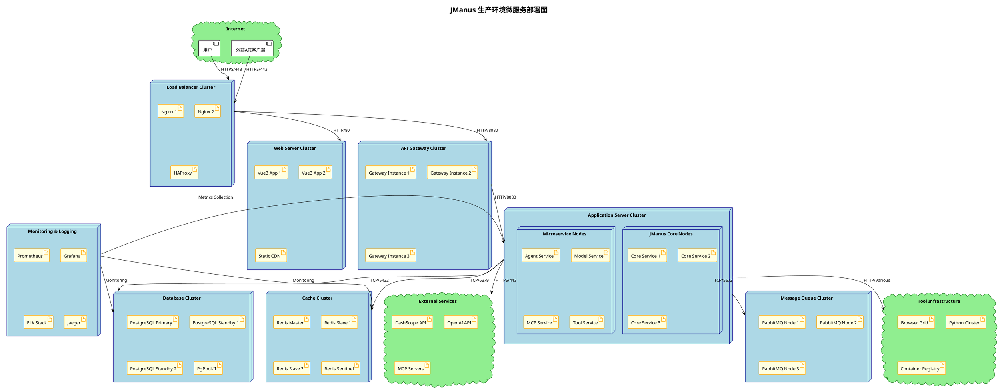
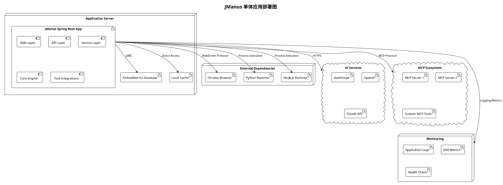
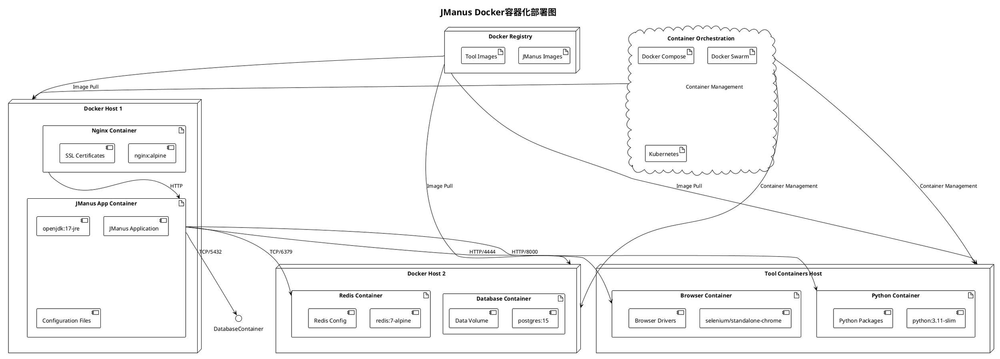
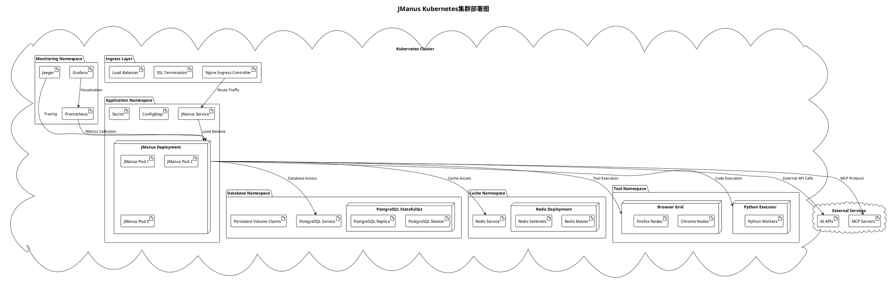
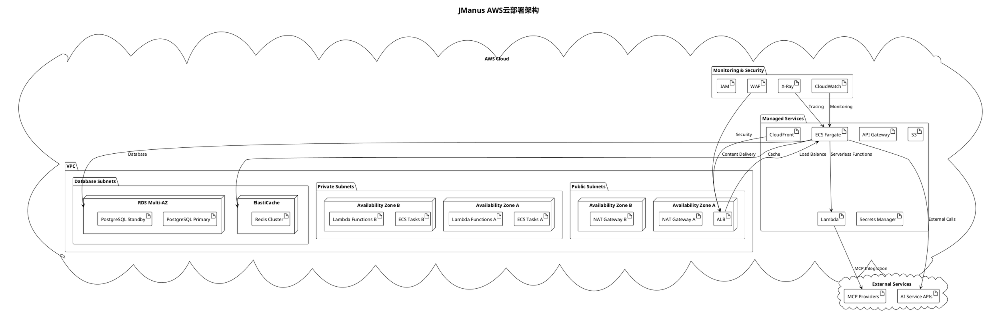
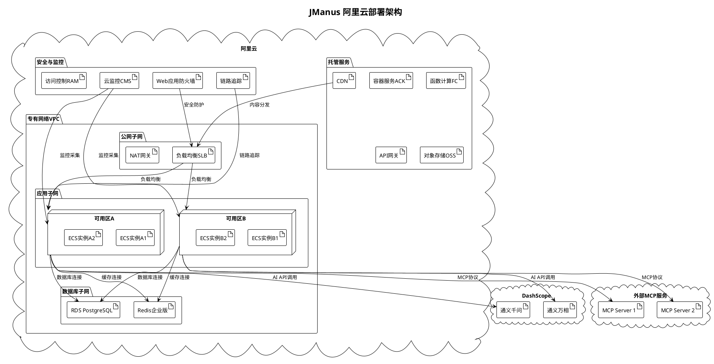
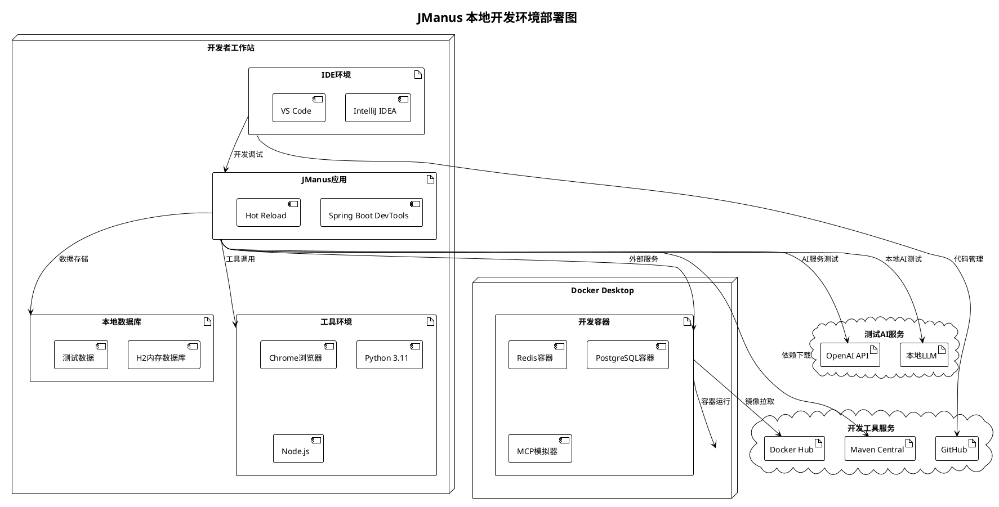
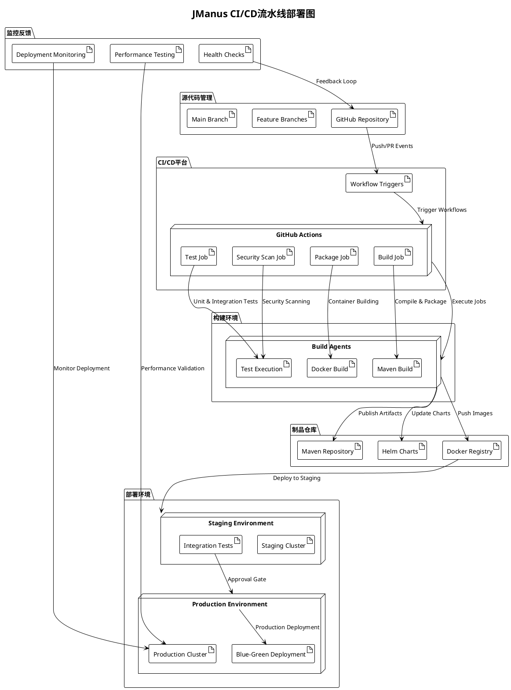
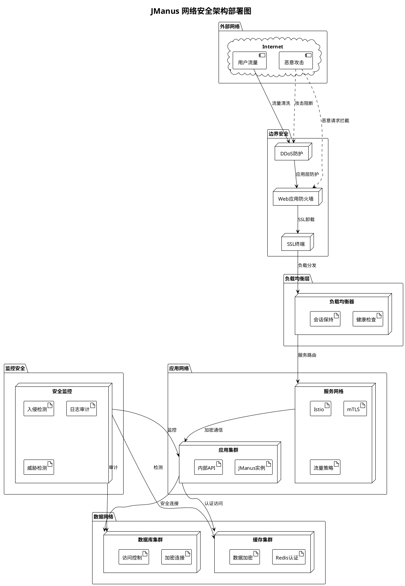
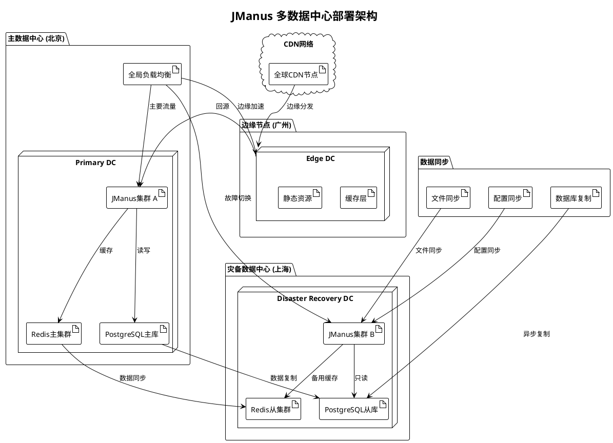

# JManus AI 智能助手平台 - 部署图 (Deployment Diagram)

本文档展示 JManus AI 智能助手平台的部署图，描述物理节点与软件部署拓扑，用于架构设计与运维。

## 文档说明

**使用场景**: 描述物理节点与软件部署拓扑  
**应用阶段**: 架构设计与运维  
**关键优势**: 展示基础设施和网络布局  

## 生产环境部署图

### 1. 微服务集群部署



### 2. 单体应用部署



### 3. Docker容器化部署



### 4. Kubernetes集群部署



## 云平台部署图

### 1. AWS云部署架构



### 2. 阿里云部署架构



## 开发环境部署图

### 1. 本地开发环境



### 2. CI/CD流水线部署



## 网络架构与安全部署

### 1. 网络安全架构



### 2. 多数据中心部署



## 部署配置与运维

### 关键部署参数

1. **资源配置**
   - CPU: 4-8核心（生产环境）
   - 内存: 8-16GB（生产环境）
   - 存储: SSD 100GB+（数据库）
   - 网络: 千兆带宽

2. **JVM参数**
   ```bash
   -Xms4g -Xmx8g
   -XX:+UseG1GC
   -XX:MaxGCPauseMillis=200
   -XX:+HeapDumpOnOutOfMemoryError
   ```

3. **数据库配置**
   - 连接池: HikariCP
   - 最大连接数: 20-50
   - 连接超时: 30s
   - 读写分离: 支持

4. **缓存配置**
   - Redis集群模式
   - 内存: 4-8GB
   - 持久化: RDB+AOF
   - 过期策略: LRU

### 监控指标

1. **应用指标**
   - QPS/TPS
   - 响应时间
   - 错误率
   - JVM指标

2. **基础设施指标**
   - CPU使用率
   - 内存使用率
   - 磁盘I/O
   - 网络流量

3. **业务指标**
   - 任务执行成功率
   - 智能体响应时间
   - AI API调用延迟
   - 工具执行成功率

---

**文档版本**: 1.0  
**创建日期**: 2025年1月  
**部署图数量**: 10个核心部署图  
**涵盖环境**: 开发、测试、生产、云平台等  
**建模工具**: PlantUML