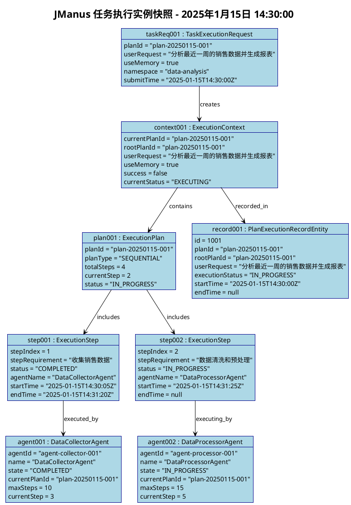
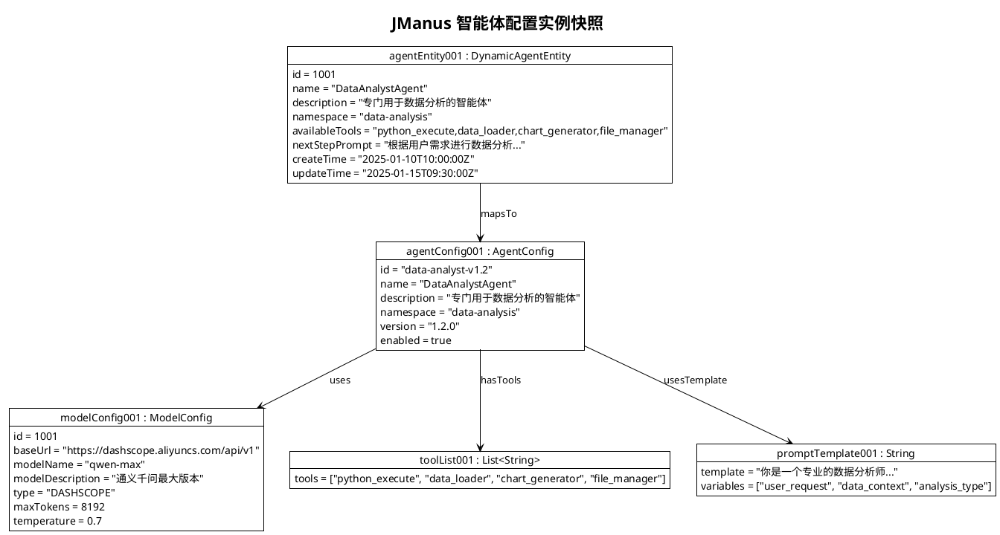
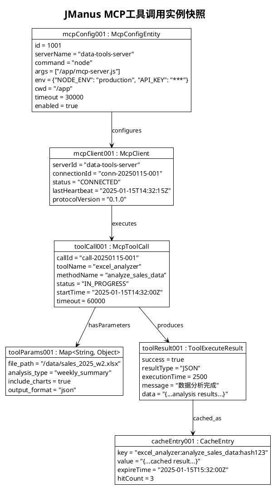
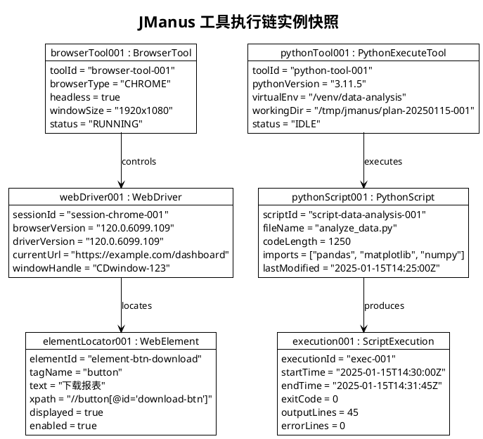
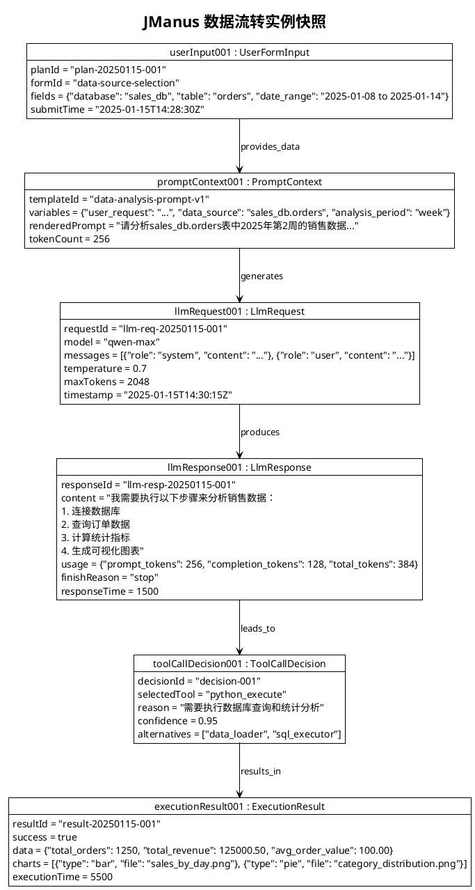
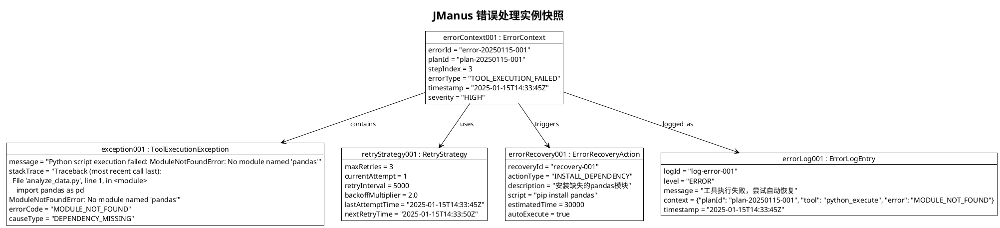
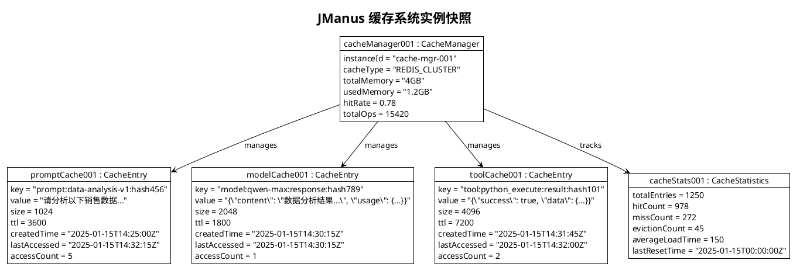
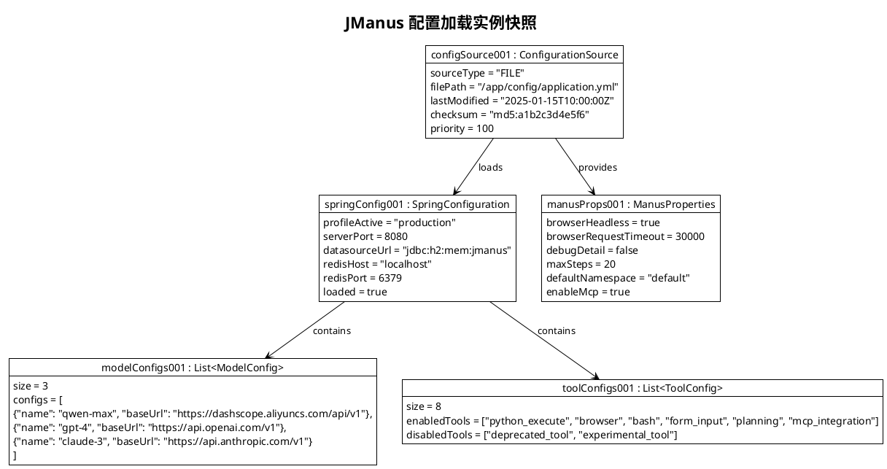
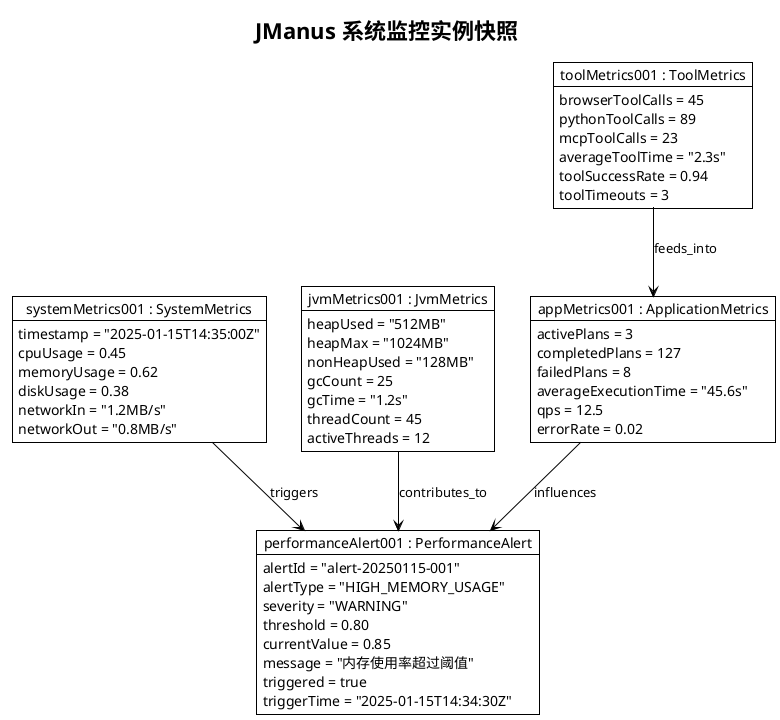
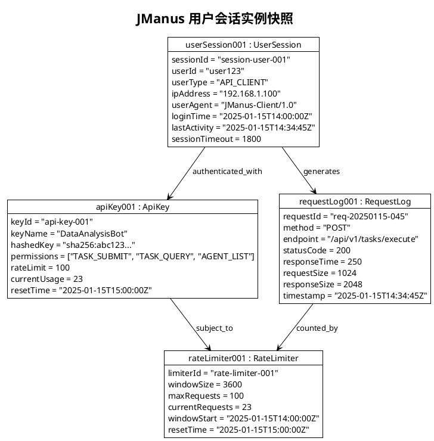

# JManus AI 智能助手平台 - 对象图 (Object Diagram)

本文档展示 JManus AI 智能助手平台的对象图，快照式展示对象实例及关联，用于调试与示例。

## 文档说明

**使用场景**: 快照式展示对象实例及关联  
**应用阶段**: 调试与示例  
**关键优势**: 具体实例演示，便于问题复现  

## 核心业务场景对象图

### 1. 任务执行实例快照

### 2. 智能体配置实例

### 3. MCP工具调用实例

### 4. 工具执行链实例

### 5. 数据流转实例

## 调试场景对象图

### 1. 错误处理实例

### 2. 缓存系统实例

### 3. 配置加载实例

## 性能监控对象图

### 1. 系统监控实例

### 2. 用户会话实例

## 对象图使用指南

### 调试价值

1. **问题定位**: 通过对象实例快照快速定位问题发生的具体环节
2. **数据流追踪**: 清晰展示数据在系统中的流转路径和状态变化
3. **状态验证**: 验证对象在特定时刻的状态是否符合预期
4. **性能分析**: 通过具体实例分析系统性能瓶颈

### 示例演示

1. **功能展示**: 为新用户展示系统功能的具体运行情况
2. **测试用例**: 作为测试用例的数据基础和验证标准
3. **文档补充**: 补充类图和时序图，提供更直观的理解
4. **培训材料**: 用于开发团队培训和知识传递

### 维护建议

1. **定期更新**: 随着系统演进更新对象图中的实例数据
2. **版本管理**: 为不同版本的系统维护对应的对象图
3. **场景覆盖**: 覆盖正常流程、异常情况、边界条件等多种场景
4. **数据脱敏**: 在文档中使用脱敏后的示例数据

---

**文档版本**: 1.0  
**创建日期**: 2025年1月  
**对象图数量**: 12个核心对象图  
**涵盖场景**: 业务执行、配置管理、错误处理、性能监控等  
**建模工具**: PlantUML