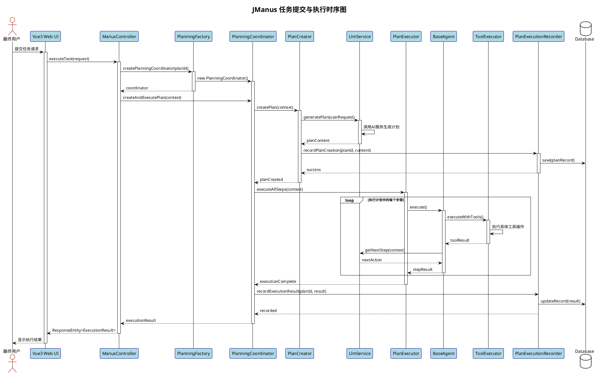
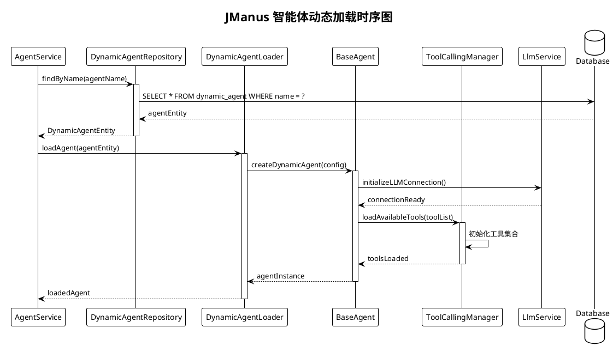
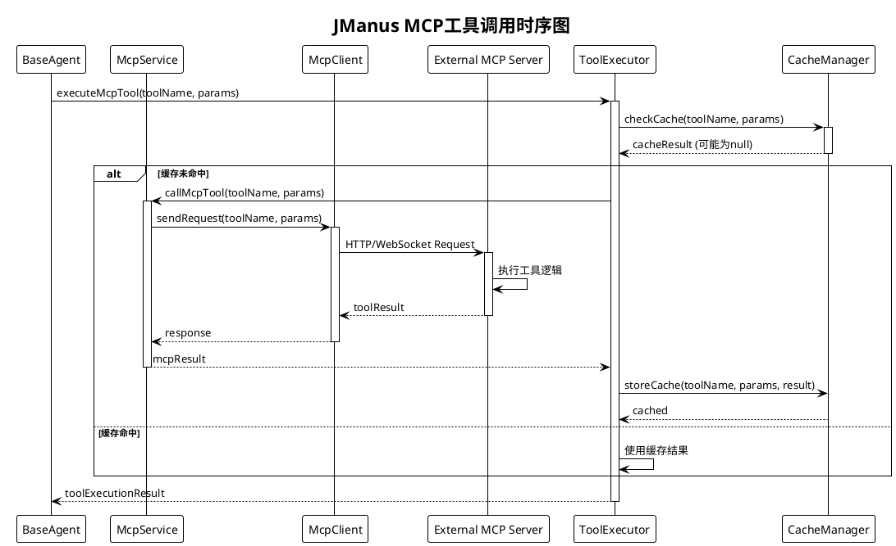
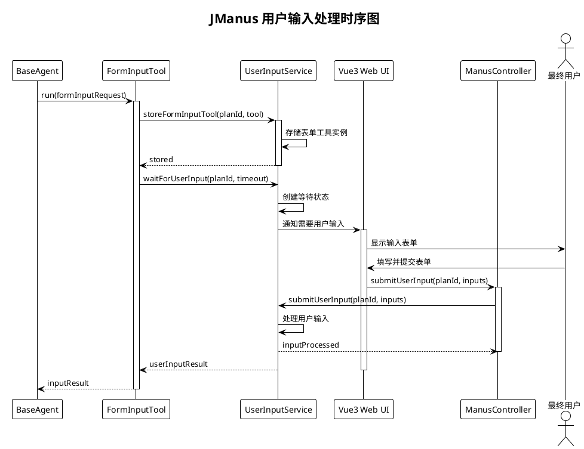
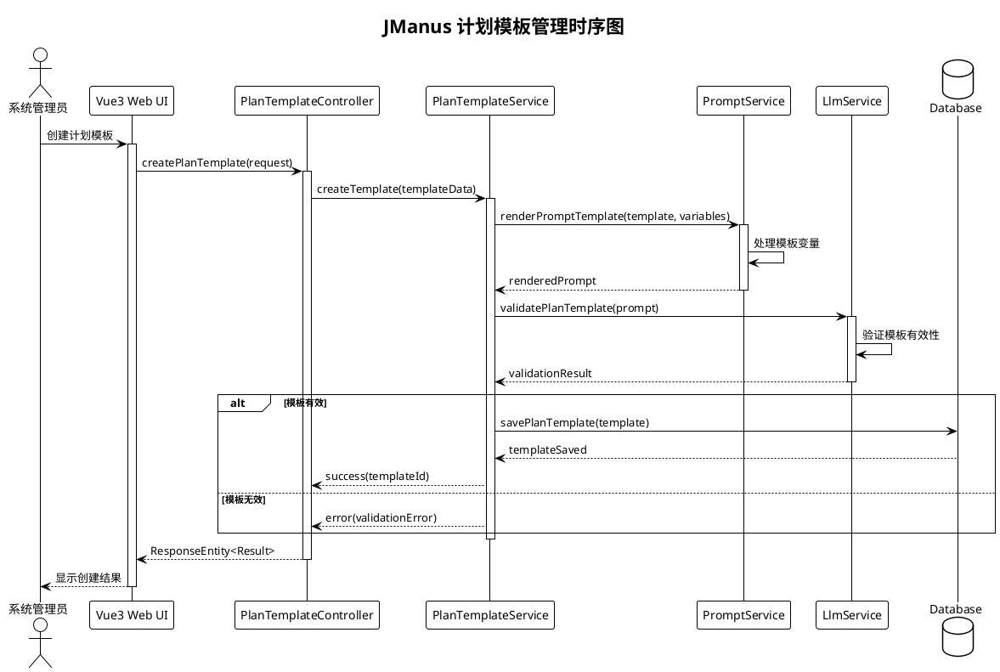
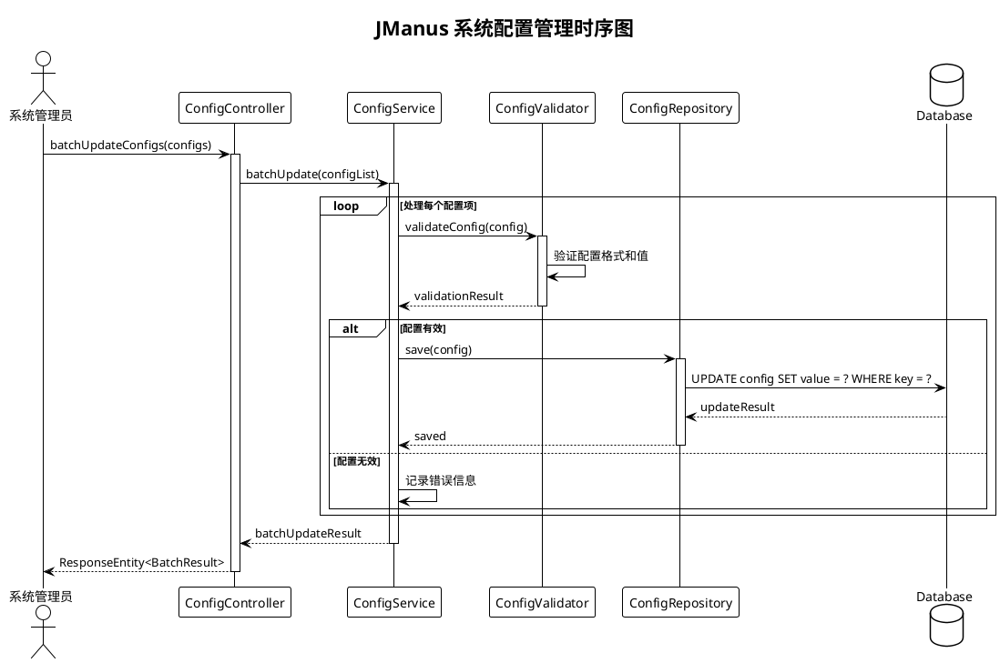
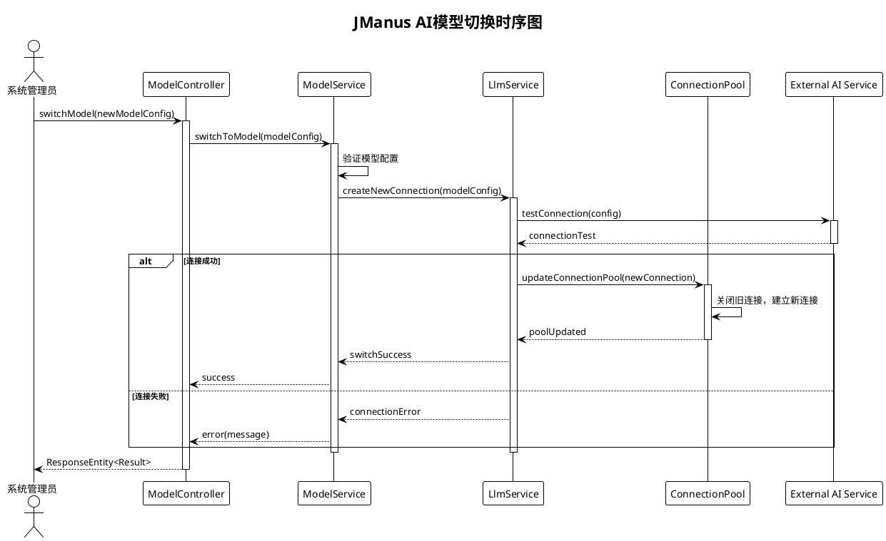
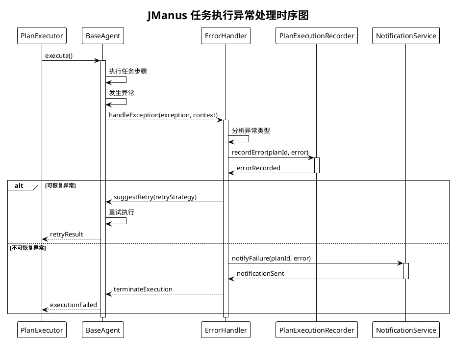
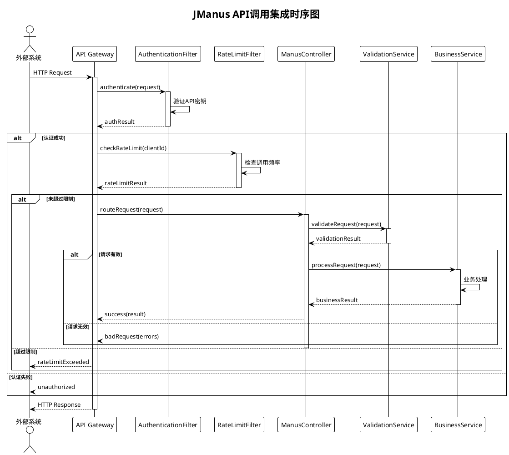

# JManus AI 智能助手平台 - 时序图 (Sequence Diagram)

本文档展示 JManus AI 智能助手平台的时序图，描述对象/组件间消息传递顺序，用于设计、开发和调试阶段。

## 文档说明

**使用场景**: 展示对象/组件间消息传递顺序  
**应用阶段**: 设计、开发、调试  
**关键优势**: 可视化流程、识别性能瓶颈  

## 核心业务流程时序图

### 1. 任务提交与执行流程



### 2. 智能体动态加载流程



### 3. MCP工具调用流程



### 4. 用户输入处理流程



### 5. 计划模板管理流程



### 6. 系统配置管理流程



### 7. AI模型切换流程



## 异常处理时序图

### 任务执行异常处理



## 性能优化时序图

### 并行执行时序图

```plantuml
@startuml
!theme plain
title JManus MapReduce并行执行时序图

participant "MapReducePlanExecutor" as Executor
participant "ExecutorService" as ThreadPool
participant "Agent1" as Agent1
participant "Agent2" as Agent2
participant "Agent3" as Agent3
participant "ResultAggregator" as Aggregator

Executor -> ThreadPool: submitMapTasks(tasks)
activate ThreadPool

par 并行执行Map阶段
    ThreadPool -> Agent1: executeMapTask(task1)
    activate Agent1
    Agent1 -> Agent1: 处理数据分片1
    Agent1 --> ThreadPool: result1
    deactivate Agent1
and
    ThreadPool -> Agent2: executeMapTask(task2)
    activate Agent2
    Agent2 -> Agent2: 处理数据分片2
    Agent2 --> ThreadPool: result2
    deactivate Agent2
and
    ThreadPool -> Agent3: executeMapTask(task3)
    activate Agent3
    Agent3 -> Agent3: 处理数据分片3
    Agent3 --> ThreadPool: result3
    deactivate Agent3
end

ThreadPool -> Aggregator: aggregate(results)
activate Aggregator
Aggregator -> Aggregator: 合并处理结果
Aggregator --> ThreadPool: finalResult
deactivate Aggregator

ThreadPool --> Executor: mapReduceComplete
deactivate ThreadPool

@enduml
```

## 系统集成时序图

### API调用集成时序图



## 关键性能指标

### 时序分析要点

1. **关键路径识别**
   - 任务提交到执行完成的端到端时间
   - AI模型调用响应时间
   - 数据库操作延迟

2. **并发处理能力**
   - MapReduce并行执行效率
   - 多智能体协作性能
   - 系统资源利用率

3. **异常恢复时间**
   - 错误检测和处理速度
   - 系统自愈能力
   - 故障转移时间

4. **集成接口性能**
   - API响应时间
   - 外部服务调用延迟
   - 数据传输效率

---

**文档版本**: 1.0  
**创建日期**: 2025年1月  
**时序图数量**: 10个核心时序图  
**涵盖场景**: 任务执行、智能体管理、工具调用、异常处理等  
**建模工具**: PlantUML