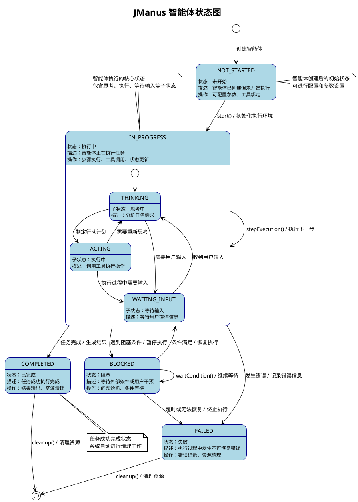
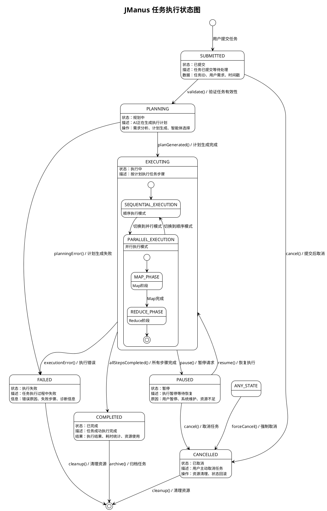
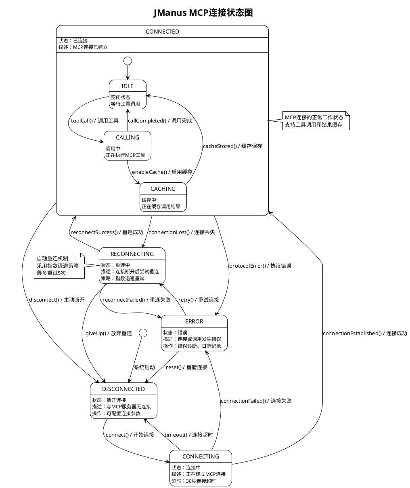
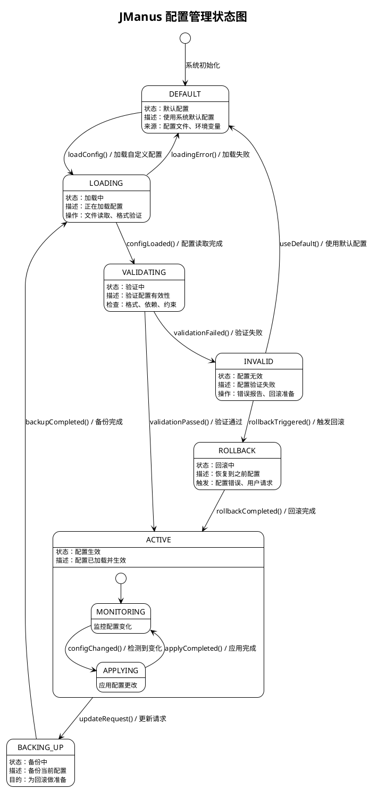
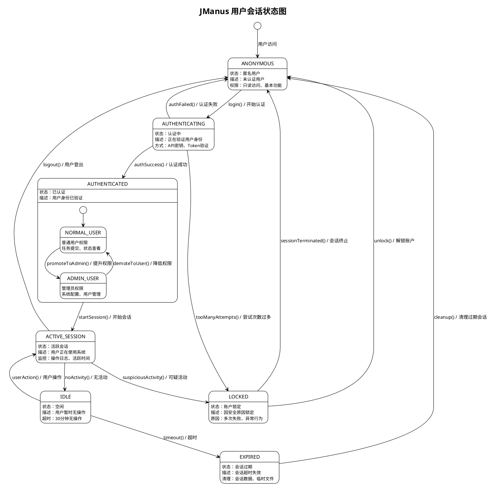

# JManus AI 智能助手平台 - 状态图 (State Diagram)

本文档展示 JManus AI 智能助手平台的状态图，表示对象生命周期状态及转换，用于复杂状态管理。

## 文档说明

**使用场景**: 表示对象生命周期状态及转换  
**应用阶段**: 复杂状态管理  
**关键优势**: 帮助跟踪状态变化、调试异常行为  

## 核心对象状态图

### 1. 智能体状态图



### 2. 任务执行状态图



### 3. MCP连接状态图



### 4. 配置管理状态图



### 5. 用户会话状态图



## 复合状态和并发状态

### 系统整体状态图

```plantuml
@startuml
!theme plain
title JManus 系统整体状态图

[*] --> INITIALIZING : 系统启动

state INITIALIZING {
  INITIALIZING : 状态：初始化中
  INITIALIZING : 描述：系统组件启动
  INITIALIZING : 操作：配置加载、服务启动、数据库连接
}

state RUNNING {
  RUNNING : 状态：运行中
  RUNNING : 描述：系统正常运行
  
  -- 并发区域：核心服务 --
  state TASK_SERVICE {
    TASK_SERVICE : 任务服务
    [*] --> IDLE_TASK
    IDLE_TASK --> PROCESSING_TASK : 接收任务
    PROCESSING_TASK --> IDLE_TASK : 任务完成
  }
  
  state AGENT_SERVICE {
    AGENT_SERVICE : 智能体服务
    [*] --> READY
    READY --> EXECUTING : 智能体执行
    EXECUTING --> READY : 执行完成
  }
  
  state MCP_SERVICE {
    MCP_SERVICE : MCP服务
    [*] --> CONNECTED_MCP
    CONNECTED_MCP --> CALLING_MCP : 工具调用
    CALLING_MCP --> CONNECTED_MCP : 调用完成
  }
  --
}

state MAINTENANCE {
  MAINTENANCE : 状态：维护模式
  MAINTENANCE : 描述：系统维护中
  MAINTENANCE : 操作：数据备份、系统更新、配置调整
}

state DEGRADED {
  DEGRADED : 状态：降级运行
  DEGRADED : 描述：部分功能不可用
  DEGRADED : 原因：服务故障、资源不足
}

state ERROR {
  ERROR : 状态：系统错误
  ERROR : 描述：系统发生严重错误
  ERROR : 操作：错误诊断、紧急修复
}

' 状态转换
INITIALIZING --> RUNNING : initCompleted() / 初始化完成
RUNNING --> MAINTENANCE : maintenanceMode() / 进入维护
RUNNING --> DEGRADED : serviceFailure() / 服务故障
RUNNING --> ERROR : criticalError() / 严重错误

MAINTENANCE --> RUNNING : maintenanceCompleted() / 维护完成
DEGRADED --> RUNNING : serviceRestored() / 服务恢复
ERROR --> RUNNING : errorResolved() / 错误解决

DEGRADED --> ERROR : cascadingFailure() / 级联故障
ERROR --> DEGRADED : partialRecovery() / 部分恢复

@enduml
```

## 状态转换触发条件

### 关键状态转换说明

1. **智能体状态转换**
   - `NOT_STARTED → IN_PROGRESS`: 调用 `start()` 方法
   - `IN_PROGRESS → COMPLETED`: 所有任务步骤完成
   - `IN_PROGRESS → FAILED`: 遇到不可恢复的错误
   - `BLOCKED → IN_PROGRESS`: 阻塞条件解除

2. **任务执行状态转换**
   - `SUBMITTED → PLANNING`: 任务验证通过
   - `PLANNING → EXECUTING`: 执行计划生成完成
   - `EXECUTING → PAUSED`: 用户暂停或系统需要
   - `PAUSED → EXECUTING`: 用户恢复或条件满足

3. **MCP连接状态转换**
   - `DISCONNECTED → CONNECTING`: 调用连接方法
   - `CONNECTING → CONNECTED`: 握手成功
   - `CONNECTED → RECONNECTING`: 连接丢失
   - `RECONNECTING → CONNECTED`: 重连成功

## 状态监控和调试

### 状态变化日志记录
- 每次状态转换都会记录详细日志
- 包含转换时间、触发条件、上下文信息
- 支持状态变化的回放和分析

### 异常状态检测
- 监控状态转换的合法性
- 检测长时间停留在某状态的情况
- 自动触发状态恢复机制

### 性能指标统计
- 各状态的平均停留时间
- 状态转换的频率统计
- 异常状态的发生率分析

---

**文档版本**: 1.0  
**创建日期**: 2025年1月  
**状态图数量**: 6个核心状态图  
**涵盖对象**: 智能体、任务、MCP连接、配置、用户会话、系统整体  
**建模工具**: PlantUML