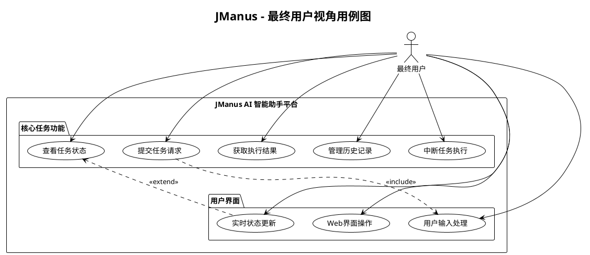
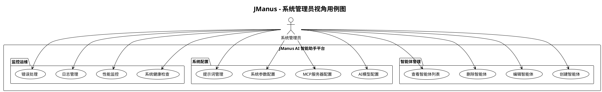
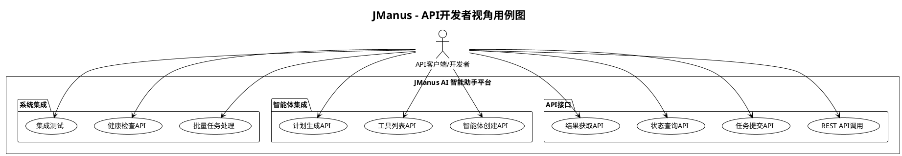

# JManus AI 智能助手平台 - 用例图 (Use Case Diagram)

本文档展示 JManus AI 智能助手平台的用例图，描述系统与外部角色（用户、系统）的交互关系，便于需求分析和系统理解。

## 文档说明

**使用场景**: 展示系统与外部角色（用户、系统）交互  
**应用阶段**: 需求分析  
**关键优势**: 高层次视角，便于需求讨论与确认  

## 系统总览用例图

```plantuml
@startuml
!theme plain
skinparam packageStyle rectangle
skinparam usecase {
  BackgroundColor lightblue
  BorderColor darkblue
  FontSize 11
}
skinparam actor {
  BackgroundColor lightyellow
  BorderColor darkred
  FontSize 12
}

title JManus AI 智能助手平台 - 系统用例图

' 定义外部角色
:最终用户: as EndUser
:API客户端/开发者: as APIClient
:系统管理员: as Administrator
:外部AI服务: as AIService
:外部工具系统: as ExternalTools
:数据库系统: as DatabaseSystem

' 系统边界
rectangle "JManus AI 智能助手平台" {

  ' ===== 任务执行相关用例 =====
  package "任务执行管理" {
    usecase "提交任务请求" as UC01
    usecase "查看任务执行状态" as UC02
    usecase "获取任务执行结果" as UC03
    usecase "管理任务执行历史" as UC04
    usecase "中断任务执行" as UC05
  }

  ' ===== 智能体管理相关用例 =====
  package "智能体管理" {
    usecase "创建智能体配置" as UC06
    usecase "编辑智能体配置" as UC07
    usecase "删除智能体配置" as UC08
    usecase "查看智能体列表" as UC09
    usecase "获取可用工具列表" as UC10
    usecase "动态加载智能体" as UC11
  }

  ' ===== 计划模板管理相关用例 =====
  package "计划模板管理" {
    usecase "生成执行计划" as UC12
    usecase "保存计划模板" as UC13
    usecase "管理计划版本" as UC14
    usecase "查看计划模板" as UC15
    usecase "复制计划模板" as UC16
  }

  ' ===== 模型配置管理相关用例 =====
  package "AI模型管理" {
    usecase "配置AI模型" as UC17
    usecase "验证模型连接" as UC18
    usecase "获取可用模型类型" as UC19
    usecase "管理模型参数" as UC20
    usecase "切换模型服务" as UC21
  }

  ' ===== 提示词管理相关用例 =====
  package "提示词管理" {
    usecase "创建提示词模板" as UC22
    usecase "编辑提示词" as UC23
    usecase "管理命名空间" as UC24
    usecase "渲染提示词模板" as UC25
    usecase "版本控制提示词" as UC26
  }

  ' ===== MCP集成相关用例 =====
  package "MCP协议集成" {
    usecase "配置MCP服务器" as UC27
    usecase "管理MCP连接" as UC28
    usecase "调用MCP工具" as UC29
    usecase "监控MCP状态" as UC30
    usecase "缓存MCP工具回调" as UC31
  }

  ' ===== 工具集成相关用例 =====
  package "工具生态集成" {
    usecase "执行浏览器操作" as UC32
    usecase "运行Python代码" as UC33
    usecase "执行Shell命令" as UC34
    usecase "处理表单输入" as UC35
    usecase "文件操作管理" as UC36
  }

  ' ===== 系统配置相关用例 =====
  package "系统配置管理" {
    usecase "管理系统配置" as UC37
    usecase "批量更新配置" as UC38
    usecase "查看配置分组" as UC39
    usecase "导入导出配置" as UC40
  }

  ' ===== 监控运维相关用例 =====
  package "监控运维" {
    usecase "系统健康检查" as UC41
    usecase "查看系统日志" as UC42
    usecase "性能监控" as UC43
    usecase "错误处理与恢复" as UC44
  }

  ' ===== 用户交互相关用例 =====
  package "用户交互" {
    usecase "Web界面操作" as UC45
    usecase "API接口调用" as UC46
    usecase "实时状态更新" as UC47
    usecase "用户输入处理" as UC48
  }
}

' ===== 角色与用例关系 =====

' 最终用户关系
EndUser --> UC01 : 提交任务
EndUser --> UC02 : 查看状态
EndUser --> UC03 : 获取结果
EndUser --> UC04 : 查看历史
EndUser --> UC05 : 中断任务
EndUser --> UC45 : 使用Web界面
EndUser --> UC47 : 查看实时状态
EndUser --> UC48 : 提供输入

' API客户端/开发者关系
APIClient --> UC01 : API提交任务
APIClient --> UC02 : API查询状态
APIClient --> UC03 : API获取结果
APIClient --> UC46 : 调用REST API
APIClient --> UC06 : API创建智能体
APIClient --> UC12 : API生成计划

' 系统管理员关系
Administrator --> UC06 : 管理智能体
Administrator --> UC07 : 编辑智能体
Administrator --> UC08 : 删除智能体
Administrator --> UC09 : 查看智能体
Administrator --> UC10 : 管理工具
Administrator --> UC11 : 动态加载
Administrator --> UC13 : 保存模板
Administrator --> UC14 : 版本管理
Administrator --> UC15 : 查看模板
Administrator --> UC16 : 复制模板
Administrator --> UC17 : 配置模型
Administrator --> UC18 : 验证连接
Administrator --> UC19 : 获取模型类型
Administrator --> UC20 : 管理参数
Administrator --> UC21 : 切换服务
Administrator --> UC22 : 创建提示词
Administrator --> UC23 : 编辑提示词
Administrator --> UC24 : 管理命名空间
Administrator --> UC25 : 渲染模板
Administrator --> UC26 : 版本控制
Administrator --> UC27 : 配置MCP服务器
Administrator --> UC28 : 管理MCP连接
Administrator --> UC30 : 监控MCP状态
Administrator --> UC37 : 管理系统配置
Administrator --> UC38 : 批量更新
Administrator --> UC39 : 查看配置分组
Administrator --> UC40 : 导入导出配置
Administrator --> UC41 : 健康检查
Administrator --> UC42 : 查看日志
Administrator --> UC43 : 性能监控
Administrator --> UC44 : 错误处理

' 外部AI服务关系
AIService <-- UC12 : 请求计划生成
AIService <-- UC18 : 连接验证
AIService <-- UC21 : 模型切换
AIService <-- UC25 : 提示词渲染

' 外部工具系统关系
ExternalTools <-- UC32 : 浏览器自动化
ExternalTools <-- UC33 : Python执行
ExternalTools <-- UC34 : Shell命令
ExternalTools <-- UC29 : MCP工具调用
ExternalTools <-- UC31 : 工具回调缓存
ExternalTools <-- UC36 : 文件操作

' 数据库系统关系
DatabaseSystem <-- UC04 : 存储历史
DatabaseSystem <-- UC13 : 保存模板
DatabaseSystem <-- UC14 : 版本管理
DatabaseSystem <-- UC37 : 配置管理
DatabaseSystem <-- UC42 : 日志存储

' ===== 用例间的包含和扩展关系 =====

' 包含关系
UC01 ..> UC12 : <<include>>
UC01 ..> UC11 : <<include>>
UC12 ..> UC25 : <<include>>
UC06 ..> UC10 : <<include>>
UC17 ..> UC18 : <<include>>
UC27 ..> UC28 : <<include>>

' 扩展关系
UC02 <.. UC47 : <<extend>>
UC01 <.. UC05 : <<extend>>
UC03 <.. UC44 : <<extend>>
UC29 <.. UC31 : <<extend>>

@enduml
```

## 角色视角用例图

### 1. 最终用户视角

### 2. 系统管理员视角

### 3. API开发者视角

## 用例关系说明

### 包含关系 (Include)
- **UC01 提交任务请求** 包含 **UC12 生成执行计划**：每次提交任务都需要生成执行计划
- **UC01 提交任务请求** 包含 **UC11 动态加载智能体**：需要根据任务加载相应的智能体
- **UC12 生成执行计划** 包含 **UC25 渲染提示词模板**：计划生成需要渲染提示词
- **UC06 创建智能体配置** 包含 **UC10 获取可用工具列表**：创建智能体时需要选择工具
- **UC17 配置AI模型** 包含 **UC18 验证模型连接**：配置模型后需要验证连接
- **UC27 配置MCP服务器** 包含 **UC28 管理MCP连接**：配置MCP服务器需要管理连接

### 扩展关系 (Extend)
- **UC47 实时状态更新** 扩展 **UC02 查看任务执行状态**：在查看状态基础上提供实时更新
- **UC05 中断任务执行** 扩展 **UC01 提交任务请求**：在任务执行过程中可以中断
- **UC44 错误处理与恢复** 扩展 **UC03 获取任务执行结果**：结果获取失败时的处理
- **UC31 缓存MCP工具回调** 扩展 **UC29 调用MCP工具**：为提高性能而扩展的缓存功能

## 核心业务价值

### 对最终用户
- **简单易用**：通过自然语言提交任务，无需技术背景
- **可视化反馈**：实时查看任务执行状态和进度
- **结果获取**：清晰获得任务处理结果
- **历史管理**：方便查看和管理过往任务

### 对开发者
- **完整API**：REST API支持程序化调用
- **灵活配置**：可编程的智能体和模型配置
- **标准集成**：标准化的系统集成方式
- **批量处理**：支持大规模任务自动化

### 对系统管理员
- **全面管理**：智能体、模型、提示词等全方位配置
- **监控运维**：完善的系统监控和运维功能
- **可扩展性**：支持动态扩展工具和服务

---

**文档版本**: 1.0  
**创建日期**: 2025年1月  
**用例总数**: 48个核心用例  
**外部角色**: 6个主要角色  
**建模工具**: PlantUML