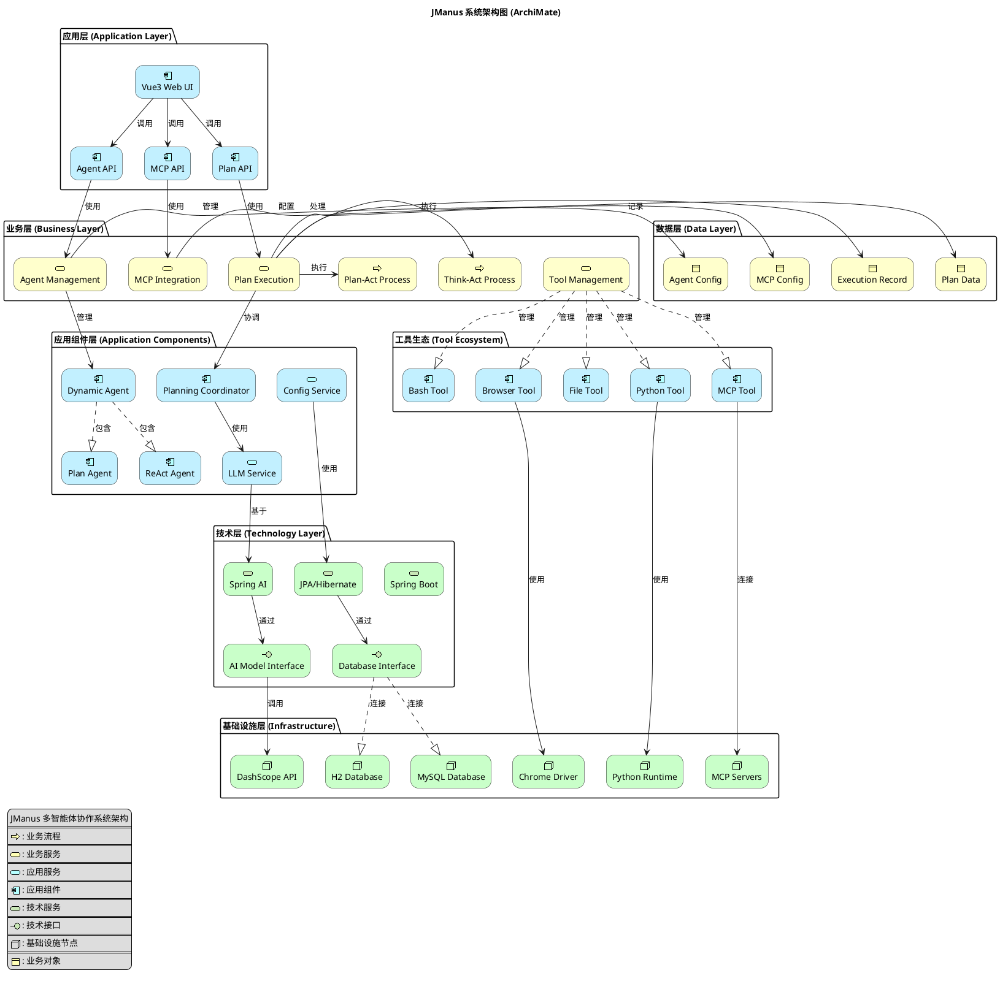

# JManus Architecture - ArchiMate Diagram

本文档使用 PlantUML ArchiMate 图表展示 JManus 系统的整体架构设计。

## 系统架构概述

JManus 是一个基于 Spring Boot 的多智能体协作系统，采用分层架构设计，支持 Plan-Act 模式执行和 MCP 协议集成。

## ArchiMate 架构图

## 架构层次说明

### 1. 应用层 (Application Layer)
- **Vue3 Web UI**: 提供用户友好的图形界面，支持智能体配置、MCP管理和执行监控
- **REST API**: 提供标准化的HTTP接口，包括智能体管理、MCP服务管理和计划执行

### 2. 业务层 (Business Layer)  
- **Agent Management**: 智能体的创建、配置、更新和删除管理
- **Plan Execution**: 支持Plan-Act和Think-Act两种执行模式
- **MCP Integration**: 集成外部服务，支持SSE、STUDIO、STREAMING连接类型
- **Tool Management**: 工具注册、调用和生命周期管理

### 3. 应用组件层 (Application Components)
- **Dynamic Agent**: 可配置的智能体，支持运行时修改
- **ReAct Agent**: 基于思考-行动循环的反应式智能体  
- **Plan Agent**: 先制定计划再执行的计划式智能体
- **Planning Coordinator**: 协调整个执行流程

### 4. 技术层 (Technology Layer)
- **Spring Boot**: 应用框架和依赖注入容器
- **JPA/Hibernate**: 对象关系映射和数据持久化
- **Spring AI**: AI模型集成和抽象层

### 5. 基础设施层 (Infrastructure)
- **数据库**: 支持H2、MySQL、PostgreSQL多种数据库
- **AI服务**: 集成DashScope、OpenAI等大语言模型服务
- **外部工具**: Chrome浏览器、Python运行时、MCP服务器等

### 6. 工具生态系统 (Tool Ecosystem)
- **Browser Tool**: 网页浏览和操作
- **Python Tool**: Python代码执行
- **Bash Tool**: Shell命令执行
- **File Tool**: 文件读写操作
- **MCP Tool**: 外部服务集成

## 关键特性

### 🎯 Plan-Act 模式
系统支持两种执行模式：
- **Think-Act**: 思考-行动循环，适合探索性任务
- **Plan-Act**: 先制定详细计划再执行，提供更高的确定性

### 🔗 MCP 协议支持
原生支持Model Context Protocol (MCP)：
- **SSE连接**: Server-Sent Events流式连接
- **STUDIO连接**: 本地STDIO连接  
- **STREAMING连接**: 流式数据传输

### 🛠️ 动态配置
- 智能体可通过Web界面动态配置
- 工具可热插拔，支持运行时添加/移除
- 支持多命名空间隔离

### 📊 监控和日志
- 完整的执行记录和审计日志
- 实时性能监控和告警
- 分层的错误处理和恢复机制

## 部署选项

### 数据库支持
- **H2**: 嵌入式数据库，适合开发和测试
- **MySQL**: 生产环境推荐
- **PostgreSQL**: 企业级应用支持

### AI模型集成
- **DashScope**: 阿里云大模型服务
- **OpenAI**: GPT系列模型
- **可扩展**: 支持其他兼容的AI服务

---

**文档版本**: 1.0  
**创建日期**: 2025年1月  
**参考**: [PlantUML ArchiMate Documentation](https://plantuml.com/en/archimate-diagram)