# JManus 系统整体架构图

本文档使用 ArchiMate 建模标准展示 JManus 系统的整体架构，涵盖业务需求、应用服务、应用组件和技术组件之间的关系。

## 架构图

```plantuml
@startuml
skinparam rectangle<<behavior>> {
	roundCorner 25
}
skinparam packageStyle rectangle
skinparam linetype ortho
skinparam ranksep 80
skinparam nodesep 60

' 定义 Archimate sprites
sprite $bProcess jar:archimate/business-process
sprite $bService jar:archimate/business-service
sprite $aService jar:archimate/application-service
sprite $aComponent jar:archimate/application-component
sprite $tService jar:archimate/technology-service
sprite $tInterface jar:archimate/technology-interface
sprite $node jar:archimate/node
sprite $businessObject jar:archimate/business-object

title JManus 系统架构图 - AI 智能助手平台

' ===== 用户接口层 =====
package "用户接口层 (Presentation Layer)" #LightBlue {
  rectangle "Vue3 Web UI" as web_ui <<$aComponent>><<behavior>> #Application
  rectangle "REST API Gateway" as api_gateway <<$aComponent>><<behavior>> #Application
  
  web_ui -[hidden]right- api_gateway
}

' ===== API控制器层 =====
package "API控制器层 (Controller Layer)" #LightGreen {
  rectangle "Agent Controller" as agent_controller <<$aComponent>><<behavior>> #Application
  rectangle "Plan Template Controller" as plan_controller <<$aComponent>><<behavior>> #Application
  rectangle "MCP Controller" as mcp_controller <<$aComponent>><<behavior>> #Application
  rectangle "Model Controller" as model_controller <<$aComponent>><<behavior>> #Application
  
  agent_controller -[hidden]right- plan_controller
  plan_controller -[hidden]right- mcp_controller
  mcp_controller -[hidden]right- model_controller
  
  rectangle "Prompt Controller" as prompt_controller <<$aComponent>><<behavior>> #Application
  rectangle "Config Controller" as config_controller <<$aComponent>><<behavior>> #Application
  rectangle "Manus Controller" as manus_controller <<$aComponent>><<behavior>> #Application
  
  prompt_controller -[hidden]right- config_controller
  config_controller -[hidden]right- manus_controller
}

' ===== 业务服务层 =====  
package "业务服务层 (Business Service Layer)" #LightYellow {
  rectangle "Agent Service" as agent_service <<$bService>><<behavior>> #Business
  rectangle "Plan Template Service" as plan_service <<$bService>><<behavior>> #Business
  rectangle "MCP Service" as mcp_service <<$bService>><<behavior>> #Business
  rectangle "Model Service" as model_service <<$bService>><<behavior>> #Business
  
  agent_service -[hidden]right- plan_service
  plan_service -[hidden]right- mcp_service
  mcp_service -[hidden]right- model_service
  
  rectangle "Prompt Service" as prompt_service <<$bService>><<behavior>> #Business
  rectangle "User Input Service" as user_input_service <<$bService>><<behavior>> #Business
  rectangle "Config Service" as config_service <<$bService>><<behavior>> #Business
  
  prompt_service -[hidden]right- user_input_service
  user_input_service -[hidden]right- config_service
}

' ===== 核心组件层 =====
package "核心组件层 (Core Components)" #LightCyan {
  rectangle "Planning Coordinator" as coordinator <<$aComponent>><<behavior>> #Application
  rectangle "Plan Creator" as plan_creator <<$aComponent>><<behavior>> #Application
  rectangle "Plan Executor" as plan_executor <<$aComponent>><<behavior>> #Application
  
  coordinator -[hidden]right- plan_creator
  plan_creator -[hidden]right- plan_executor
  
  rectangle "Dynamic Agent" as dynamic_agent <<$aComponent>><<behavior>> #Application
  rectangle "Dynamic Agent Loader" as agent_loader <<$aComponent>><<behavior>> #Application
  rectangle "LLM Service" as llm_service <<$aService>><<behavior>> #Application
  rectangle "Plan Execution Recorder" as execution_recorder <<$aComponent>><<behavior>> #Application
  
  dynamic_agent -[hidden]right- agent_loader
  agent_loader -[hidden]right- llm_service
  llm_service -[hidden]right- execution_recorder
}

' ===== 工具生态层 =====
package "工具生态层 (Tool Ecosystem)" #LightSalmon {
  rectangle "Browser Tool" as browser_tool <<$aComponent>><<behavior>> #Application
  rectangle "Python Execute Tool" as python_tool <<$aComponent>><<behavior>> #Application
  rectangle "Bash Tool" as bash_tool <<$aComponent>><<behavior>> #Application
  
  browser_tool -[hidden]right- python_tool
  python_tool -[hidden]right- bash_tool
  
  rectangle "Planning Tool" as planning_tool <<$aComponent>><<behavior>> #Application
  rectangle "Form Input Tool" as form_tool <<$aComponent>><<behavior>> #Application
  rectangle "MCP Tool Integration" as mcp_tool <<$aComponent>><<behavior>> #Application
  
  planning_tool -[hidden]right- form_tool
  form_tool -[hidden]right- mcp_tool
}

' ===== 左侧：技术支撑层 =====
package "技术支撑层 (Technology Layer)" #LightGray {
  rectangle "Spring Boot Framework" as spring_boot <<$tService>><<behavior>> #Technology
  rectangle "Spring AI Framework" as spring_ai <<$tService>><<behavior>> #Technology
  
  spring_boot -[hidden]down- spring_ai
  
  rectangle "JPA/Hibernate" as jpa <<$tService>><<behavior>> #Technology
  rectangle "Vite Dev Server" as vite <<$tService>><<behavior>> #Technology
  
  jpa -[hidden]down- vite
  
  rectangle "Database Interface" as db_interface <<$tInterface>><<behavior>> #Technology
  rectangle "AI Model Interface" as ai_interface <<$tInterface>><<behavior>> #Technology
  
  db_interface -[hidden]down- ai_interface
}

' ===== 右侧：数据层 =====
package "数据层 (Data Layer)" #LightPink {
  rectangle "Agent Config" as agent_config <<$businessObject>><<behavior>> #Business
  rectangle "Plan Template" as plan_template <<$businessObject>><<behavior>> #Business
  
  agent_config -[hidden]down- plan_template
  
  rectangle "Execution Context" as exec_context <<$businessObject>><<behavior>> #Business
  rectangle "MCP Config" as mcp_config <<$businessObject>><<behavior>> #Business
  
  exec_context -[hidden]down- mcp_config
  
  rectangle "Model Config" as model_config <<$businessObject>><<behavior>> #Business
  rectangle "Prompt Config" as prompt_config <<$businessObject>><<behavior>> #Business
  
  model_config -[hidden]down- prompt_config
}

' ===== 基础设施层 =====
package "基础设施层 (Infrastructure)" #LightSteelBlue {
  rectangle "H2 Database" as h2_db <<$node>><<behavior>> #Technology
  rectangle "MySQL Database" as mysql_db <<$node>><<behavior>> #Technology
  rectangle "PostgreSQL Database" as postgres_db <<$node>><<behavior>> #Technology
  
  h2_db -[hidden]right- mysql_db
  mysql_db -[hidden]right- postgres_db
  
  rectangle "DashScope API" as dashscope <<$node>><<behavior>> #Technology
  rectangle "OpenAI API" as openai <<$node>><<behavior>> #Technology
  rectangle "MCP Servers" as mcp_servers <<$node>><<behavior>> #Technology
  
  dashscope -[hidden]right- openai
  openai -[hidden]right- mcp_servers
  
  rectangle "Chrome Browser" as chrome <<$node>><<behavior>> #Technology
  rectangle "Python Runtime" as python_env <<$node>><<behavior>> #Technology
  
  chrome -[hidden]right- python_env
}

' ===== 关系定义 =====

' 用户接口层关系
web_ui -down-> api_gateway : "调用"

' API控制器层关系  
api_gateway -down-> agent_controller : "路由"
api_gateway -down-> plan_controller : "路由"
api_gateway -down-> mcp_controller : "路由"
api_gateway -down-> model_controller : "路由"
api_gateway -down-> prompt_controller : "路由"
api_gateway -down-> config_controller : "路由"
api_gateway -down-> manus_controller : "路由"

' 控制器到服务层关系
agent_controller -down-> agent_service : "调用"
plan_controller -down-> plan_service : "调用"
mcp_controller -down-> mcp_service : "调用"
model_controller -down-> model_service : "调用"
prompt_controller -down-> prompt_service : "调用"
config_controller -down-> config_service : "调用"
manus_controller -down-> coordinator : "调用"

' 服务层到核心组件关系
plan_service -down-> coordinator : "使用"
coordinator -down-> plan_creator : "协调"
coordinator -down-> plan_executor : "协调"
plan_executor -down-> dynamic_agent : "执行"
agent_service -down-> agent_loader : "使用"
agent_loader -down-> dynamic_agent : "加载"
plan_creator -down-> llm_service : "使用"
dynamic_agent -down-> llm_service : "使用"
plan_executor -down-> execution_recorder : "记录"

' 核心组件到工具层关系
dynamic_agent -down-> browser_tool : "使用"
dynamic_agent -down-> python_tool : "使用"  
dynamic_agent -down-> bash_tool : "使用"
plan_creator -down-> planning_tool : "使用"
user_input_service -down-> form_tool : "使用"
mcp_service -down-> mcp_tool : "集成"

' 技术支撑关系
spring_boot .up.> api_gateway : "支撑"
spring_ai .up.> llm_service : "支撑"
jpa .up.> agent_service : "支撑"
jpa .up.> plan_service : "支撑"
jpa .up.> mcp_service : "支撑"
jpa .up.> model_service : "支撑"
jpa .up.> prompt_service : "支撑"
vite .up.> web_ui : "支撑"

' 基础设施连接
db_interface .down.|> h2_db : "连接"
db_interface .down.|> mysql_db : "连接"
db_interface .down.|> postgres_db : "连接"
ai_interface -down-> dashscope : "调用"
ai_interface -down-> openai : "调用"
browser_tool -down-> chrome : "使用"
python_tool -down-> python_env : "使用"
mcp_tool -down-> mcp_servers : "连接"

' 数据访问关系
agent_service -right-> agent_config : "管理"
plan_service -right-> plan_template : "管理"
coordinator -right-> exec_context : "管理"
mcp_service -right-> mcp_config : "管理"
model_service -right-> model_config : "管理"
prompt_service -right-> prompt_config : "管理"

' 接口连接
jpa -down-> db_interface : "通过"
llm_service -down-> ai_interface : "通过"

legend right
JManus AI 智能助手平台架构
====
<$bProcess> : 业务流程
====
<$bService> : 业务服务
====
<$aService> : 应用服务
====
<$aComponent> : 应用组件
====
<$tService> : 技术服务
====
<$tInterface> : 技术接口
====
<$node> : 基础设施节点
====
<$businessObject> : 业务对象
endlegend

@enduml
```

## 架构层次说明

### 1. 业务需求层 (Motivation Layer)

**核心业务需求**：
- **智能AI助手服务**：为用户提供智能化的任务处理和问答服务
- **任务自动化执行**：支持复杂任务的自动分解和执行
- **自然语言交互**：提供友好的自然语言用户界面
- **多模态工具集成**：集成浏览器、文件操作等多种工具

### 2. 应用服务层 (Application Services)

**核心应用服务**：
- **用户界面服务**：提供Web界面和API接口
- **任务规划服务**：智能分析用户需求并生成执行计划
- **任务执行服务**：协调执行计划中的各个步骤
- **AI推理服务**：提供大语言模型推理能力
- **数据管理服务**：管理执行历史和配置数据
- **工具集成服务**：集成外部工具和服务

### 3. 应用组件层 (Application Components)

**前端组件**：
- **Vue3 前端应用**：基于Vue3的现代化用户界面
- **Spring Boot API 网关**：提供REST API服务

**核心业务组件**：
- **规划协调器 (PlanningCoordinator)**：协调整个任务执行流程
- **计划创建器 (PlanCreator)**：基于LLM生成智能执行计划
- **计划执行器 (PlanExecutor)**：执行具体的计划步骤
- **动态智能体 (DynamicAgent)**：可配置的任务执行智能体

**AI服务组件**：
- **大语言模型服务**：封装LLM调用逻辑
- **DashScope API**：阿里云通义千问API集成

**工具集成组件**：
- **浏览器工具**：自动化浏览器操作
- **MCP 协议集成**：Model Context Protocol集成

### 4. 技术组件层 (Technology Layer)

**开发和运行时技术**：
- **Vite 开发服务器**：前端开发和构建工具
- **Spring Boot 框架**：后端应用框架
- **Spring AI 框架**：AI集成框架
- **数据库系统**：持久化存储（H2/MySQL/PostgreSQL）
- **Chrome 浏览器**：浏览器自动化基础
- **Playwright 自动化**：浏览器自动化工具

### 5. 数据对象 (Business Objects)

**核心数据实体**：
- **执行上下文 (ExecutionContext)**：任务执行过程中的状态数据
- **计划记录 (PlanRecord)**：任务计划和执行历史
- **智能体配置 (AgentConfig)**：智能体的配置信息

## 架构特点

### 1. 分层架构
- **清晰的层次结构**：从业务需求到技术实现的完整映射
- **关注点分离**：每层专注于特定的架构关注点
- **灵活扩展**：支持在各层独立演进和扩展

### 2. 微服务风格
- **松耦合设计**：组件间通过明确的接口交互
- **单一职责**：每个组件专注于特定功能
- **可替换性**：支持组件的独立替换和升级

### 3. AI优先设计
- **LLM驱动**：核心逻辑由大语言模型智能决策
- **智能体架构**：基于智能体的任务执行模式
- **自适应能力**：根据任务复杂度动态选择执行策略

### 4. 工具生态
- **开放集成**：支持多种外部工具的集成
- **标准协议**：采用MCP等标准协议确保互操作性
- **扩展能力**：便于添加新的工具和服务

## 关键技术决策

### 1. 前后端分离
- **Vue3 + Spring Boot**：现代化的前后端技术栈
- **RESTful API**：标准的HTTP接口设计
- **异步处理**：支持长时间运行的任务

### 2. AI框架选择
- **Spring AI**：简化AI服务集成
- **DashScope API**：提供强大的LLM能力
- **多模型支持**：支持不同的AI模型和服务

### 3. 数据持久化
- **JPA/Hibernate**：对象关系映射
- **多数据库支持**：H2、MySQL、PostgreSQL
- **事务管理**：确保数据一致性

### 4. 自动化工具
- **Playwright**：现代化的浏览器自动化
- **Chrome DevTools**：深度浏览器集成
- **跨平台支持**：支持多种操作系统

---

**文档版本**: 1.0  
**创建日期**: 2025年1月  
**架构标准**: ArchiMate 3.1  
**建模工具**: PlantUML + ArchiMate