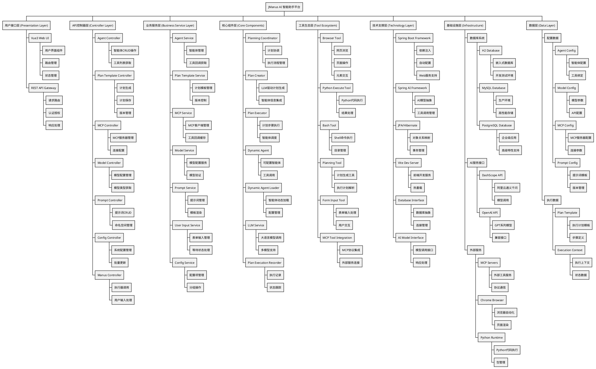

# JManus 核心组件分解结构

本文档使用 PlantUML WBS（工作分解结构图）展示 JManus 系统的核心组件层次结构，按照分层架构进行组件分解。

## 组件分解结构图

## 组件层次说明

### 🎯 架构分层概述

JManus 采用8层分层架构设计，每层职责明确，组件边界清晰：

1. **用户接口层** - 提供用户交互界面和API网关
2. **API控制器层** - 处理HTTP请求，实现RESTful接口
3. **业务服务层** - 封装业务逻辑，提供服务接口
4. **核心组件层** - 实现核心功能，包括规划、执行、智能体等
5. **工具生态层** - 提供各种工具集成，支持多模态操作
6. **技术支撑层** - 提供技术框架和接口抽象
7. **基础设施层** - 提供底层资源和外部服务
8. **数据层** - 管理系统数据和配置信息

### 🔧 核心组件特点

#### **智能体系统**
- **Dynamic Agent**: 支持运行时配置的智能体
- **Agent Loader**: 动态加载和管理智能体实例
- **Agent Service**: 提供智能体生命周期管理

#### **规划执行系统**
- **Plan Creator**: 基于LLM生成智能执行计划
- **Plan Executor**: 协调执行计划中的各个步骤
- **Planning Coordinator**: 统一协调规划和执行流程

#### **工具集成生态**
- **多工具支持**: 浏览器、Python、Bash、MCP等
- **统一接口**: 标准化工具调用和结果处理
- **可扩展性**: 支持新工具类型的快速集成

#### **数据管理体系**
- **配置管理**: 智能体、模型、提示词等配置
- **执行记录**: 完整的执行历史和状态跟踪
- **版本控制**: 支持配置和计划的版本管理

### 🚀 技术优势

1. **分层解耦**: 清晰的层次边界，便于维护和扩展
2. **组件化设计**: 高内聚低耦合的组件结构
3. **标准接口**: 统一的服务接口和数据格式
4. **可扩展性**: 支持新功能和工具的快速集成
5. **可观测性**: 完整的执行记录和状态监控

---

**文档版本**: 1.0  
**创建日期**: 2025年1月  
**更新日期**: 2025年1月  
**建模工具**: PlantUML WBS