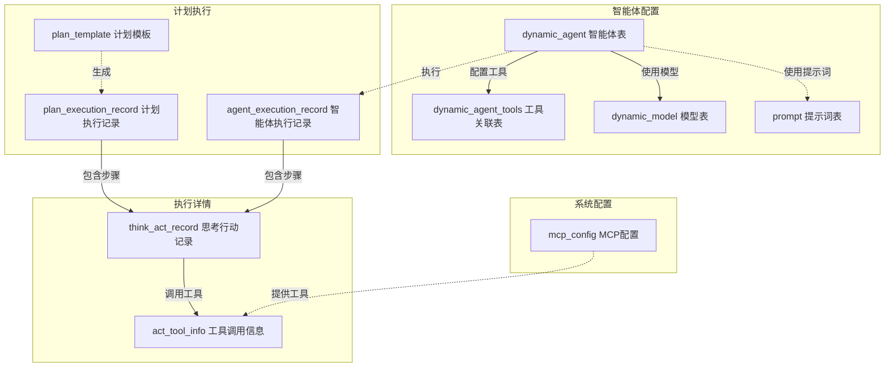
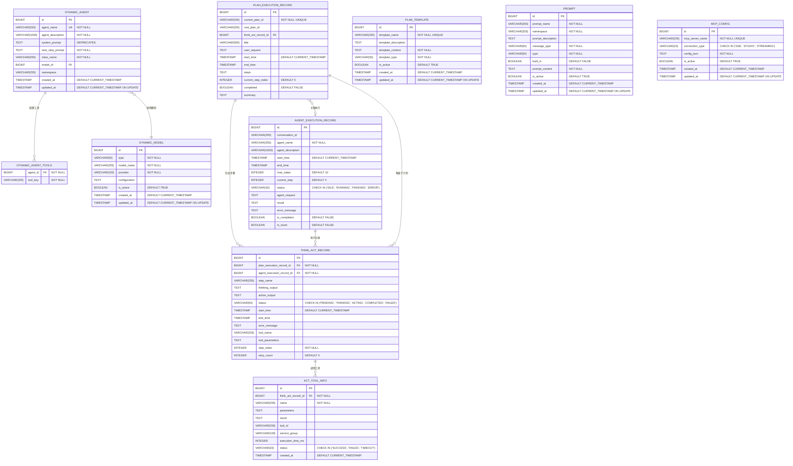

# JManus 数据库设计文档

## 1. 概述

Spring AI Alibaba JManus 系统采用JPA/Hibernate作为ORM框架，支持H2、MySQL、PostgreSQL等多种数据库。本文档详细描述了系统的数据库表结构和关系设计。

## 2. 数据库配置

### 2.1 支持的数据库类型

| 数据库类型 | 驱动 | 方言 | 配置文件 |
|-----------|------|------|----------|
| H2 | org.h2.Driver | org.hibernate.dialect.H2Dialect | application-h2.yml |
| MySQL | com.mysql.cj.jdbc.Driver | org.hibernate.dialect.MySQLDialect | application-mysql.yml |
| PostgreSQL | org.postgresql.Driver | org.hibernate.dialect.PostgreSQLDialect | application-postgres.yml |

### 2.2 连接配置示例

#### H2数据库配置
```yaml
spring:
  datasource:
    url: jdbc:h2:file:./h2-data/openmanus_db;MODE=MYSQL;DATABASE_TO_LOWER=TRUE
    driver-class-name: org.h2.Driver
    username: sa
    password: $FSD#@!@#!#$!12341234
  h2:
    console:
      enabled: true
      path: /h2-console
```

#### MySQL数据库配置
```yaml
spring:
  datasource:
    url: jdbc:mysql://your-mysql-host:3306/openmanus_db?serverTimezone=UTC&useUnicode=true&characterEncoding=utf8
    driver-class-name: com.mysql.cj.jdbc.Driver
    username: your_mysql_username
    password: your_mysql_password
```

#### PostgreSQL数据库配置
```yaml
spring:
  datasource:
    url: jdbc:postgresql://localhost:5432/openmanus_db
    driver-class-name: org.postgresql.Driver
    username: postgres
    password: 123456
```

## 3. 核心数据表

### 3.0 表清单概览

#### 3.0.1 数据表清单

| 序号 | 表名 | 中文名称 | 主要用途 | 关键字段 |
|------|------|----------|----------|----------|
| 1 | dynamic_agent | 动态智能体表 | 存储可配置的智能体定义 | id, agent_name, agent_description |
| 2 | dynamic_agent_tools | 智能体工具关联表 | 存储智能体与工具的关联关系 | agent_id, tool_key |
| 3 | dynamic_model | 动态模型表 | 存储AI模型配置信息 | id, model_name, provider |
| 4 | plan_execution_record | 计划执行记录表 | 记录计划执行的完整过程 | id, current_plan_id, user_request |
| 5 | plan_template | 计划模板表 | 存储可复用的计划模板 | id, template_name, template_content |
| 6 | agent_execution_record | 智能体执行记录表 | 记录智能体的执行过程 | id, agent_name, conversation_id |
| 7 | think_act_record | 思考-行动记录表 | 记录智能体的思考和行动细节 | id, thinking_output, action_output |
| 8 | act_tool_info | 行动工具信息表 | 记录工具调用的详细信息 | id, name, parameters, result |
| 9 | prompt | 提示词表 | 存储系统提示词和模板 | id, prompt_name, prompt_content |
| 10 | mcp_config | MCP配置表 | 存储MCP服务器配置信息 | id, mcp_server_name, connection_type |

#### 3.0.2 表关系清单

| 关系类型 | 主表 | 从表 | 关系描述 | 外键字段 |
|----------|------|------|----------|----------|
| 一对多 | dynamic_agent | dynamic_agent_tools | 一个智能体可以配置多个工具 | agent_id |
| 多对一 | dynamic_agent | dynamic_model | 多个智能体可以使用同一个模型 | model_id |
| 一对多 | plan_execution_record | think_act_record | 一个计划包含多个思考-行动步骤 | plan_execution_record_id |
| 一对多 | agent_execution_record | think_act_record | 一个智能体执行包含多个思考-行动步骤 | agent_execution_record_id |
| 一对多 | think_act_record | act_tool_info | 一个思考-行动可以调用多个工具 | think_act_record_id |
| 多对多 | plan_execution_record | agent_execution_record | 计划执行与智能体执行可以多对多关联 | 通过conversation_id关联 |
| 一对多 | think_act_record | plan_execution_record | 思考-行动记录可以触发子计划 | think_act_record_id |

#### 3.0.3 核心业务流程表关系



### 3.1 动态智能体相关表

#### 3.1.1 dynamic_agent (动态智能体表)

| 字段名 | 类型 | 约束 | 描述 |
|--------|------|------|------|
| id | BIGINT | PK, AUTO_INCREMENT | 主键ID |
| agent_name | VARCHAR(255) | NOT NULL, UNIQUE | 智能体名称，唯一标识 |
| agent_description | VARCHAR(1000) | NOT NULL | 智能体描述 |
| system_prompt | TEXT | NULLABLE, DEPRECATED | 系统提示词（已废弃） |
| next_step_prompt | TEXT | NOT NULL | 下一步执行提示词 |
| class_name | VARCHAR(255) | NOT NULL | 智能体实现类名 |
| model_id | BIGINT | FK | 关联的AI模型ID |
| namespace | VARCHAR(255) | NULLABLE | 命名空间 |
| created_at | TIMESTAMP | DEFAULT CURRENT_TIMESTAMP | 创建时间 |
| updated_at | TIMESTAMP | DEFAULT CURRENT_TIMESTAMP ON UPDATE | 更新时间 |

**JPA实体类**：
```java
@Entity
@Table(name = "dynamic_agent")
public class DynamicAgentEntity {
    @Id
    @GeneratedValue(strategy = GenerationType.IDENTITY)
    private Long id;
    
    @Column(nullable = false, unique = true)
    private String agentName;
    
    @Column(nullable = false, length = 1000)
    private String agentDescription;
    
    @Column(nullable = true, length = 40000)
    @Deprecated
    private String systemPrompt = "";
    
    @Column(nullable = false, length = 40000)
    private String nextStepPrompt;
    
    @ElementCollection(fetch = FetchType.EAGER)
    @CollectionTable(name = "dynamic_agent_tools", joinColumns = @JoinColumn(name = "agent_id"))
    @Column(name = "tool_key")
    private List<String> availableToolKeys;
    
    @Column(nullable = false)
    private String className;
    
    @ManyToOne(fetch = FetchType.EAGER)
    @JoinColumn(name = "model_id")
    private DynamicModelEntity model;
    
    @Column(nullable = true)
    private String namespace;
}
```

#### 3.1.2 dynamic_agent_tools (智能体工具关联表)

| 字段名 | 类型 | 约束 | 描述 |
|--------|------|------|------|
| agent_id | BIGINT | FK, NOT NULL | 智能体ID |
| tool_key | VARCHAR(255) | NOT NULL | 工具键名 |

**关系说明**：该表通过@ElementCollection注解自动生成，用于存储智能体可用的工具列表。

#### 3.1.3 dynamic_model (动态模型表)

| 字段名 | 类型 | 约束 | 描述 |
|--------|------|------|------|
| id | BIGINT | PK, AUTO_INCREMENT | 主键ID |
| type | VARCHAR(50) | NOT NULL | 模型类型 |
| model_name | VARCHAR(255) | NOT NULL | 模型名称 |
| provider | VARCHAR(100) | NOT NULL | 模型提供商 |
| configuration | TEXT | NULLABLE | 模型配置JSON |
| is_active | BOOLEAN | DEFAULT TRUE | 是否激活 |
| created_at | TIMESTAMP | DEFAULT CURRENT_TIMESTAMP | 创建时间 |
| updated_at | TIMESTAMP | DEFAULT CURRENT_TIMESTAMP ON UPDATE | 更新时间 |

### 3.2 计划执行相关表

#### 3.2.1 plan_execution_record (计划执行记录表)

| 字段名 | 类型 | 约束 | 描述 |
|--------|------|------|------|
| id | BIGINT | PK, AUTO_INCREMENT | 主键ID |
| current_plan_id | VARCHAR(255) | NOT NULL, UNIQUE | 当前计划唯一标识 |
| root_plan_id | VARCHAR(255) | NULLABLE | 根计划ID（用于子计划） |
| think_act_record_id | BIGINT | FK, NULLABLE | 触发该子计划的思考-行动记录ID |
| title | VARCHAR(500) | NULLABLE | 计划标题 |
| user_request | TEXT | NULLABLE | 用户原始请求 |
| start_time | TIMESTAMP | DEFAULT CURRENT_TIMESTAMP | 执行开始时间 |
| end_time | TIMESTAMP | NULLABLE | 执行结束时间 |
| steps | TEXT | NULLABLE | 计划步骤列表（JSON格式） |
| current_step_index | INTEGER | DEFAULT 0 | 当前执行步骤索引 |
| completed | BOOLEAN | DEFAULT FALSE | 是否完成 |
| summary | TEXT | NULLABLE | 执行摘要 |

**JPA实体类**：
```java
@Entity
@Table(name = "plan_execution_record")
public class PlanExecutionRecord {
    @Id
    @GeneratedValue(strategy = GenerationType.IDENTITY)
    private Long id;
    
    private String currentPlanId;
    private String rootPlanId;
    private Long thinkActRecordId;
    private String title;
    private String userRequest;
    
    @JsonSerialize(using = LocalDateTimeSerializer.class)
    @JsonDeserialize(using = LocalDateTimeDeserializer.class)
    private LocalDateTime startTime;
    
    @JsonSerialize(using = LocalDateTimeSerializer.class)
    @JsonDeserialize(using = LocalDateTimeDeserializer.class)
    private LocalDateTime endTime;
    
    private List<String> steps;
    private Integer currentStepIndex;
    private boolean completed;
    private String summary;
    private List<AgentExecutionRecord> agentExecutionSequence;
}
```

#### 3.2.2 plan_template (计划模板表)

| 字段名 | 类型 | 约束 | 描述 |
|--------|------|------|------|
| id | BIGINT | PK, AUTO_INCREMENT | 主键ID |
| template_name | VARCHAR(255) | NOT NULL, UNIQUE | 模板名称 |
| template_description | TEXT | NULLABLE | 模板描述 |
| template_content | TEXT | NOT NULL | 模板内容 |
| template_type | VARCHAR(50) | NOT NULL | 模板类型 |
| is_active | BOOLEAN | DEFAULT TRUE | 是否激活 |
| created_at | TIMESTAMP | DEFAULT CURRENT_TIMESTAMP | 创建时间 |
| updated_at | TIMESTAMP | DEFAULT CURRENT_TIMESTAMP ON UPDATE | 更新时间 |

**JPA实体类**：
```java
@Entity
@Table(name = "plan_template")
public class PlanTemplate {
    @Id
    @GeneratedValue(strategy = GenerationType.IDENTITY)
    private Long id;
    
    @Column(nullable = false, unique = true)
    private String templateName;
    
    private String templateDescription;
    
    @Column(nullable = false)
    private String templateContent;
    
    @Column(nullable = false)
    private String templateType;
    
    private Boolean isActive = true;
    private LocalDateTime createdAt;
    private LocalDateTime updatedAt;
}
```

### 3.3 智能体执行记录表

#### 3.3.1 agent_execution_record (智能体执行记录表)

| 字段名 | 类型 | 约束 | 描述 |
|--------|------|------|------|
| id | BIGINT | PK, AUTO_INCREMENT | 主键ID |
| conversation_id | VARCHAR(255) | NULLABLE | 对话唯一标识 |
| agent_name | VARCHAR(255) | NOT NULL | 智能体名称 |
| agent_description | VARCHAR(1000) | NULLABLE | 智能体描述 |
| start_time | TIMESTAMP | DEFAULT CURRENT_TIMESTAMP | 执行开始时间 |
| end_time | TIMESTAMP | NULLABLE | 执行结束时间 |
| max_steps | INTEGER | DEFAULT 10 | 最大执行步数 |
| current_step | INTEGER | DEFAULT 0 | 当前执行步数 |
| status | VARCHAR(20) | CHECK IN ('IDLE', 'RUNNING', 'FINISHED', 'ERROR') | 执行状态 |
| agent_request | TEXT | NULLABLE | 智能体输入请求 |
| result | TEXT | NULLABLE | 执行结果 |
| error_message | TEXT | NULLABLE | 错误信息 |
| is_completed | BOOLEAN | DEFAULT FALSE | 是否完成 |
| is_stuck | BOOLEAN | DEFAULT FALSE | 是否卡住 |

**JPA实体类**：
```java
@Entity
@Table(name = "agent_execution_record")
public class AgentExecutionRecord {
    @Id
    @GeneratedValue(strategy = GenerationType.IDENTITY)
    private Long id;
    
    private String conversationId;
    private String agentName;
    private String agentDescription;
    private LocalDateTime startTime;
    private LocalDateTime endTime;
    private Integer maxSteps;
    private Integer currentStep;
    private String status;
    private String agentRequest;
    private String result;
    private String errorMessage;
    private Boolean isCompleted;
    private Boolean isStuck;
    
    @OneToMany(mappedBy = "agentExecutionRecord", cascade = CascadeType.ALL)
    private List<ThinkActRecord> thinkActSteps = new ArrayList<>();
}
```

#### 3.3.2 think_act_record (思考-行动记录表)

| 字段名 | 类型 | 约束 | 描述 |
|--------|------|------|------|
| id | BIGINT | PK, AUTO_INCREMENT | 主键ID |
| plan_execution_record_id | BIGINT | FK, NOT NULL | 关联的计划执行记录ID |
| agent_execution_record_id | BIGINT | FK, NOT NULL | 关联的智能体执行记录ID |
| step_name | VARCHAR(255) | NULLABLE | 步骤名称 |
| thinking_output | TEXT | NULLABLE | 思考输出 |
| action_output | TEXT | NULLABLE | 行动输出 |
| status | VARCHAR(50) | CHECK IN ('PENDING', 'THINKING', 'ACTING', 'COMPLETED', 'FAILED') | 状态 |
| start_time | TIMESTAMP | DEFAULT CURRENT_TIMESTAMP | 开始时间 |
| end_time | TIMESTAMP | NULLABLE | 结束时间 |
| error_message | TEXT | NULLABLE | 错误信息 |
| tool_name | VARCHAR(255) | NULLABLE | 使用的工具名称 |
| tool_parameters | TEXT | NULLABLE | 工具参数 |
| step_index | INTEGER | NOT NULL | 步骤索引 |
| retry_count | INTEGER | DEFAULT 0 | 重试次数 |

#### 3.3.3 act_tool_info (行动工具信息表)

| 字段名 | 类型 | 约束 | 描述 |
|--------|------|------|------|
| id | BIGINT | PK, AUTO_INCREMENT | 主键ID |
| think_act_record_id | BIGINT | FK, NOT NULL | 关联的思考-行动记录ID |
| name | VARCHAR(255) | NOT NULL | 工具名称 |
| parameters | TEXT | NULLABLE | 工具参数 |
| result | TEXT | NULLABLE | 执行结果 |
| tool_id | VARCHAR(255) | NULLABLE | 工具ID |
| service_group | VARCHAR(100) | NULLABLE | 服务组 |
| execution_time_ms | INTEGER | NULLABLE | 执行时间（毫秒） |
| status | VARCHAR(20) | CHECK IN ('SUCCESS', 'FAILED', 'TIMEOUT') | 执行状态 |
| created_at | TIMESTAMP | DEFAULT CURRENT_TIMESTAMP | 创建时间 |

### 3.4 提示词管理表

#### 3.4.1 prompt (提示词表)

| 字段名 | 类型 | 约束 | 描述 |
|--------|------|------|------|
| id | BIGINT | PK, AUTO_INCREMENT | 主键ID |
| prompt_name | VARCHAR(255) | NOT NULL | 提示词名称 |
| namespace | VARCHAR(255) | NOT NULL | 命名空间 |
| prompt_description | TEXT | NULLABLE | 提示词描述 |
| message_type | VARCHAR(50) | NOT NULL | 消息类型 |
| type | VARCHAR(50) | NOT NULL | 提示词类型 |
| built_in | BOOLEAN | DEFAULT FALSE | 是否内置 |
| prompt_content | TEXT | NOT NULL | 提示词内容 |
| is_active | BOOLEAN | DEFAULT TRUE | 是否激活 |
| created_at | TIMESTAMP | DEFAULT CURRENT_TIMESTAMP | 创建时间 |
| updated_at | TIMESTAMP | DEFAULT CURRENT_TIMESTAMP ON UPDATE | 更新时间 |

**唯一约束**：
- UNIQUE KEY `unique_prompt_name` (`namespace`, `prompt_name`)

### 3.5 MCP配置表

#### 3.5.1 mcp_config (MCP配置表)

| 字段名 | 类型 | 约束 | 描述 |
|--------|------|------|------|
| id | BIGINT | PK, AUTO_INCREMENT | 主键ID |
| mcp_server_name | VARCHAR(255) | NOT NULL, UNIQUE | MCP服务器名称 |
| connection_type | VARCHAR(20) | CHECK IN ('SSE', 'STUDIO', 'STREAMING') | 连接类型 |
| config_json | TEXT | NOT NULL | 配置JSON |
| is_active | BOOLEAN | DEFAULT TRUE | 是否激活 |
| created_at | TIMESTAMP | DEFAULT CURRENT_TIMESTAMP | 创建时间 |
| updated_at | TIMESTAMP | DEFAULT CURRENT_TIMESTAMP ON UPDATE | 更新时间 |

## 4. 表关系图



## 5. 索引设计

### 5.1 主要索引

| 表名 | 索引名 | 字段 | 类型 | 用途 |
|------|--------|------|------|------|
| dynamic_agent | idx_agent_name | agent_name | UNIQUE | 智能体名称唯一性 |
| dynamic_agent | idx_namespace | namespace | INDEX | 命名空间查询 |
| plan_execution_record | idx_plan_id | current_plan_id | UNIQUE | 计划ID唯一性 |
| plan_execution_record | idx_root_plan | root_plan_id | INDEX | 根计划查询 |
| agent_execution_record | idx_conversation | conversation_id | INDEX | 对话查询 |
| think_act_record | idx_plan_record | plan_execution_record_id | INDEX | 计划记录关联 |
| think_act_record | idx_agent_record | agent_execution_record_id | INDEX | 智能体记录关联 |
| prompt | idx_namespace_name | namespace, prompt_name | UNIQUE | 提示词唯一性 |
| mcp_config | idx_server_name | mcp_server_name | UNIQUE | MCP服务器名称唯一性 |

### 5.2 性能优化建议

1. **分区策略**：
   - 按时间分区：think_act_record、act_tool_info等记录表可按月份分区
   - 按命名空间分区：dynamic_agent、prompt等可按namespace分区

2. **查询优化**：
   - 为frequently查询的字段添加索引
   - 使用复合索引优化多字段查询
   - 定期清理历史执行记录

3. **数据清理**：
   - 设置执行记录的保留期限
   - 定期归档历史数据
   - 清理无效的MCP配置

## 6. 数据完整性约束

### 6.1 外键约束

1. **dynamic_agent.model_id** → **dynamic_model.id**
2. **dynamic_agent_tools.agent_id** → **dynamic_agent.id**
3. **think_act_record.plan_execution_record_id** → **plan_execution_record.id**
4. **think_act_record.agent_execution_record_id** → **agent_execution_record.id**
5. **act_tool_info.think_act_record_id** → **think_act_record.id**

### 6.2 检查约束

1. **agent_execution_record.status** ∈ ('IDLE', 'RUNNING', 'FINISHED', 'ERROR')
2. **think_act_record.status** ∈ ('PENDING', 'THINKING', 'ACTING', 'COMPLETED', 'FAILED')
3. **act_tool_info.status** ∈ ('SUCCESS', 'FAILED', 'TIMEOUT')
4. **mcp_config.connection_type** ∈ ('SSE', 'STUDIO', 'STREAMING')

### 6.3 业务规则约束

1. **智能体名称唯一性**：在同一命名空间内，智能体名称必须唯一
2. **计划ID唯一性**：current_plan_id在全局范围内必须唯一
3. **提示词唯一性**：在同一命名空间内，提示词名称必须唯一
4. **执行状态一致性**：智能体执行状态必须与相关记录状态保持一致

## 7. 数据迁移和版本控制

### 7.1 版本控制策略

- 使用Flyway或Liquibase进行数据库版本控制
- 所有DDL变更都通过迁移脚本执行
- 保持向后兼容性，避免破坏性变更

### 7.2 迁移注意事项

1. **prompt表结构变更**：
   - 旧版本使用prompt_name唯一约束
   - 新版本使用(namespace, prompt_name)联合唯一约束
   - 迁移时需要先删除旧约束，再添加新约束

2. **数据类型兼容性**：
   - 确保不同数据库之间的数据类型映射正确
   - 特别注意TEXT类型在不同数据库中的长度限制

3. **字符编码**：
   - MySQL需要设置utf8mb4字符集
   - PostgreSQL默认支持UTF-8

## 8. 监控和维护

### 8.1 性能监控

1. **查询性能**：
   - 监控慢查询日志
   - 定期分析查询执行计划
   - 优化高频查询

2. **存储监控**：
   - 监控表空间使用情况
   - 跟踪数据增长趋势
   - 预警存储容量

### 8.2 数据维护

1. **定期清理**：
   - 清理过期的执行记录
   - 归档历史数据
   - 优化表碎片

2. **备份策略**：
   - 配置自动备份
   - 测试恢复流程
   - 保证数据安全

---

**文档版本**: 1.0  
**最后更新**: 2025年1月  
**维护者**: Spring AI Alibaba Team

## PlanningFactory**负责创建和管理工具回调映射：

```java
public Map<String, ToolCallBackContext> toolCallbackMap(String planId, String rootPlanId, List<String> terminateColumns) {
    Map<String, ToolCallBackContext> toolCallbackMap = new HashMap<>();
    List<ToolCallBiFunctionDef<?>> toolDefinitions = new ArrayList<>();
    
    // 添加各种工具定义
    toolDefinitions.add(new BrowserUseTool());
    toolDefinitions.add(new TerminateTool(planId, terminateColumns));
    toolDefinitions.add(new Bash());
    // ... 其他工具
    
    return toolCallbackMap;
}
```

**工具注册流程**:
1. 创建工具定义列表
2. 为每个工具创建FunctionToolCallback
3. 设置工具元数据和参数
4. 建立工具名称到回调的映射关系

// ... existing code ...

在PlanningFactory中添加工具注册：

```java
public void registerCustomTool() {
    toolDefinitions.add(new CustomTool());
}
```