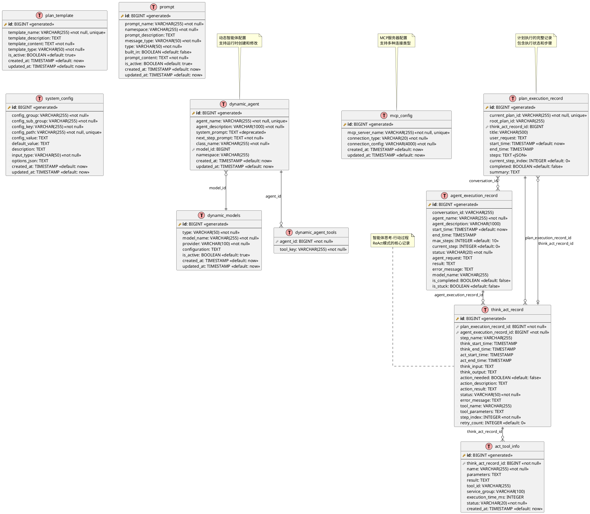

# JManus 数据库 ER 图

本文档使用 PlantUML 生成 JManus 项目的数据库实体关系图（ER图），展示了系统中各个数据表的结构和关系。

## 数据库表概览

JManus 系统包含以下核心数据表：

1. **dynamic_agent** - 动态智能体表
2. **dynamic_agent_tools** - 智能体工具关联表
3. **dynamic_models** - 动态模型表
4. **plan_template** - 计划模板表
5. **plan_execution_record** - 计划执行记录表
6. **agent_execution_record** - 智能体执行记录表
7. **think_act_record** - 思考-行动记录表
8. **act_tool_info** - 行动工具信息表
9. **prompt** - 提示词表
10. **mcp_config** - MCP配置表
11. **system_config** - 系统配置表

## PlantUML ER 图



## 表关系说明

### 主要关系

1. **智能体配置关系**
   - `dynamic_agent` → `dynamic_models` (多对一)：智能体使用的AI模型
   - `dynamic_agent` → `dynamic_agent_tools` (一对多)：智能体可用的工具列表

2. **执行记录关系**
   - `plan_execution_record` → `think_act_record` (一对多)：计划包含多个思考-行动步骤
   - `agent_execution_record` → `think_act_record` (一对多)：智能体执行包含多个思考-行动步骤
   - `think_act_record` → `act_tool_info` (一对多)：每个思考-行动可调用多个工具

3. **自引用关系**
   - `plan_execution_record` → `think_act_record` (多对一)：子计划由某个思考-行动步骤触发
   - `plan_execution_record` ↔ `agent_execution_record` (多对多)：通过conversation_id关联

### 约束说明

- **唯一性约束**：
  - `dynamic_agent.agent_name` - 智能体名称唯一
  - `plan_execution_record.current_plan_id` - 计划ID唯一
  - `prompt.namespace + prompt_name` - 命名空间内提示词名称唯一
  - `mcp_config.mcp_server_name` - MCP服务器名称唯一

- **状态约束**：
  - `agent_execution_record.status` ∈ ('IDLE', 'RUNNING', 'FINISHED', 'ERROR')
  - `think_act_record.status` ∈ ('PENDING', 'THINKING', 'ACTING', 'COMPLETED', 'FAILED')
  - `act_tool_info.status` ∈ ('SUCCESS', 'FAILED', 'TIMEOUT')
  - `mcp_config.connection_type` ∈ ('SSE', 'STUDIO', 'STREAMING')

## 数据库支持

JManus 支持多种数据库：

- **H2** - 开发和测试环境
- **MySQL** - 生产环境
- **PostgreSQL** - 生产环境

所有表结构通过 JPA/Hibernate 自动生成，支持跨数据库兼容。

## 索引建议

为提高查询性能，建议在以下字段上创建索引：

```sql
-- 智能体相关索引
CREATE INDEX idx_agent_namespace ON dynamic_agent(namespace);
CREATE INDEX idx_agent_model ON dynamic_agent(model_id);

-- 执行记录相关索引
CREATE INDEX idx_plan_root_id ON plan_execution_record(root_plan_id);
CREATE INDEX idx_agent_conversation ON agent_execution_record(conversation_id);
CREATE INDEX idx_think_act_plan ON think_act_record(plan_execution_record_id);
CREATE INDEX idx_think_act_agent ON think_act_record(agent_execution_record_id);

-- 提示词相关索引
CREATE INDEX idx_prompt_namespace ON prompt(namespace);
CREATE INDEX idx_prompt_type ON prompt(type);

-- 时间相关索引
CREATE INDEX idx_plan_start_time ON plan_execution_record(start_time);
CREATE INDEX idx_agent_start_time ON agent_execution_record(start_time);
```

---

**文档版本**: 1.0  
**生成时间**: 2025年1月  
**维护者**: Spring AI Alibaba Team