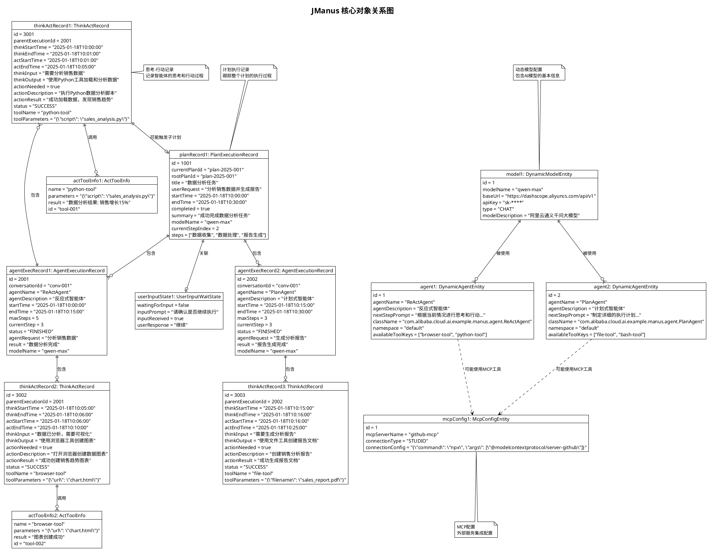

# JManus 核心对象图 (Object Diagram)

本文档展示 JManus 系统核心对象及其在特定时刻的关系。对象图提供了系统结构的快照，捕捉了存在的实例及其关联的静态视图。

## 系统核心对象概述

JManus 系统包含以下核心领域对象：

- **配置管理对象**: DynamicAgentEntity、DynamicModelEntity、McpConfigEntity
- **执行记录对象**: PlanExecutionRecord、AgentExecutionRecord、ThinkActRecord
- **工具信息对象**: ActToolInfo、UserInputWaitState

## PlantUML 对象图



## 核心对象说明

### 1. 配置管理对象

#### 1.1 DynamicModelEntity (动态模型实体)
- **作用**: 存储AI模型配置信息
- **关键属性**: modelName, baseUrl, apiKey, type, modelDescription
- **关系**: 与 DynamicAgentEntity 一对多关系

#### 1.2 DynamicAgentEntity (动态智能体实体)
- **作用**: 存储智能体配置信息
- **关键属性**: agentName, agentDescription, nextStepPrompt, className, availableToolKeys
- **关系**: 与 DynamicModelEntity 多对一关系

#### 1.3 McpConfigEntity (MCP配置实体)
- **作用**: 存储外部MCP服务器配置
- **关键属性**: mcpServerName, connectionType, connectionConfig
- **关系**: 被智能体间接使用

### 2. 执行记录对象

#### 2.1 PlanExecutionRecord (计划执行记录)
- **作用**: 跟踪计划执行的完整生命周期
- **关键属性**: currentPlanId, rootPlanId, title, userRequest, steps, agentExecutionSequence
- **关系**: 
  - 与 AgentExecutionRecord 一对多关系
  - 与 UserInputWaitState 一对一关系
  - 支持递归关系（子计划）

#### 2.2 AgentExecutionRecord (智能体执行记录)
- **作用**: 记录单个智能体的执行过程
- **关键属性**: agentName, startTime, endTime, maxSteps, currentStep, status, thinkActSteps
- **关系**: 与 ThinkActRecord 一对多关系

#### 2.3 ThinkActRecord (思考-行动记录)
- **作用**: 记录智能体单次思考-行动循环
- **关键属性**: 
  - 思考阶段: thinkInput, thinkOutput, thinkStartTime, thinkEndTime
  - 行动阶段: actionDescription, actionResult, actStartTime, actEndTime
  - 工具信息: toolName, toolParameters, actToolInfoList
- **关系**: 
  - 与 AgentExecutionRecord 多对一关系
  - 与 ActToolInfo 一对多关系
  - 与 PlanExecutionRecord 一对一关系（子计划）

### 3. 辅助对象

#### 3.1 ActToolInfo (行动工具信息)
- **作用**: 记录工具调用的详细信息
- **关键属性**: name, parameters, result, id
- **关系**: 被 ThinkActRecord 包含

#### 3.2 UserInputWaitState (用户输入等待状态)
- **作用**: 管理需要用户输入的等待状态
- **关键属性**: waitingForInput, inputPrompt, inputReceived, userResponse
- **关系**: 被 PlanExecutionRecord 关联

## 对象关系特点

### 1. 层次化结构
```
PlanExecutionRecord (计划)
  └── AgentExecutionRecord[] (智能体执行序列)
      └── ThinkActRecord[] (思考-行动步骤)
          └── ActToolInfo[] (工具调用信息)
```

### 2. 递归关系
- ThinkActRecord 可以通过 subPlanExecutionRecord 触发新的 PlanExecutionRecord
- 支持无限嵌套的子计划执行

### 3. 配置与执行分离
- 配置对象 (DynamicAgentEntity, DynamicModelEntity, McpConfigEntity) 相对静态
- 执行对象 (PlanExecutionRecord, AgentExecutionRecord, ThinkActRecord) 动态创建

### 4. 时间序列特性
- 所有执行记录都包含时间戳信息
- 支持执行过程的完整时间线重建

## 使用场景

### 1. 计划执行跟踪
通过 PlanExecutionRecord 跟踪整个计划的执行状态和进度。

### 2. 智能体行为分析
通过 AgentExecutionRecord 和 ThinkActRecord 分析智能体的思考和决策过程。

### 3. 工具使用统计
通过 ActToolInfo 统计和分析工具的使用情况和效果。

### 4. 错误诊断和调试
通过完整的执行记录链进行问题定位和性能优化。

---

**文档版本**: 1.0  
**创建日期**: 2025年1月  
**参考**: JManus 核心实体类源码