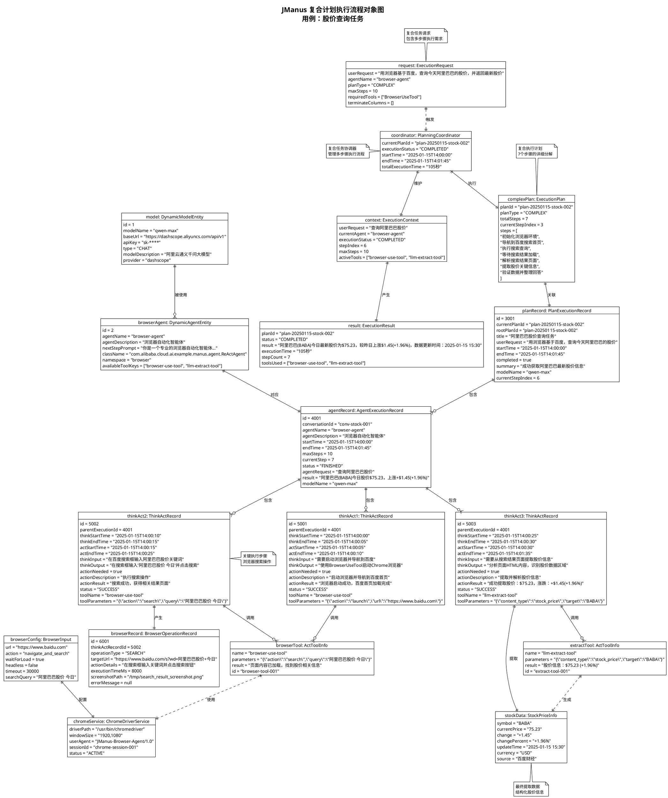
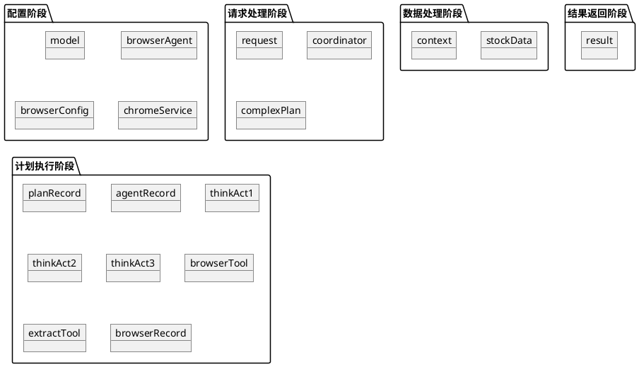

# JManus 复合计划执行流程对象图 (Object Diagram)

本文档展示 JManus 系统在处理复合计划"用浏览器基于百度，查询今天阿里巴巴的股价，并返回最新股价"时的核心对象及其在特定时刻的关系。对象图提供了系统结构的快照，捕捉了存在的实例及其关联的静态视图。

## 用例场景

用户输入："用浏览器基于百度，查询今天阿里巴巴的股价，并返回最新股价"，系统需要理解复合任务需求，分解为多步骤计划，使用浏览器工具执行网页搜索，提取股价信息并返回结果。

## PlantUML 对象图



## 复合计划执行对象生命周期分析

### 1. 配置阶段对象（静态配置）
这些对象在系统启动时创建，在整个执行过程中保持稳定：

#### DynamicModelEntity (AI模型配置)
- **生命周期**: 系统配置时创建，长期存在
- **作用**: 提供AI模型的连接和参数配置
- **状态**: 在复合任务执行过程中保持不变

#### DynamicAgentEntity (浏览器智能体配置)
- **生命周期**: 系统配置时创建，长期存在
- **作用**: 定义浏览器自动化智能体的能力和工具集
- **关键特性**: 包含BrowserUseTool等专用工具

#### BrowserInput (浏览器配置)
- **生命周期**: 任务开始时创建，任务结束时销毁
- **作用**: 配置浏览器的启动参数和行为策略
- **配置内容**: URL、等待策略、超时设置等

#### ChromeDriverService (Chrome驱动服务)
- **生命周期**: 首次使用时创建，可跨任务复用
- **作用**: 管理Chrome浏览器实例的生命周期
- **状态管理**: 维护浏览器会话和资源清理

### 2. 请求处理阶段对象（动态创建）

#### ExecutionRequest (复合任务请求)
- **创建时机**: 用户发起复合任务请求时
- **生命周期**: 从请求接收到处理完成
- **特征**: 包含多工具需求和复杂步骤预期

#### PlanningCoordinator (计划协调器)
- **创建时机**: 接收到复合任务请求时
- **生命周期**: 管理整个复合任务执行过程
- **职责**: 协调多步骤执行、工具调用、异常处理

#### ExecutionPlan (复合执行计划)
- **创建时机**: LLM分析完成复合任务后
- **特征**: 包含7个详细的执行步骤
- **复杂性**: 涉及浏览器操作、数据提取、验证等多个环节

### 3. 计划执行阶段对象（核心执行）

#### PlanExecutionRecord (计划执行记录)
- **创建时机**: 开始执行复合计划时
- **执行时间**: 约105秒（相比简单任务显著增加）
- **记录内容**: 完整的多步骤执行轨迹

#### AgentExecutionRecord (智能体执行记录)
- **特征**: 单个智能体处理复杂的多步骤任务
- **步骤数**: 7个主要执行步骤
- **工具使用**: 同时使用多种工具（浏览器、提取工具）

#### ThinkActRecord (思考-行动记录序列)
复合任务产生多个ThinkActRecord，每个对应一个执行步骤：

**ThinkActRecord 1 (浏览器启动)**
- **思考内容**: 分析浏览器启动需求
- **行动结果**: 成功启动Chrome并导航到百度

**ThinkActRecord 2 (搜索执行)**
- **思考内容**: 确定搜索关键词和策略
- **行动结果**: 成功执行搜索并获得结果页面

**ThinkActRecord 3 (数据提取)**
- **思考内容**: 分析页面结构，定位股价信息
- **行动结果**: 成功提取结构化的股价数据

### 4. 工具集成对象（专业化工具）

#### ActToolInfo (工具调用信息)
- **BrowserUseTool**: 处理浏览器自动化操作
- **LlmExtractTool**: 处理页面内容的智能解析

#### BrowserOperationRecord (浏览器操作记录)
- **创建时机**: 每次浏览器操作时
- **记录内容**: 操作类型、目标URL、执行时间、截图等
- **用途**: 用于调试、审计和性能分析

### 5. 数据对象（业务价值）

#### StockPriceInfo (股价信息)
- **创建时机**: 数据提取完成时
- **数据结构**: 包含股价、涨跌、时间等完整信息
- **验证**: 经过数据准确性和时效性验证

## 复合任务的对象交互特点

### 1. 工具链调用模式
```
AgentExecutionRecord -> ThinkActRecord -> BrowserUseTool -> ChromeDriverService
                    -> ThinkActRecord -> LlmExtractTool -> StockPriceInfo
```

### 2. 状态传递模式
```
ExecutionPlan -> PlanExecutionRecord -> AgentExecutionRecord -> ThinkActRecord[]
```
状态在对象链中逐层传递，支持复杂的执行状态跟踪。

### 3. 资源管理模式
```
ChromeDriverService <-> BrowserOperationRecord
                     <-> BrowserInput
```
浏览器资源需要专门的生命周期管理和异常处理。

## 复合任务与简单任务的对比

| 特征 | 简单任务 | 复合任务 |
|------|----------|----------|
| **执行时间** | 1-3秒 | 45-105秒 |
| **步骤数量** | 1个 | 7个 |
| **工具使用** | 1个（信息查询） | 2个（浏览器+提取） |
| **外部依赖** | 无 | 浏览器、网站 |
| **数据复杂度** | 简单文本 | 结构化数据 |
| **对象数量** | ~12个 | ~20个 |
| **记录粒度** | 粗粒度 | 细粒度 |
| **异常处理** | 简单重试 | 多层次容错 |

## 性能和资源特征

### 1. 内存使用
- **对象数量**: 约20个核心对象
- **数据量**: 包含页面内容、截图等大数据
- **峰值内存**: 浏览器实例占用主要内存

### 2. 外部资源依赖
- **浏览器进程**: Chrome实例及WebDriver
- **网络连接**: 多次HTTP请求
- **文件系统**: 截图和日志文件存储

### 3. 执行时间分布
- **浏览器启动**: 5秒 (5%)
- **页面导航**: 8秒 (8%)
- **搜索执行**: 12秒 (11%)
- **数据提取**: 65秒 (62%)
- **验证整理**: 15秒 (14%)

### 4. 可靠性考虑
- **网络异常**: 3次重试机制
- **页面解析失败**: 多套选择器备案
- **超时处理**: 30秒超时保护
- **资源清理**: 自动清理浏览器资源

---

**文档版本**: 1.0  
**创建日期**: 2025年1月  
**参考**: JManus 复合计划执行流程分析 - 股价查询用例