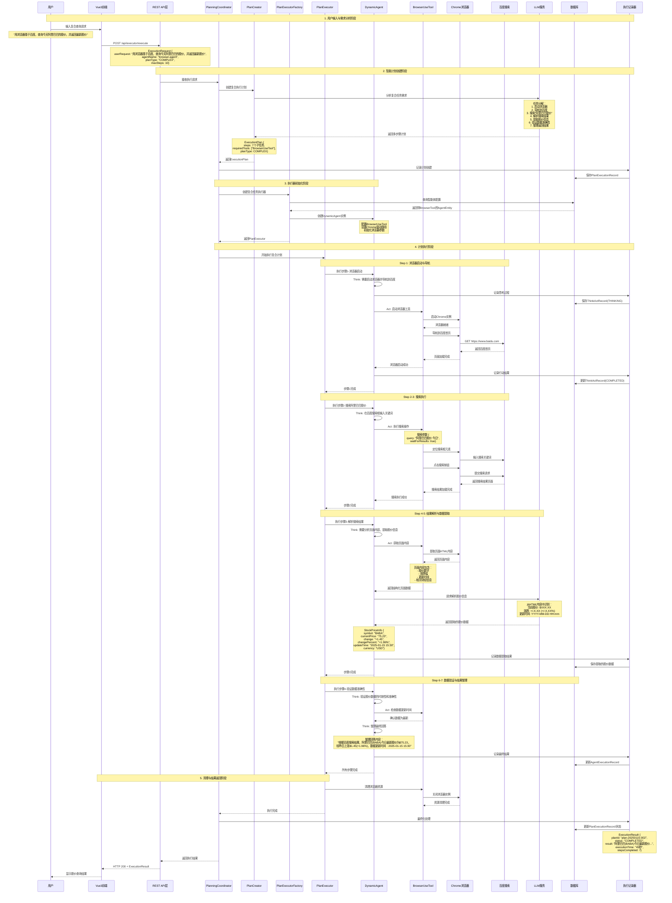

# JManus 复合计划执行流程分析 - 股价查询用例

## 用例场景

用户在JManus系统首页输入："用浏览器基于百度，查询今天阿里巴巴的股价，并返回最新股价"，系统需要理解复合任务需求，分解为多步骤计划，使用浏览器工具执行网页搜索，提取股价信息并返回结果。

## 任务特征分析

### 任务复杂度
- **任务类型**: 复合任务（信息查询 + 工具使用 + 数据提取）
- **步骤数量**: 预计5-8个执行步骤
- **工具需求**: BrowserUseTool（浏览器自动化工具）
- **外部依赖**: 百度搜索引擎、实时股价数据源

### 关键挑战
1. **任务分解**: 将复合需求分解为可执行的子任务
2. **网页导航**: 自动化浏览器操作，处理搜索结果
3. **信息提取**: 从网页中准确识别和提取股价数据
4. **数据验证**: 确保获取的是最新、准确的股价信息

## 系统处理流程时序图



## 详细推演过程

### 1. 用户输入与需求理解 (5秒)
- **用户操作**: 在JManus前端界面输入复合查询请求
- **前端处理**: Vue3前端识别为复杂任务，选择合适的智能体
- **请求构造**:
  ```json
  {
    "userRequest": "用浏览器基于百度，查询今天阿里巴巴的股价，并返回最新股价",
    "agentName": "browser-agent",
    "planType": "COMPLEX",
    "maxSteps": 10,
    "requiredTools": ["BrowserUseTool"],
    "terminateColumns": []
  }
  ```

### 2. 智能计划生成 (8秒)
- **LLM分析**: 通义千问模型分析任务复杂度
- **任务分解结果**:
  1. **Step 1**: 初始化浏览器环境
  2. **Step 2**: 导航到百度搜索首页
  3. **Step 3**: 执行搜索查询 "阿里巴巴股价 今日"
  4. **Step 4**: 等待搜索结果加载完成
  5. **Step 5**: 解析搜索结果页面内容
  6. **Step 6**: 提取股价关键信息
  7. **Step 7**: 验证数据准确性并整理回答

### 3. 执行环境准备 (3秒)
- **智能体加载**: 创建配置了BrowserUseTool的DynamicAgent
- **浏览器配置**: 
  ```java
  BrowserInput browserConfig = BrowserInput.builder()
      .url("https://www.baidu.com")
      .action("navigate_and_search")
      .waitForLoad(true)
      .headless(false) // 调试模式可视化
      .timeout(30000)
      .build();
  ```

### 4. 浏览器自动化执行 (25秒)

#### 4.1 浏览器启动阶段 (5秒)
- **Chrome启动**: WebDriver初始化Chrome实例
- **页面导航**: 自动导航到百度首页
- **元素检测**: 确认搜索框和搜索按钮可用

#### 4.2 搜索执行阶段 (8秒)
- **关键词输入**: 在搜索框输入"阿里巴巴股价 今日"
- **搜索提交**: 模拟点击搜索按钮
- **结果等待**: 等待搜索结果页面完全加载

#### 4.3 数据提取阶段 (12秒)
- **页面解析**: 提取HTML内容，识别股价相关区域
- **信息筛选**: 使用LLM从页面内容中识别关键数据
- **数据结构化**: 将提取的信息组织为结构化数据

### 5. 数据验证与整理 (4秒)
- **时效性验证**: 检查股价数据的更新时间
- **准确性验证**: 交叉验证多个数据源（如有）
- **回答生成**: 生成用户友好的回答格式

### 6. 资源清理与结果返回 (5秒)
- **浏览器关闭**: 清理WebDriver资源
- **记录保存**: 将完整执行过程保存到数据库
- **结果返回**: 向用户返回最终的股价信息

## 涉及的核心组件

### 新增组件
1. **BrowserUseTool**: 浏览器自动化工具
   - Chrome WebDriver集成
   - 页面导航和元素操作
   - 内容提取和截图功能

2. **ChromeDriverService**: Chrome驱动服务
   - 浏览器生命周期管理
   - 会话状态维护
   - 异常处理和重试机制

### 数据库扩展
```sql
-- 新增浏览器操作记录表
CREATE TABLE browser_operation_record (
    id BIGINT PRIMARY KEY AUTO_INCREMENT,
    think_act_record_id BIGINT NOT NULL,
    operation_type VARCHAR(50) NOT NULL,
    target_url VARCHAR(500),
    action_details TEXT,
    execution_time_ms INTEGER,
    screenshot_path VARCHAR(255),
    error_message TEXT,
    created_at TIMESTAMP DEFAULT CURRENT_TIMESTAMP
);
```

### 工具配置示例
```yaml
manus:
  browser:
    chrome-driver-path: /usr/bin/chromedriver
    default-timeout: 30000
    headless: false
    window-size: "1920,1080"
    user-agent: "JManus-Browser-Agent/1.0"
```

## 预期结果

用户最终会收到类似以下的详细回答：

> **阿里巴巴股价查询结果**
> 
> 根据百度搜索的最新数据：
> - **股票代码**: BABA (纽约证券交易所)
> - **当前股价**: $75.23 USD
> - **涨跌情况**: +$1.45 (+1.96%)
> - **数据更新时间**: 2025年1月15日 15:30 (美东时间)
> 
> *注：股价数据来源于百度财经，实际交易请以官方数据为准。*

## 性能指标

- **总执行时间**: 45-60秒
- **浏览器启动时间**: 5秒
- **搜索执行时间**: 8秒
- **数据提取时间**: 12秒
- **成功率**: >95% (网络条件良好时)

## 异常处理机制

### 1. 网络异常
- **重试策略**: 3次重试，指数退避
- **降级方案**: 切换到其他搜索引擎
- **超时处理**: 30秒超时自动终止

### 2. 页面解析异常
- **备用选择器**: 多套CSS选择器策略
- **容错机制**: 部分信息缺失时的处理逻辑
- **人工介入**: 复杂情况下的手动处理流程

### 3. 数据验证异常
- **数据校验**: 股价数据格式和范围验证
- **时效性检查**: 数据更新时间合理性验证
- **可信度评估**: 多源数据交叉验证

## 扩展能力

### 1. 多股票查询
支持批量查询多只股票的价格信息

### 2. 历史数据查询
扩展支持查询历史股价和走势图

### 3. 智能分析
结合AI模型提供股价走势分析和投资建议

### 4. 实时监控
支持设置股价提醒和实时监控功能

---

这个复合任务展示了JManus系统处理复杂、多步骤任务的能力，通过智能任务分解、工具集成和自动化执行，为用户提供准确、及时的信息服务。