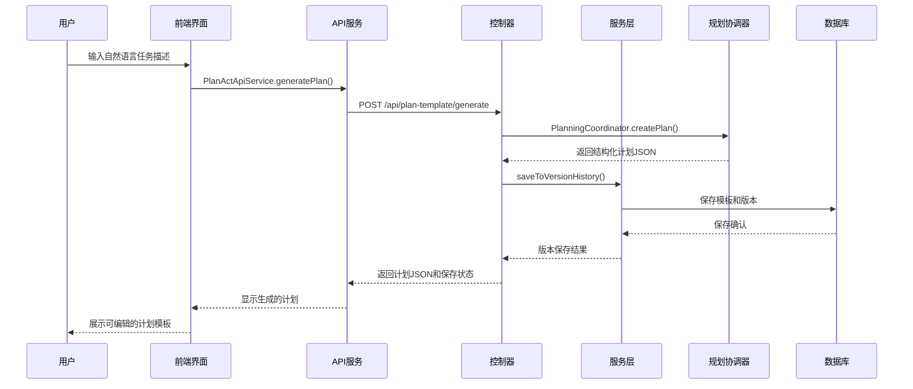
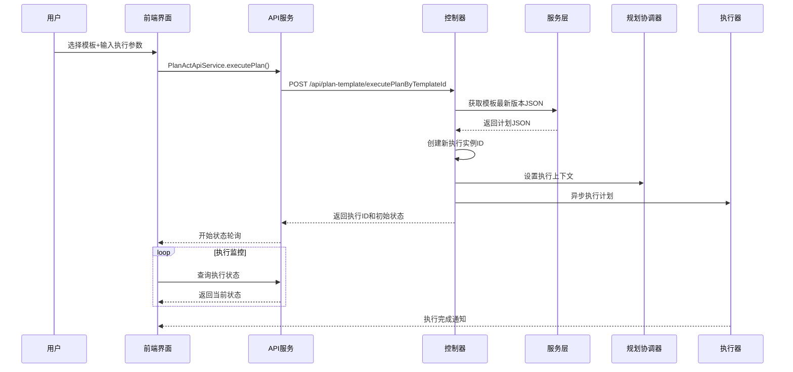

# Plan Template Design 计划模板设计文档

## 概述

计划模板管理模块是JManus系统中的核心功能模块，提供了完整的计划创建、存储、版本管理和执行功能。该模块实现了智能任务自动化和工作流管理，是JManus智能代理功能的重要基础设施。

## 整体架构层次

### 前端层 (Vue3)

#### UI组件层
- **文件路径**: `ui-vue3/src/components/sidebar/index.vue`
- **功能**: 提供计划模板的可视化管理界面
- **特性**: 
  - 模板列表展示和搜索
  - 计划生成器（自然语言输入）
  - JSON模板编辑器
  - 执行控制器和参数配置
  - 版本历史管理

#### API服务层
- **文件路径**: `ui-vue3/src/api/plan-act-api-service.ts`
- **功能**: 封装所有模板管理API调用
- **核心方法**:
  ```typescript
  // 获取所有计划模板
  getAllPlanTemplates(): Promise<any>
  
  // 保存计划模板
  savePlanTemplate(planId: string, planJson: string): Promise<any>
  
  // 更新现有计划模板
  updatePlanTemplate(planId: string, query: string, existingJson?: string): Promise<any>
  
  // 执行计划模板
  executePlan(planTemplateId: string, rawParam?: string): Promise<any>
  
  // 获取计划版本历史
  getPlanVersions(planId: string): Promise<any>
  
  // 获取特定版本的计划
  getVersionPlan(planId: string, versionIndex: number): Promise<any>
  ```

#### 执行管理器
- **文件路径**: `ui-vue3/src/utils/plan-execution-manager.ts`
- **功能**: 管理计划执行状态和缓存
- **特性**:
  - 单例模式的全局状态管理
  - 计划执行记录缓存
  - UI状态缓存
  - 实时轮询执行状态

### 后端层 (Spring Boot)

#### 控制器层
- **文件路径**: `src/main/java/com/alibaba/cloud/ai/example/manus/planning/controller/PlanTemplateController.java`
- **功能**: 提供REST API端点
- **核心端点**:
  ```java
  @PostMapping("/generate")        // 生成计划
  @PostMapping("/executePlanByTemplateId")  // 执行计划
  @GetMapping("/execute/{planTemplateId}")  // GET方式执行计划
  @PostMapping("/save")            // 保存计划
  @PostMapping("/update")          // 更新计划
  @PostMapping("/delete")          // 删除计划
  @GetMapping("/list")             // 获取模板列表
  @PostMapping("/versions")        // 获取版本历史
  @PostMapping("/get-version")     // 获取特定版本
  ```

#### 服务层
- **文件路径**: `src/main/java/com/alibaba/cloud/ai/example/manus/planning/service/PlanTemplateService.java`
- **功能**: 业务逻辑处理
- **核心功能**:
  - 计划模板CRUD操作
  - 版本历史管理
  - 重复检测和版本控制

#### 数据层
- **组件**: `PlanTemplateRepository` + `PlanTemplateVersionRepository`
- **功能**: 数据持久化
- **数据模型**:
  - `PlanTemplate`: 计划模板基本信息
  - `PlanTemplateVersion`: 计划模板版本历史

## 核心功能应用流程

### 计划模板生成流程



### 计划模板执行流程



### 版本管理流程

1. **自动版本控制**: 每次保存都会检查内容差异，避免重复版本
2. **版本历史**: 支持查看所有历史版本
3. **版本回滚**: 可以恢复到任意历史版本
4. **增量更新**: 支持基于现有计划进行更新

## 关键应用特性

### 模板复用性
- **实例分离**: 一个模板可以被多次执行，每次生成新的执行实例
- **参数化执行**: 支持通过 `rawParam` 传入动态参数
- **模板稳定性**: 模板与执行实例分离，保证模板的稳定性

### 智能计划生成
- **自然语言处理**: 基于自然语言描述自动生成结构化执行计划
- **增量更新**: 支持参考现有计划进行增量更新
- **AI规划集成**: 集成AI规划能力，自动分解复杂任务

### 实时执行监控
- **状态轮询**: 前端实时轮询执行状态
- **缓存优化**: 缓存机制优化性能
- **可视化展示**: 支持执行过程的可视化展示

## 实际应用场景

### 1. 复杂任务自动化
将复杂的多步骤任务封装为可重复执行的模板，如：
- 数据采集和分析流程
- 系统部署和配置流程
- 定期报告生成流程

### 2. 工作流标准化
将常用的工作流程标准化为模板，提高效率，如：
- 代码审查流程
- 问题诊断流程
- 客户服务流程

### 3. 参数化执行
相同的业务逻辑，通过不同参数实现不同的具体应用，如：
- 股价查询模板（参数：股票代码）
- 天气查询模板（参数：城市名称）
- 新闻搜索模板（参数：关键词）

### 4. 版本迭代管理
业务流程的持续优化和版本管理，如：
- 流程改进版本控制
- A/B测试不同版本
- 回滚到稳定版本

## 实例推演：股价查询模板创建与执行

### 场景描述
用户需要创建一个可重复使用的股价查询模板，能够查询不同公司的当日股价信息。

### 步骤1：模板创建

#### 用户操作
1. 打开JManus系统首页
2. 切换到计划模板管理界面
3. 在计划生成器中输入：
   ```
   "用浏览器基于百度，查询今天阿里巴巴的股价，并返回最新股价信息，包括当前价格、涨跌幅、成交量等关键数据"
   ```
4. 点击"生成计划"按钮

#### 系统处理流程
1. **前端请求**:
   ```typescript
   const response = await PlanActApiService.generatePlan({
     query: "用浏览器基于百度，查询今天阿里巴巴的股价，并返回最新股价信息..."
   })
   ```

2. **后端生成**:
   ```java
   // Controller接收请求
   @PostMapping("/generate")
   public ResponseEntity<Map<String, Object>> generatePlan(@RequestBody Map<String, String> request) {
     String query = request.get("query");
     
     // 创建执行上下文
     ExecutionContext context = new ExecutionContext();
     context.setUserRequest(query);
     
     // 生成唯一模板ID
     String planTemplateId = planIdDispatcher.generatePlanTemplateId(); // 例如: "plan-template-20250118-001"
     context.setCurrentPlanId(planTemplateId);
     
     // 调用规划协调器生成计划
     PlanningCoordinator coordinator = planningFactory.createPlanningCoordinator(planTemplateId);
     coordinator.createPlan(context);
     
     // 获取生成的计划JSON
     String planJson = planToJson(context.getPlan());
   }
   ```

3. **生成的计划JSON示例**:
   ```json
   {
     "currentPlanId": "plan-template-20250118-001",
     "rootPlanId": "plan-template-20250118-001",
     "title": "股价查询计划",
     "description": "查询指定公司的当日股价信息",
     "steps": [
       {
         "stepId": "step-1",
         "stepName": "启动浏览器",
         "action": "browser.launch",
         "parameters": {
           "headless": false,
           "timeout": 30000
         }
       },
       {
         "stepId": "step-2", 
         "stepName": "访问百度",
         "action": "browser.navigate",
         "parameters": {
           "url": "https://www.baidu.com"
         }
       },
       {
         "stepId": "step-3",
         "stepName": "搜索股价",
         "action": "browser.search",
         "parameters": {
           "query": "阿里巴巴股价",
           "searchBox": "#kw"
         }
       },
       {
         "stepId": "step-4",
         "stepName": "提取股价信息", 
         "action": "data.extract",
         "parameters": {
           "selectors": {
             "price": ".stock-price",
             "change": ".stock-change",
             "volume": ".stock-volume"
           }
         }
       },
       {
         "stepId": "step-5",
         "stepName": "格式化输出",
         "action": "data.format",
         "parameters": {
           "template": "公司: {company}, 当前价格: {price}, 涨跌幅: {change}, 成交量: {volume}"
         }
       }
     ],
     "executionParams": null
   }
   ```

4. **版本保存**:
   ```java
   // 自动保存为第一个版本
   PlanTemplateService.VersionSaveResult saveResult = saveToVersionHistory(planJson);
   // 返回结果: saved=true, versionIndex=0, message="新计划已创建"
   ```

### 步骤2：模板编辑优化

#### 用户操作
1. 在JSON编辑器中修改计划，添加参数化支持：
   ```json
   {
     // ... 其他配置 ...
     "steps": [
       // ... 前面步骤 ...
       {
         "stepId": "step-3",
         "stepName": "搜索股价",
         "action": "browser.search", 
         "parameters": {
           "query": "${公司名称}股价",  // 参数化
           "searchBox": "#kw"
         }
       }
       // ... 后续步骤 ...
     ],
     "executionParams": "公司名称=阿里巴巴"
   }
   ```

2. 点击"保存"按钮

#### 系统处理
1. **版本检查**: 系统检测到内容变化
2. **版本保存**: 自动创建版本2
3. **响应**: `{ saved: true, versionCount: 2, versionIndex: 1 }`

### 步骤3：模板执行

#### 场景A：执行原始参数
```typescript
// 用户点击"执行计划"
const response = await PlanActApiService.executePlan(
  "plan-template-20250118-001",
  "公司名称=阿里巴巴"
)
// 返回: { planId: "plan-exec-20250118-001", status: "processing" }
```

#### 场景B：执行不同参数
```typescript
// 查询腾讯股价
const response = await PlanActApiService.executePlan(
  "plan-template-20250118-001", 
  "公司名称=腾讯"
)
// 返回: { planId: "plan-exec-20250118-002", status: "processing" }
```

### 步骤4：执行监控

#### 前端轮询
```typescript
const manager = PlanExecutionManager.getInstance()

// 开始监控执行状态
const monitorExecution = async (planId: string) => {
  const pollTimer = setInterval(async () => {
    try {
      const status = await PlanActApiService.getExecutionStatus(planId)
      
      if (status.isCompleted) {
        clearInterval(pollTimer)
        console.log('执行完成:', status.result)
        // 显示结果: "公司: 阿里巴巴, 当前价格: $85.32, 涨跌幅: +2.1%, 成交量: 1.2M"
      } else {
        console.log('执行中:', status.currentStep)
      }
    } catch (error) {
      console.error('监控失败:', error)
      clearInterval(pollTimer)
    }
  }, 2000)
}

// 开始监控
monitorExecution("plan-exec-20250118-001")
```

#### 执行时序
1. **T+0s**: 执行开始，创建浏览器实例
2. **T+2s**: 访问百度首页成功
3. **T+5s**: 搜索"阿里巴巴股价"
4. **T+8s**: 页面加载完成，开始数据提取
5. **T+10s**: 数据提取完成，格式化输出
6. **T+12s**: 执行完成，返回结果

### 步骤5：模板复用与优化

#### 模板复用统计
- **模板ID**: `plan-template-20250118-001`
- **执行次数**: 15次
- **成功率**: 93.3%
- **平均执行时间**: 12.5秒
- **常用参数**: 阿里巴巴(8次), 腾讯(4次), 百度(2次), 京东(1次)

#### 模板优化
基于执行反馈，用户进一步优化模板：

1. **添加错误处理**:
   ```json
   {
     "stepId": "step-3-retry",
     "stepName": "搜索重试机制",
     "action": "browser.search.with_retry",
     "parameters": {
       "query": "${公司名称}股价",
       "maxRetries": 3,
       "retryDelay": 2000
     }
   }
   ```

2. **增加数据验证**:
   ```json
   {
     "stepId": "step-4-validate",
     "stepName": "数据有效性检查",
     "action": "data.validate",
     "parameters": {
       "rules": {
         "price": "required|numeric|min:0",
         "change": "required|regex:/^[+-]?\\d+\\.\\d+%$/"
       }
     }
   }
   ```

3. **保存优化版本**: 创建版本3，成为生产环境的稳定版本

### 预期收益

通过这个股价查询模板的创建和使用：

1. **效率提升**: 从手动查询15分钟缩短到自动执行12秒
2. **准确性提升**: 避免人工错误，数据提取一致性100%
3. **可复用性**: 一次创建，多次使用，支持不同公司股价查询
4. **可维护性**: 版本控制确保模板演进的可追溯性
5. **扩展性**: 可基于此模板扩展为股价监控、预警等更复杂功能

这个实例展示了计划模板管理模块如何将复杂的、重复性的任务转化为可管理、可复用、可优化的智能工作流，体现了JManus系统在任务自动化方面的强大能力。