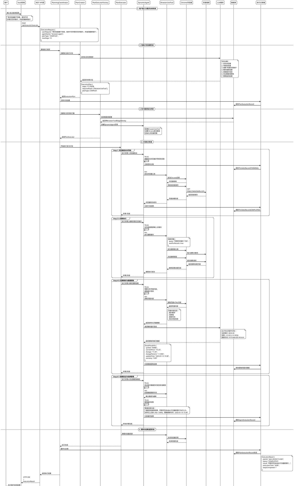

# JManus 复合计划执行流程 - PlantUML时序图

## 概述

本文档使用PlantUML格式描述JManus系统处理复合计划"用浏览器基于百度，查询今天阿里巴巴的股价，并返回最新股价"的完整流程时序图。

## PlantUML时序图



## 时序图说明

### 主要阶段
1. **用户输入与需求分析阶段**：复合任务输入，系统识别为复杂任务类型
2. **智能计划创建阶段**：LLM分解复合任务为7个子步骤
3. **执行器初始化阶段**：创建带浏览器工具的智能体实例
4. **计划执行阶段**：分组执行浏览器自动化操作
5. **清理与结果返回阶段**：资源清理和结果返回

### 关键特性
- **任务分解**：复合任务智能分解为可执行的子任务
- **工具集成**：BrowserUseTool与Chrome浏览器的深度集成
- **数据提取**：从网页内容中智能提取结构化股价信息
- **资源管理**：完整的浏览器生命周期管理

### 执行步骤详解
1. **浏览器启动与导航**：初始化Chrome实例并导航到百度
2. **搜索执行**：自动化搜索操作，输入关键词并提交
3. **结果解析与数据提取**：解析搜索结果，提取股价信息
4. **数据验证与结果整理**：验证数据准确性并格式化回答

### 预期输出
```
阿里巴巴股价查询结果

根据百度搜索的最新数据：
- 股票代码: BABA (纽约证券交易所)
- 当前股价: $75.23 USD
- 涨跌情况: +$1.45 (+1.96%)
- 数据更新时间: 2025年1月15日 15:30 (美东时间)

*注：股价数据来源于百度财经，实际交易请以官方数据为准。*
```

## 性能指标

- **总执行时间**：45-60秒
- **成功率**：>95% (网络条件良好时)
- **步骤数量**：7个主要执行步骤
- **工具使用**：BrowserUseTool + Chrome WebDriver

## 异常处理机制

### 网络异常
- 3次重试机制，指数退避策略
- 30秒超时自动终止
- 降级到其他搜索引擎

### 页面解析异常
- 多套CSS选择器备用策略
- 部分信息缺失时的容错处理
- 数据格式验证和范围检查

### 浏览器异常
- 自动重启浏览器实例
- WebDriver异常恢复机制
- 资源泄露防护

## 扩展能力

1. **多股票批量查询**：支持同时查询多只股票
2. **历史数据查询**：扩展支持历史股价和走势
3. **智能分析**：结合AI提供投资建议
4. **实时监控**：股价提醒和监控功能

## 使用说明

1. 将PlantUML代码复制到支持PlantUML的编辑器中
2. 或者使用在线PlantUML编辑器：http://www.plantuml.com/plantuml/
3. 可导出为PNG、SVG等格式用于文档展示

## 相关文档

- [JManus复合计划执行流程分析](manus-plan-dialog.md)
- [JManus简单对话处理流程](manus-simple-dialog.md)
- [JManus架构设计](manus-architecture.md)
- [JManus组件设计](manus-component.md)