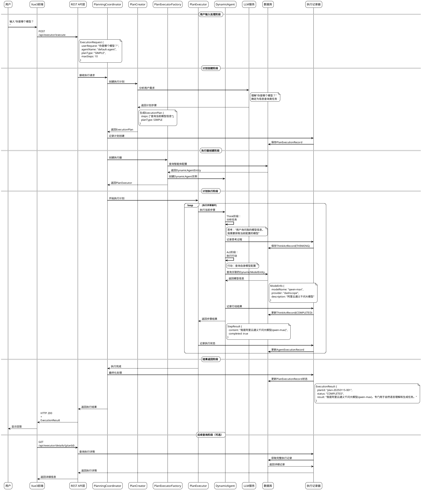

# JManus 简单对话处理流程 - PlantUML时序图

## 概述

本文档使用PlantUML格式描述JManus系统处理简单对话"你是哪个模型？"的完整流程时序图。

## PlantUML时序图

## 时序图说明

### 主要阶段
1. **用户输入处理阶段**：用户通过前端界面输入问题，前端构造API请求
2. **计划创建阶段**：系统分析用户需求，创建执行计划
3. **执行器创建阶段**：加载智能体配置，创建执行实例
4. **计划执行阶段**：智能体执行Think-Act循环，处理用户请求
5. **结果返回阶段**：返回处理结果给用户
6. **后续查询阶段**：可选的执行详情查询

### 关键交互
- **Think-Act循环**：智能体的核心处理模式，先思考再行动
- **数据库记录**：完整记录每个执行步骤，便于审计和分析
- **模型信息查询**：通过查询DynamicModelEntity获取当前AI模型配置

### 预期输出
用户最终收到的回答：
> "我是阿里云通义千问大模型(qwen-max)，专门用于自然语言理解和生成任务。我可以帮助您处理各种文本相关的工作，包括问答、分析、创作等。"

## 使用说明

1. 将PlantUML代码复制到支持PlantUML的编辑器中（如VSCode with PlantUML插件）
2. 或者使用在线PlantUML编辑器：http://www.plantuml.com/plantuml/
3. 生成的时序图可以导出为PNG、SVG等格式用于文档展示

## 相关文档

- [JManus简单对话处理流程分析](manus-simple-dialog.md)
- [JManus架构设计](manus-architecture.md)
- [JManus组件设计](manus-component.md)