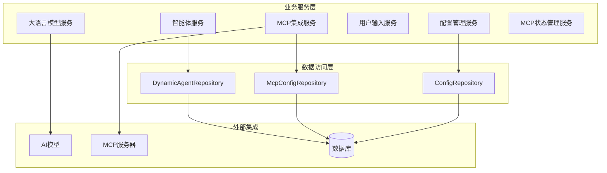
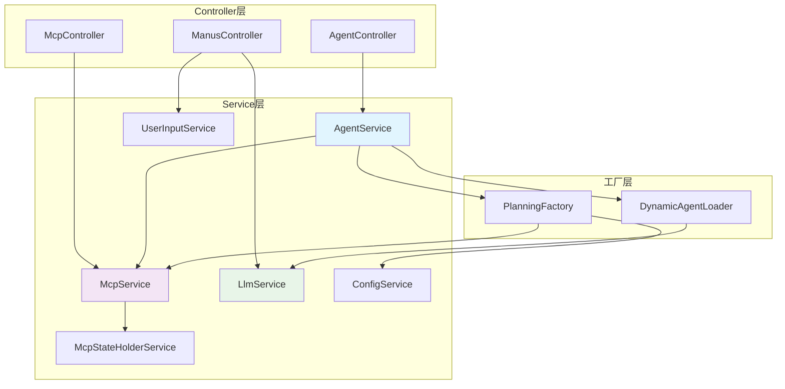
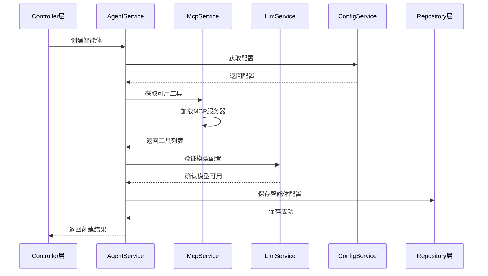
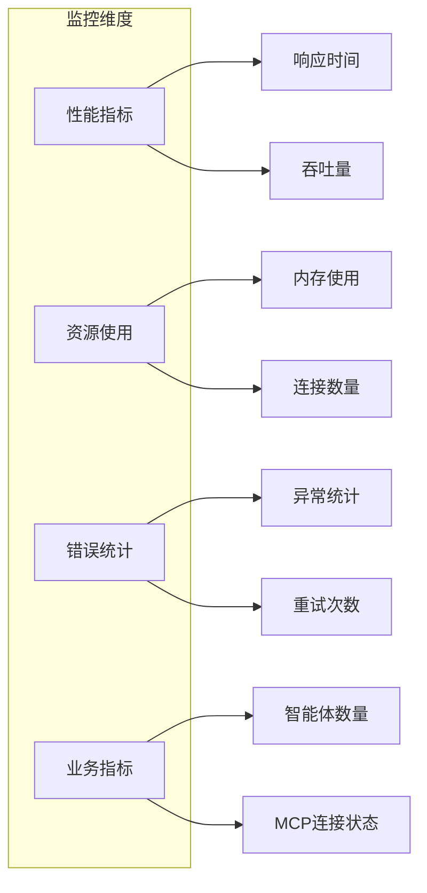

# JManus 核心Service组件设计文档

## 1. 概述

JManus系统采用分层架构设计，Service层作为业务逻辑的核心，负责处理复杂的业务流程、数据处理和系统集成。本文档详细描述了系统中所有核心Service组件的设计和实现。

### 1.1 Service层架构



## 2. 核心Service组件清单

| 序号 | Service名称 | 包路径 | 主要职责 | 依赖组件 |
|------|-------------|--------|----------|----------|
| 1 | AgentServiceImpl | com.alibaba.cloud.ai.example.manus.dynamic.agent.service | 智能体管理 | DynamicAgentRepository, PlanningFactory |
| 2 | McpService | com.alibaba.cloud.ai.example.manus.dynamic.mcp.service | MCP集成管理 | McpConfigRepository, McpAsyncClient |
| 3 | LlmService | com.alibaba.cloud.ai.example.manus.llm | 大语言模型服务 | ChatModel, ChatClient |
| 4 | UserInputService | com.alibaba.cloud.ai.example.manus.planning.service | 用户输入管理 | FormInputTool, UserInputWaitState |
| 5 | ConfigService | com.alibaba.cloud.ai.example.manus.config | 系统配置管理 | ConfigRepository, Environment |
| 6 | McpStateHolderService | com.alibaba.cloud.ai.example.manus.dynamic.mcp.service | MCP状态管理 | McpState |

## 3. 智能体管理服务

### 3.1 AgentService接口

```java
package com.alibaba.cloud.ai.example.manus.dynamic.agent.service;

import java.util.List;
import java.util.Map;
import com.alibaba.cloud.ai.example.manus.agent.BaseAgent;
import com.alibaba.cloud.ai.example.manus.dynamic.agent.model.Tool;

public interface AgentService {
    List<AgentConfig> getAllAgents();
    List<AgentConfig> getAllAgentsByNamespace(String namespace);
    AgentConfig getAgentById(String id);
    AgentConfig createAgent(AgentConfig agentConfig);
    AgentConfig updateAgent(AgentConfig agentConfig);
    void deleteAgent(String id);
    List<Tool> getAvailableTools();
    
    /**
     * Create and return a usable BaseAgent object, similar to the
     * createPlanningCoordinator method in PlanningFactory
     */
    BaseAgent createDynamicBaseAgent(String name, String currentPlanId, String rootPlanId,
            Map<String, Object> initialAgentSetting, List<String> columns);
}
```

### 3.2 AgentServiceImpl实现

```java
package com.alibaba.cloud.ai.example.manus.dynamic.agent.service;

import com.alibaba.cloud.ai.example.manus.agent.BaseAgent;
import com.alibaba.cloud.ai.example.manus.dynamic.agent.DynamicAgent;
import com.alibaba.cloud.ai.example.manus.dynamic.agent.entity.DynamicAgentEntity;
import com.alibaba.cloud.ai.example.manus.dynamic.agent.repository.DynamicAgentRepository;
import com.alibaba.cloud.ai.example.manus.planning.IPlanningFactory;
import com.alibaba.cloud.ai.example.manus.llm.ILlmService;
// ... existing code ...

@Service
public class AgentServiceImpl implements AgentService {
    private static final String DEFAULT_AGENT_NAME = "DEFAULT_AGENT";
    
    // MapReduce protected agent names - cannot be deleted by users
    private static final String[] PROTECTED_MAPREDUCE_AGENTS = { 
        "MAPREDUCE_DATA_PREPARE_AGENT", 
        "MAPREDUCE_FIN_AGENT",
        "MAPREDUCE_MAP_TASK_AGENT", 
        "MAPREDUCE_REDUCE_TASK_AGENT" 
    };
    
    private static final Logger log = LoggerFactory.getLogger(AgentServiceImpl.class);
    
    private final IDynamicAgentLoader dynamicAgentLoader;
    private final DynamicAgentRepository repository;
    private final IPlanningFactory planningFactory;
    private final IMcpService mcpService;
    
    @Autowired
    @Lazy
    private ILlmService llmService;
    
    @Autowired
    @Lazy
    private ToolCallingManager toolCallingManager;
    
    @Override
    public List<AgentConfig> getAllAgents() {
        return repository.findAll().stream().map(this::mapToAgentConfig).collect(Collectors.toList());
    }
    
    @Override
    public List<AgentConfig> getAllAgentsByNamespace(String namespace) {
        return repository.findAllByNamespace(namespace)
            .stream()
            .map(this::mapToAgentConfig)
            .collect(Collectors.toList());
    }
    // ... existing code ...
}
```

**核心功能**：
- 智能体的完整CRUD操作
- 按命名空间管理智能体
- 动态智能体加载和创建
- 工具列表管理
- 受保护智能体管理（MapReduce专用智能体）

## 4. MCP集成服务

### 4.1 IMcpService接口

```java
package com.alibaba.cloud.ai.example.manus.dynamic.mcp.service;

import java.util.List;
import java.io.IOException;

public interface IMcpService {
    /**
     * Add MCP server
     */
    void addMcpServer(McpConfigRequestVO mcpConfig) throws IOException;
    
    /**
     * Insert or update MCP repository
     */
    List<McpConfigEntity> insertOrUpdateMcpRepo(McpConfigRequestVO mcpConfigVO) throws IOException;
    
    /**
     * Remove MCP server
     */
    void removeMcpServer(long id);
    void removeMcpServer(String mcpServerName);
    
    /**
     * Get MCP server list
     */
    List<McpConfigEntity> getMcpServers();
    
    /**
     * Get function callbacks
     */
    List<McpServiceEntity> getFunctionCallbacks(String planId);
    
    /**
     * Close MCP service for the specified plan
     */
    void close(String planId);
}
```

### 4.2 McpService实现

```java
package com.alibaba.cloud.ai.example.manus.dynamic.mcp.service;

import com.google.common.cache.CacheBuilder;
import com.google.common.cache.CacheLoader;
import com.google.common.cache.LoadingCache;
import com.google.common.cache.RemovalListener;
// ... existing code ...

@Component
public class McpService implements IMcpService {
    private static final Logger logger = LoggerFactory.getLogger(McpService.class);
    
    @Autowired
    private McpConfigRepository mcpConfigRepository;
    
    private final LoadingCache<String, Map<String, McpServiceEntity>> toolCallbackMapCache = 
        CacheBuilder.newBuilder()
            .expireAfterAccess(10, TimeUnit.MINUTES)
            .removalListener((RemovalListener<String, Map<String, McpServiceEntity>>) notification -> {
                Map<String, McpServiceEntity> mcpServiceEntityMap = notification.getValue();
                if (mcpServiceEntityMap == null) {
                    return;
                }
                for (McpServiceEntity mcpServiceEntity : mcpServiceEntityMap.values()) {
                    try {
                        mcpServiceEntity.getMcpAsyncClient().close();
                    }
                    catch (Throwable t) {
                        logger.error("Failed to close MCP client", t);
                    }
                }
            })
            .build(new CacheLoader<>() {
                @Override
                public Map<String, McpServiceEntity> load(String key) throws Exception {
                    return loadMcpServices(mcpConfigRepository.findAll());
                }
            });
    
    private Map<String, McpServiceEntity> loadMcpServices(List<McpConfigEntity> mcpConfigEntities) throws IOException {
        Map<String, McpServiceEntity> toolCallbackMap = new ConcurrentHashMap<>();
        
        if (mcpConfigEntities == null || mcpConfigEntities.isEmpty()) {
            logger.info("No MCP server configurations found");
            return toolCallbackMap;
        }
        
        logger.info("Loading {} MCP server configurations", mcpConfigEntities.size());
        
        for (McpConfigEntity mcpConfigEntity : mcpConfigEntities) {
            String serverName = mcpConfigEntity.getMcpServerName();
            
            try {
                // Validate basic configuration
                if (mcpConfigEntity.getConnectionType() == null) {
                    logger.error("Connection type is required for server: {}", serverName);
                    throw new IOException("Connection type is required for server: " + serverName);
                }
                
                McpConfigType type = mcpConfigEntity.getConnectionType();
                logger.debug("Processing MCP server: {} with type: {}", serverName, type);
                
                McpServiceEntity mcpServiceEntity = null;
                
                switch (type) {
                    case SSE -> {
                        mcpServiceEntity = createSseConnection(mcpConfigEntity, serverName);
                    }
                    case STUDIO -> {
                        mcpServiceEntity = createStudioConnection(mcpConfigEntity, serverName);
                    }
                    case STREAMING -> {
                        mcpServiceEntity = createStreamableConnection(mcpConfigEntity, serverName);
                    }
                    default -> {
                        logger.error("Unsupported connection type: {} for server: {}", type, serverName);
                        throw new IOException("Unsupported connection type: " + type + " for server: " + serverName);
                    }
                }
                
                if (mcpServiceEntity != null) {
                    toolCallbackMap.put(serverName, mcpServiceEntity);
                    logger.info("Successfully loaded MCP server: {} with type: {}", serverName, type);
                }
                else {
                    logger.warn("Failed to create MCP service entity for server: {}", serverName);
                }
            }
            catch (Exception e) {
                logger.error("Failed to load MCP server configuration for: {}, error: {}", serverName, e.getMessage(), e);
            }
        }
        
        logger.info("Successfully loaded {} out of {} MCP servers", toolCallbackMap.size(), mcpConfigEntities.size());
        return toolCallbackMap;
    }
    // ... existing code ...
}
```

**核心功能**：
- MCP服务器连接管理（SSE、STUDIO、STREAMING）
- 工具回调缓存（10分钟过期）
- 重试机制（最大3次，递增等待时间）
- 连接状态监控和错误处理
- 资源清理和连接关闭

## 5. 大语言模型服务

### 5.1 LlmService实现

```java
package com.alibaba.cloud.ai.example.manus.llm;

import org.springframework.ai.chat.client.ChatClient;
import org.springframework.ai.chat.memory.ChatMemory;
import org.springframework.ai.chat.model.ChatModel;
import org.springframework.ai.openai.OpenAiChatOptions;
// ... existing code ...

@Service
public class LlmService implements ILlmService {
    private static final Logger log = LoggerFactory.getLogger(LlmService.class);
    
    private final ChatClient agentExecutionClient;
    private final ChatClient planningChatClient;
    private final ChatClient finalizeChatClient;
    private ChatMemory conversationMemory;
    private ChatMemory agentMemory;
    private final ChatModel chatModel;
    
    public LlmService(ChatModel chatModel) {
        this.chatModel = chatModel;
        
        // Execute and summarize planning, use the same memory
        this.planningChatClient = ChatClient.builder(chatModel)
            .defaultAdvisors(new SimpleLoggerAdvisor())
            .defaultOptions(OpenAiChatOptions.builder().temperature(0.1).build())
            .build();
        
        // Each agent execution process uses independent memory
        this.agentExecutionClient = ChatClient.builder(chatModel)
            .defaultAdvisors(new SimpleLoggerAdvisor())
            .defaultOptions(OpenAiChatOptions.builder().internalToolExecutionEnabled(false).build())
            .build();
        // ... existing code ...
    }
    // ... existing code ...
}
```

**核心功能**：
- 多种ChatClient管理（规划、执行、最终化）
- 独立内存管理（对话内存、智能体内存）
- 温度参数配置（规划0.1，执行默认）
- 工具执行控制
- 日志记录和监控

## 6. 用户输入服务

### 6.1 UserInputService实现

```java
package com.alibaba.cloud.ai.example.manus.planning.service;

import com.alibaba.cloud.ai.example.manus.planning.model.vo.UserInputWaitState;
import com.alibaba.cloud.ai.example.manus.tool.FormInputTool;
import org.springframework.stereotype.Service;
import java.util.Map;
import java.util.concurrent.ConcurrentHashMap;

@Service
public class UserInputService implements IUserInputService {
    // ConcurrentHashMap to store user input wait states by plan ID
    private final Map<String, UserInputWaitState> userInputWaitStates = new ConcurrentHashMap<>();
    
    // FormInputTool instances by plan ID
    private final Map<String, FormInputTool> formInputTools = new ConcurrentHashMap<>();
    
    /**
     * Add form input tool for specific plan
     */
    public void addFormInputTool(String planId, FormInputTool formInputTool) {
        formInputTools.put(planId, formInputTool);
    }
    
    /**
     * Remove form input tool for specific plan
     */
    public void removeFormInputTool(String planId) {
        formInputTools.remove(planId);
        userInputWaitStates.remove(planId);
    }
    
    /**
     * Get user input wait state for specific plan
     */
    public UserInputWaitState getUserInputWaitState(String planId) {
        return userInputWaitStates.get(planId);
    }
    
    /**
     * Set user input wait state for specific plan
     */
    public void setUserInputWaitState(String planId, UserInputWaitState state) {
        userInputWaitStates.put(planId, state);
    }
    // ... existing code ...
}
```

**核心功能**：
- 用户输入等待状态管理
- 表单输入工具管理
- 计划ID维度的状态隔离
- 并发安全的状态存储
- 资源清理机制

## 7. 系统配置服务

### 7.1 ConfigService实现

```java
package com.alibaba.cloud.ai.example.manus.config;

import com.alibaba.cloud.ai.example.manus.config.entity.ConfigEntity;
import com.alibaba.cloud.ai.example.manus.config.repository.ConfigRepository;
import org.springframework.context.ApplicationListener;
import org.springframework.context.event.ContextRefreshedEvent;
// ... existing code ...

@Service
public class ConfigService implements IConfigService, ApplicationListener<ContextRefreshedEvent> {
    private static final Logger log = LoggerFactory.getLogger(ConfigService.class);
    
    @Autowired
    private ConfigRepository configRepository;
    
    @Autowired
    private ApplicationContext applicationContext;
    
    @Autowired
    private Environment environment;
    
    private final Map<String, ConfigCacheEntry<String>> configCache = new ConcurrentHashMap<>();
    private boolean initialized = false;
    
    @Override
    public void onApplicationEvent(ContextRefreshedEvent event) {
        if (!initialized) {
            initialized = true;
            init();
        }
    }
    
    private void init() {
        // Only get beans with @ConfigurationProperties annotation
        Map<String, Object> configBeans = applicationContext.getBeansWithAnnotation(ConfigurationProperties.class);
        log.info("Found {} configuration beans", configBeans.size());
        
        // Initialize configuration cache from database
        List<ConfigEntity> allConfigs = configRepository.findAll();
        for (ConfigEntity config : allConfigs) {
            String cacheKey = config.getGroupName() + "." + config.getConfigKey();
            configCache.put(cacheKey, new ConfigCacheEntry<>(config.getConfigValue(), System.currentTimeMillis()));
        }
        log.info("Loaded {} configuration items into cache", configCache.size());
    }
    // ... existing code ...
}
```

**核心功能**：
- 配置项缓存管理
- 应用启动时自动初始化
- @ConfigurationProperties注解扫描
- 数据库配置同步
- 运行时配置更新

## 8. MCP状态管理服务

### 8.1 McpStateHolderService实现

```java
package com.alibaba.cloud.ai.example.manus.dynamic.mcp.service;

import com.alibaba.cloud.ai.example.manus.dynamic.mcp.model.vo.McpState;
import org.springframework.stereotype.Service;
import java.util.Map;
import java.util.concurrent.ConcurrentHashMap;

@Service
public class McpStateHolderService implements IMcpStateHolderService {
    private Map<String, McpState> mcpStateMap = new ConcurrentHashMap<>();
    
    public McpState getMcpState(String key) {
        return mcpStateMap.get(key);
    }
    
    public void setMcpState(String key, McpState mcpState) {
        mcpStateMap.put(key, mcpState);
    }
    
    public void removeMcpState(String key) {
        mcpStateMap.remove(key);
    }
    
    public boolean containsKey(String key) {
        return mcpStateMap.containsKey(key);
    }
    
    public void clearAll() {
        mcpStateMap.clear();
    }
    
    public int size() {
        return mcpStateMap.size();
    }
}
```

**核心功能**：
- MCP工具状态存储
- 计划ID维度的状态隔离
- 并发安全的状态管理
- 状态清理和维护
- 轻量级内存存储

## 9. Service层交互关系

### 9.1 服务依赖图



### 9.2 服务协作流程



## 10. 性能和监控

### 10.1 缓存策略

| Service | 缓存类型 | 过期时间 | 清理策略 |
|---------|----------|----------|----------|
| McpService | LoadingCache | 10分钟 | 访问后过期 |
| ConfigService | ConcurrentHashMap | 永久 | 手动刷新 |
| McpStateHolderService | ConcurrentHashMap | 手动清理 | 计划完成时 |

### 10.2 监控指标



## 11. 扩展和定制

### 11.1 自定义Service

```java
@Service
public class CustomBusinessService {
    @Autowired
    private AgentService agentService;
    
    @Autowired
    private McpService mcpService;
    
    public void customBusinessLogic() {
        // 自定义业务逻辑
        List<AgentConfig> agents = agentService.getAllAgents();
        // 处理业务逻辑
    }
}
```

### 11.2 Service集成模式

1. **依赖注入模式**：通过@Autowired注入核心服务
2. **工厂模式**：PlanningFactory作为服务工厂
3. **观察者模式**：ConfigService监听应用启动事件
4. **缓存模式**：McpService使用Guava Cache
5. **状态管理模式**：McpStateHolderService管理临时状态

## 12. 最佳实践

### 12.1 Service设计原则

1. **单一职责**：每个Service专注于特定的业务域
2. **接口隔离**：定义清晰的Service接口
3. **依赖倒置**：面向接口编程，降低耦合
4. **异常处理**：统一的异常处理策略
5. **日志记录**：完善的日志记录机制

### 12.2 性能优化建议

1. **缓存使用**：合理使用缓存减少数据库访问
2. **异步处理**：耗时操作使用异步处理
3. **连接池**：MCP连接使用连接池管理
4. **资源清理**：及时清理无用资源
5. **监控告警**：设置关键指标监控

---

**文档版本**: 1.0  
**最后更新**: 2025年1月  
**维护者**: Spring AI Alibaba Team