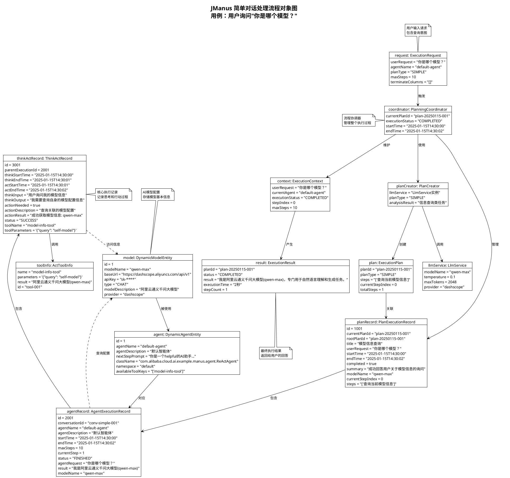
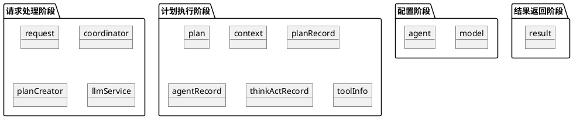

# JManus简单对话处理流程对象图

本文档展示 JManus 系统在处理简单对话"你是哪个模型？"时的核心对象及其在特定时刻的关系。对象图提供了系统结构的快照，捕捉了存在的实例及其关联的静态视图。

## 用例场景

用户输入："你是哪个模型？"，系统识别用户意图并返回当前使用的AI模型信息。

## PlantUML 对象图





## 对象生命周期分析

### 1. 配置阶段对象

这些对象在系统启动时创建，相对静态：

#### DynamicModelEntity (模型配置)

- **生命周期**: 系统配置时创建，长期存在
- **作用**: 存储AI模型的连接信息和配置参数
- **状态**: 在整个对话过程中保持不变

#### DynamicAgentEntity (智能体配置)

- **生命周期**: 系统配置时创建，长期存在
- **作用**: 定义智能体的行为策略和可用工具
- **状态**: 在整个对话过程中保持不变

### 2. 请求处理阶段对象

这些对象在每次用户请求时创建：

#### ExecutionRequest (执行请求)

- **创建时机**: 用户发起请求时
- **生命周期**: 从请求开始到处理完成
- **作用**: 封装用户的输入和执行参数

#### PlanningCoordinator (计划协调器)

- **创建时机**: 接收到执行请求时
- **生命周期**: 管理整个执行过程
- **作用**: 协调各个组件的执行顺序

#### PlanCreator (计划创建器)

- **创建时机**: 需要生成执行计划时
- **生命周期**: 计划创建完成后结束
- **作用**: 基于LLM分析生成执行步骤

### 3. 计划执行阶段对象

这些对象记录具体的执行过程：

#### ExecutionPlan (执行计划)

- **创建时机**: 计划创建器分析完成后
- **生命周期**: 从创建到执行完成
- **作用**: 定义具体的执行步骤序列

#### PlanExecutionRecord (计划执行记录)

- **创建时机**: 开始执行计划时
- **生命周期**: 持久化保存，用于审计
- **作用**: 记录整个计划的执行状态

#### AgentExecutionRecord (智能体执行记录)

- **创建时机**: 智能体开始执行时
- **生命周期**: 持久化保存，用于分析
- **作用**: 记录智能体的执行过程

#### ThinkActRecord (思考-行动记录)

- **创建时机**: 每次思考-行动循环时
- **生命周期**: 持久化保存，最细粒度记录
- **作用**: 记录具体的思考过程和行动结果

### 4. 结果返回阶段对象

#### ExecutionResult (执行结果)

- **创建时机**: 执行完成时
- **生命周期**: 返回给前端后销毁
- **作用**: 封装最终的执行结果

## 对象交互模式

### 1. 查询模式

```
AgentExecutionRecord -> DynamicModelEntity
ThinkActRecord -> DynamicModelEntity
```

智能体通过查询配置对象获取自身的模型信息。

### 2. 记录模式

```
PlanExecutionRecord -> AgentExecutionRecord -> ThinkActRecord
```

形成层次化的执行记录链，支持完整的执行轨迹追踪。

### 3. 工具调用模式

```
ThinkActRecord -> ActToolInfo
```

每个工具调用都会产生对应的信息记录。

## 简单对话的特点

### 1. 执行路径简单

- 只需要一个执行步骤：查询模型信息
- 不涉及复杂的工具链调用
- 执行时间很短（约2秒）

### 2. 数据访问模式

- 主要是读取操作：查询配置信息
- 写入操作：保存执行记录
- 无外部API调用

### 3. 对象关系稳定

- 配置对象之间的关系固定
- 执行记录对象按时间顺序创建
- 无并发执行的复杂性

## 性能特征

### 1. 内存使用

- 对象数量少：约12个核心对象
- 数据量小：主要是文本信息
- 生命周期短：大部分对象执行完即销毁

### 2. 数据库操作

- 读取操作：3-4次（配置查询）
- 写入操作：3-4次（记录保存）
- 事务简单：无复杂的数据一致性要求

### 3. 响应时间

- 总响应时间：1-3秒
- LLM调用：占用主要时间
- 数据库操作：毫秒级

---

**文档版本**: 1.0
**创建日期**: 2025年1月
**参考**: JManus 简单对话处理流程分析
