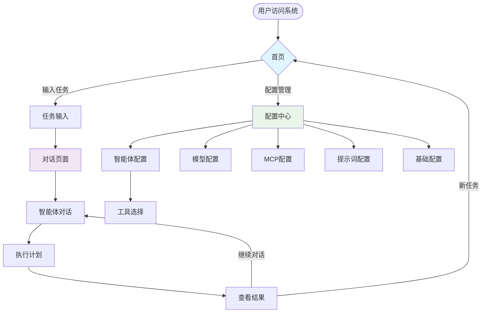
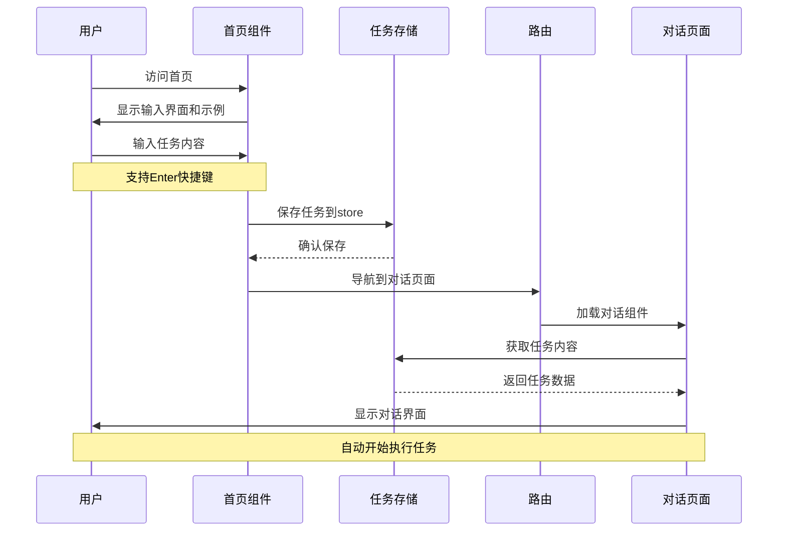
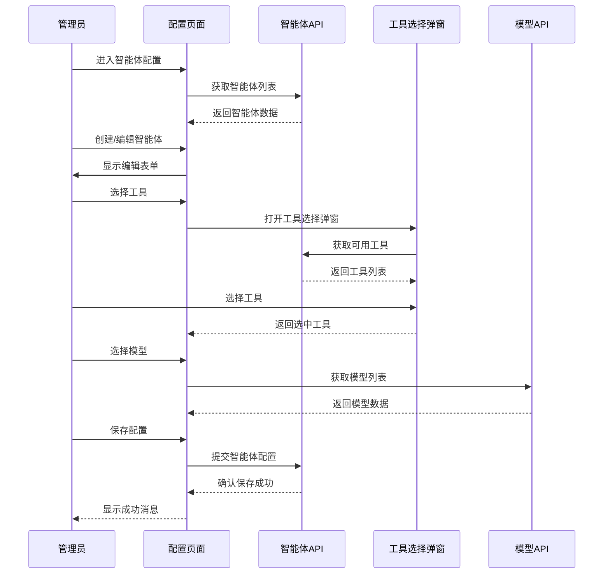
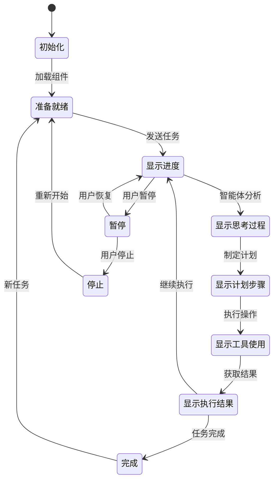
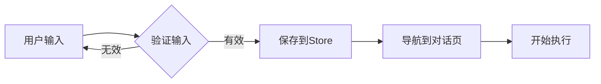
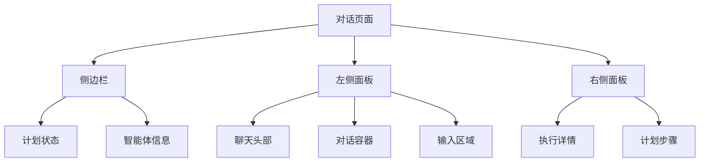
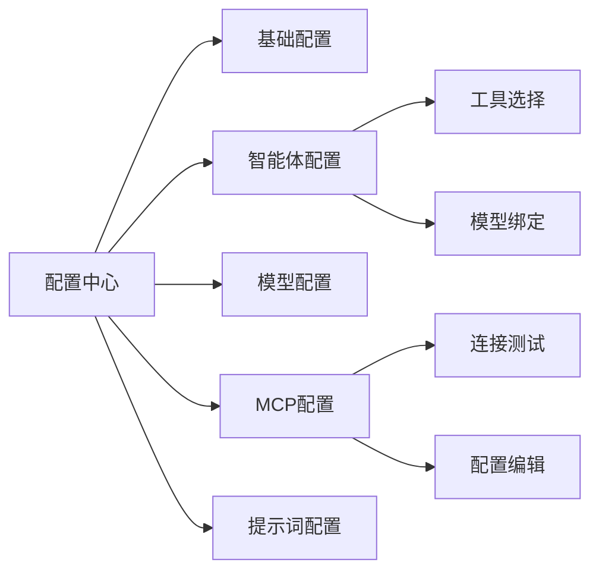
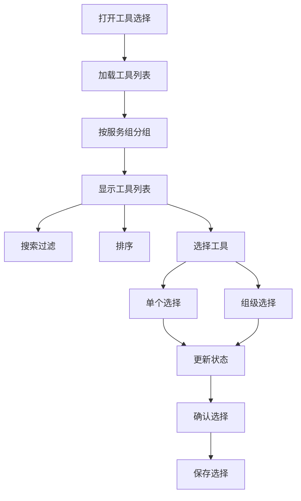
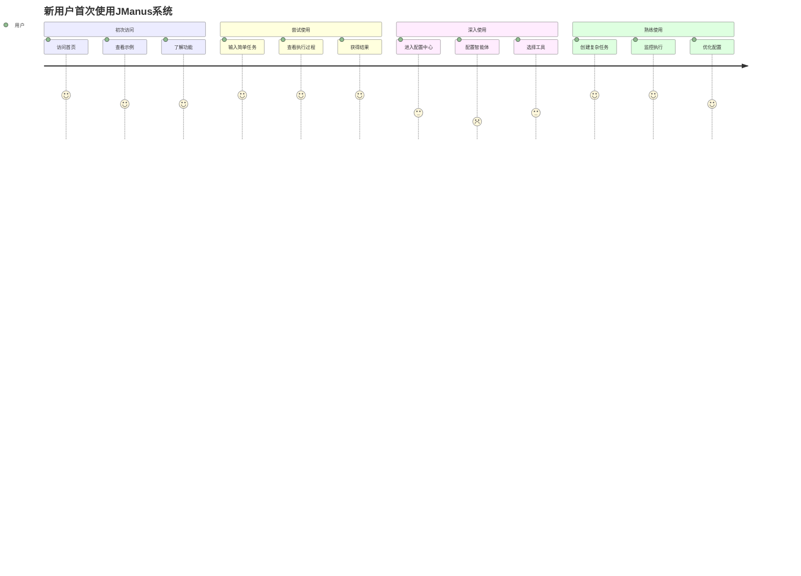
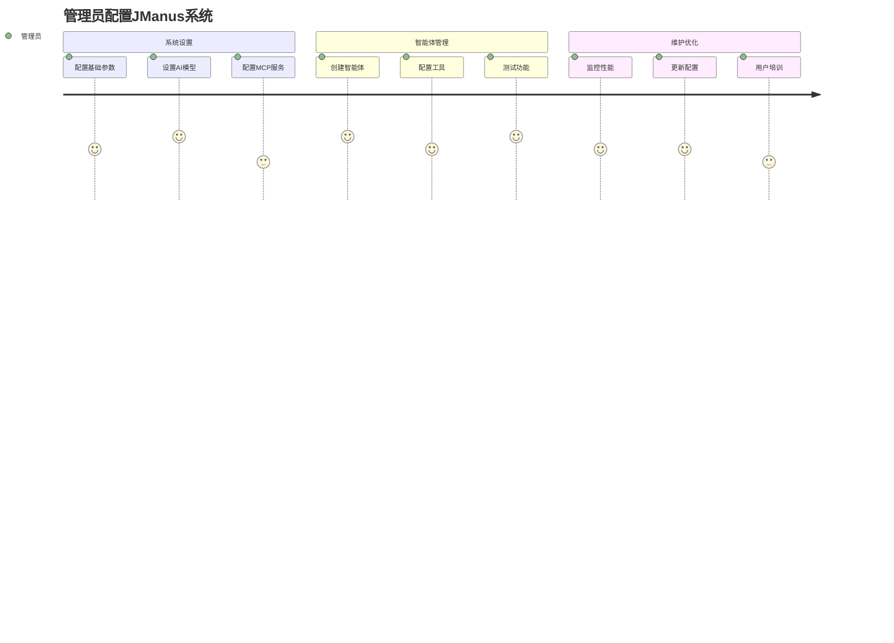

# JManus 用户故事设计文档

## 1. 概述

本文档基于JManus系统的Vue3前端代码，整理了系统已支持的用户故事，并提供完整的流程图分析。JManus是一个多智能体协作系统，提供Web界面供用户配置和使用智能体。

## 2. 已支持的用户故事清单

### 2.1 核心用户故事

| 序号 | 用户故事 | 页面/组件 | 优先级 | 状态 |
|------|----------|-----------|--------|------|
| 1 | 作为用户，我希望在首页输入任务并快速执行 | home/index.vue | 高 | ✅ 已实现 |
| 2 | 作为用户，我希望与智能体进行对话交互 | direct/index.vue | 高 | ✅ 已实现 |
| 3 | 作为管理员，我希望配置和管理智能体 | configs/agentConfig.vue | 高 | ✅ 已实现 |
| 4 | 作为管理员，我希望配置AI模型 | configs/modelConfig.vue | 高 | ✅ 已实现 |
| 5 | 作为管理员，我希望配置MCP服务器 | configs/mcpConfig.vue | 中 | ✅ 已实现 |
| 6 | 作为管理员，我希望管理提示词模板 | configs/dynamicPromptConfig.vue | 中 | ✅ 已实现 |
| 7 | 作为管理员，我希望配置系统基础设置 | configs/basicConfig.vue | 中 | ✅ 已实现 |
| 8 | 作为用户，我希望选择智能体可用的工具 | tool-selection-modal/index.vue | 中 | ✅ 已实现 |
| 9 | 作为用户，我希望切换界面语言 | language-switcher/index.vue | 低 | ✅ 已实现 |
| 10 | 作为用户，我希望看到友好的错误页面 | error/notFound.vue | 低 | ✅ 已实现 |

### 2.2 详细用户故事描述

#### 故事1：首页任务输入与执行
- **用户角色**：普通用户
- **需求描述**：作为用户，我希望能在首页直接输入任务描述，系统能理解我的需求并快速启动执行
- **验收标准**：
  - 提供清晰的输入框和示例提示
  - 支持快捷键（Enter）发送
  - 能自动跳转到执行页面
  - 保存用户输入的任务内容

#### 故事2：智能体对话交互
- **用户角色**：普通用户
- **需求描述**：作为用户，我希望能与智能体进行连续对话，实时查看执行进度和结果
- **验收标准**：
  - 支持多轮对话
  - 实时显示智能体状态
  - 可以查看执行计划和步骤
  - 支持停止执行操作

#### 故事3：智能体配置管理
- **用户角色**：系统管理员
- **需求描述**：作为管理员，我希望能创建、编辑、删除智能体，配置其工具和模型
- **验收标准**：
  - 完整的CRUD操作界面
  - 工具选择和配置功能
  - 模型关联配置
  - 批量操作支持

#### 故事4：AI模型配置
- **用户角色**：系统管理员
- **需求描述**：作为管理员，我希望能配置不同的AI模型提供商和参数
- **验收标准**：
  - 支持多种模型提供商
  - 模型参数配置
  - 连接测试功能
  - 模型使用统计

#### 故事5：MCP服务器配置
- **用户角色**：系统管理员
- **需求描述**：作为管理员，我希望能配置MCP服务器以扩展系统工具能力
- **验收标准**：
  - 支持多种连接类型（SSE、STUDIO、STREAMING）
  - JSON配置编辑器
  - 连接状态监控
  - 配置验证功能

## 3. 系统架构流程图

### 3.1 整体用户流程



### 3.2 首页任务输入流程



### 3.3 智能体配置流程



### 3.4 对话执行流程



## 4. 页面组件详细说明

### 4.1 首页组件 (home/index.vue)

**功能特性**：
- 欢迎界面和系统介绍
- 任务输入框（支持Enter快捷键）
- 示例任务展示卡片
- 语言切换功能
- 任务存储和路由导航

**交互流程**：


### 4.2 对话页面 (direct/index.vue)

**功能特性**：
- 侧边栏（计划执行状态）
- 对话容器（消息展示）
- 输入区域（支持多种输入模式）
- 右侧面板（执行详情）
- 语言切换和配置入口

**布局结构**：


### 4.3 配置中心 (configs/index.vue)

**功能模块**：
- 基础配置：系统参数设置
- 智能体配置：CRUD操作和工具选择
- 模型配置：AI模型参数设置
- MCP配置：外部服务集成
- 提示词配置：模板管理

**导航结构**：


### 4.4 工具选择弹窗 (tool-selection-modal/index.vue)

**功能特性**：
- 按服务组分类显示工具
- 搜索和过滤功能
- 批量选择和取消选择
- 工具状态管理（启用/禁用）
- 组级别的全选功能

**交互逻辑**：


## 5. 技术实现要点

### 5.1 状态管理

**任务存储 (task store)**：
```typescript
interface TaskState {
  currentTask: string | null
  homeVisited: boolean
}
```

**侧边栏存储 (sidebar store)**：
```typescript
interface SidebarState {
  collapsed: boolean
  activePanel: string
}
```

### 5.2 国际化支持

系统支持多语言切换，包括：
- 中文（简体）
- 英文
- 动态语言切换组件
- 完整的翻译键值对

### 5.3 响应式设计

- 自适应布局
- 移动端友好
- 灵活的面板尺寸调整
- 可折叠的侧边栏

### 5.4 API集成

主要API服务包括：
- `PlanActApiService`: 计划执行相关API
- `AgentApiService`: 智能体管理API
- `ModelApiService`: 模型配置API
- `McpApiService`: MCP服务器API
- `PromptApiService`: 提示词管理API
- `AdminApiService`: 系统配置API

## 6. 用户旅程图

### 6.1 新用户首次使用



### 6.2 管理员配置系统



## 7. 未来扩展方向

### 7.1 短期优化

1. **用户体验改进**
   - 添加更多交互提示
   - 优化加载状态显示
   - 增强错误处理

2. **功能增强**
   - 支持批量任务执行
   - 添加任务历史记录
   - 增加更多配置选项

### 7.2 长期规划

1. **高级功能**
   - 用户权限管理
   - 多租户支持
   - API监控面板

2. **集成扩展**
   - 更多MCP服务器集成
   - 第三方工具支持
   - 自定义插件系统

---

**文档版本**: 1.0  
**最后更新**: 2025年1月  
**维护者**: Spring AI Alibaba Team