# JManus 系统类图 (Class Diagram)

本文档展示 JManus AI 智能助手平台的类图，描述系统核心类、接口及其关系，明确系统结构、职责、继承与关联关系。

## 📋 文档汇总清单

### 🎯 类图概览

| 项目 | 数量/类型 | 说明 | 详细明细 |
|------|-----------|------|----------|
| **总类图数量** | 6个 | 1个系统整体类图 + 5个分层类图 | 系统整体类图、控制器层、工具系统、智能体系统、规划系统、数据层类图 |
| **核心类总数** | 50+ 个 | 包含类、接口、抽象类 | 具体类35个、接口8个、抽象类7个、枚举1个 |
| **设计模式** | 4种主要模式 | 策略、模板方法、工厂、组合 | 策略模式(3处)、模板方法模式(2处)、工厂模式(2处)、组合模式(1处) |
| **架构层次** | 8层 | 分层架构设计 | 接口层→控制器层→服务层→核心组件层→工具层→数据层→仓库层→基础设施层 |

### 📊 包含的图表类型

| 序号 | 图表名称 | 描述 | 包含组件数量 | 主要关系类型 | 锚点链接 |
|------|----------|------|--------------|--------------|----------|
| 1 | 系统整体类图 | 展示所有核心组件关系 | 50+个类和接口 | 继承、组合、聚合、依赖 | [查看](#系统整体类图) |
| 2 | 控制器层类图 | REST API控制器 | 6个控制器类 | 聚合关系为主 | [查看](#1-控制器层类图) |
| 3 | 工具系统类图 | 工具接口和实现 | 3个接口+6个工具类 | 继承和实现关系 | [查看](#2-工具系统类图) |
| 4 | 智能体系统类图 | BaseAgent和相关组件 | 1个抽象类+1个枚举+相关服务 | 组合和依赖关系 | [查看](#3-智能体系统类图) |
| 5 | 规划系统类图 | 计划创建、执行、协调 | 7个核心类+2个值对象 | 组合和继承关系 | [查看](#4-规划系统类图) |
| 6 | 数据层类图 | 实体、仓库、值对象 | 6个实体+6个仓库+2个值对象 | 映射和关联关系 | [查看](#5-数据层类图) |

### 🏗️ 核心组件统计

| 组件类型 | 数量 | 主要包含 | 具体类名 | 核心职责 |
|----------|------|----------|----------|----------|
| **控制器 (Controllers)** | 6个 | Agent、Model、Manus、Prompt、Mcp、Config | AgentController、ModelController、ManusController、PromptController、McpController、ConfigController | HTTP请求处理和路由 |
| **服务 (Services)** | 8个 | 业务逻辑封装和协调 | AgentService、ModelService、LlmService、UserInputService等 | 业务逻辑处理和组件协调 |
| **实体 (Entities)** | 6个 | 数据模型定义 | DynamicAgentEntity、DynamicModelEntity、PromptEntity、McpConfigEntity、ConfigEntity、PlanExecutionRecordEntity | 数据持久化对象 |
| **仓库 (Repositories)** | 6个 | 数据访问接口 | DynamicAgentRepository、DynamicModelRepository、PromptRepository、McpConfigRepository、ConfigRepository、PlanExecutionRecordRepository | 数据访问抽象层 |
| **工具 (Tools)** | 6个 | 可扩展工具体系 | PlanningTool、FormInputTool、TerminateTool、DocLoaderTool、MapReducePlanningTool、UnifiedDirectoryManager | 功能执行和外部集成 |
| **核心接口** | 8个 | 系统扩展点定义 | ILlmService、ToolCallBiFunctionDef、PlanningToolInterface、TerminableTool、PlanExecutorInterface、IUnifiedDirectoryManager、IManusProperties、AgentService | 系统架构和扩展点 |

### 🔗 关系类型统计

| 关系类型 | 数量 | UML符号 | 说明 | 具体实例 | 应用场景 |
|----------|------|---------|------|----------|----------|
| **继承关系 (Inheritance)** | 15个 | `<|--` | 类和接口的继承 | AbstractBaseTool→PlanningTool、AbstractPlanExecutor→PlanExecutor等 | 代码复用和多态 |
| **组合关系 (Composition)** | 8个 | `*--` | 强依赖关系 | PlanningCoordinator*--PlanCreator、BaseAgent*--AgentState等 | 生命周期管理 |
| **聚合关系 (Aggregation)** | 8个 | `o--` | 弱依赖关系 | AgentController o-- AgentService、BaseAgent o-- ILlmService等 | 功能协作 |
| **依赖关系 (Dependency)** | 6个 | `..>` | 使用关系 | PlanningCoordinator..>ExecutionContext等 | 方法参数依赖 |
| **实现关系 (Implementation)** | 15个 | `<|..` | 接口实现 | LlmService<|..ILlmService、AgentServiceImpl<|..AgentService等 | 接口契约实现 |

### 🎨 设计模式应用

| 设计模式 | 应用场景 | 核心类/接口 | 具体实现 | 解决问题 | 设计优势 |
|----------|----------|-------------|----------|----------|----------|
| **策略模式** | 执行策略选择 | PlanExecutorInterface及其实现 | PlanExecutor、MapReducePlanExecutor | 不同计划类型的执行策略 | 算法可替换、易扩展 |
| **模板方法模式** | 工具和执行框架 | AbstractBaseTool、AbstractPlanExecutor | run()方法模板、executeStep()框架 | 统一流程控制，变化点可定制 | 代码复用、流程标准化 |
| **工厂模式** | 对象创建管理 | PlanningFactory、PlanExecutorFactory | createPlanningCoordinator()、createExecutor() | 复杂对象创建和依赖注入 | 解耦创建逻辑、集中管理 |
| **组合模式** | 组件组合协调 | PlanningCoordinator组件组合 | 组合PlanCreator、PlanExecutorFactory、PlanFinalizer | 复杂功能的分解和协调 | 职责分离、灵活组合 |

### 📚 文档结构导航

| 章节 | 内容描述 | 包含子章节 | 页面估计 | 复杂度 | 快速链接 |
|------|----------|------------|----------|--------|----------|
| 系统整体类图 | 完整架构视图 | 核心接口、配置管理、工具体系、智能体系统、规划系统、服务层、控制器层、数据层、仓库层、值对象、工厂模式 | 1页 | ⭐⭐⭐⭐⭐ | [查看](#系统整体类图) |
| 分层类图 | 按架构层次详细展示 | 5个分层类图 | 5页 | ⭐⭐⭐⭐ | [查看](#分层类图) |
| 类图关系说明 | 架构特点和业务流程 | 系统架构特点、设计模式、关键接口、业务流程、扩展机制、数据流向、系统特性 | 2页 | ⭐⭐⭐ | [查看](#类图关系说明) |
| 扩展机制 | 系统扩展指南 | 新工具集成、新智能体类型、新执行器类型 | 1页 | ⭐⭐ | [查看](#扩展机制) |

---

## 系统整体类图

```plantuml
@startuml
!theme plain
skinparam linetype ortho
skinparam packageStyle rectangle
skinparam class {
  BackgroundColor lightblue
  BorderColor darkblue
  FontSize 10
}
skinparam interface {
  BackgroundColor lightgreen
  BorderColor darkgreen
  FontSize 10
}
skinparam abstract {
  BackgroundColor lightyellow
  BorderColor orange
  FontSize 10
}

title JManus AI 智能助手平台 - 系统类图

' ===== 核心接口定义 =====
package "核心接口 (Core Interfaces)" {
  interface ILlmService {
    +getChatClient(): ChatClient
    +getPlanningChatClient(): ChatClient
    +getChatModel(): ChatModel
  }
  
  interface ToolCallBiFunctionDef<I> {
    +getName(): String
    +getDescription(): String
    +getParameters(): String
    +getInputType(): Class<I>
    +isReturnDirect(): boolean
    +setCurrentPlanId(planId: String): void
    +setRootPlanId(rootPlanId: String): void
    +getCurrentToolStateString(): String
    +cleanup(planId: String): void
    +apply(input: I, context: ToolContext): ToolExecuteResult
  }
  
  interface PlanningToolInterface {
    +getCurrentPlanId(): String
    +getCurrentPlan(): PlanInterface
    +getFunctionToolCallback(): FunctionToolCallback
  }
  
  interface TerminableTool {
    +canTerminate(): boolean
  }
  
  interface PlanExecutorInterface {
    +executeAllSteps(context: ExecutionContext): void
  }
  
  interface IUnifiedDirectoryManager {
    +getWorkingDirectoryPath(): String
    +getWorkingDirectory(): Path
    +createTaskDirectory(taskId: String): Path
    +createPlanDirectory(planId: String): Path
  }
}

' ===== 配置管理 =====
package "配置管理 (Configuration)" {
  interface IManusProperties {
    +getBrowserHeadless(): Boolean
    +getBrowserRequestTimeout(): Integer
    +getDebugDetail(): Boolean
    +getMaxSteps(): Integer
  }
  
  class ManusProperties {
    -browserHeadless: Boolean
    -browserRequestTimeout: Integer
    -debugDetail: Boolean
    -maxSteps: Integer
    +getBrowserHeadless(): Boolean
    +setBrowserHeadless(value: Boolean): void
  }
}

' ===== 工具层次结构 =====
package "工具体系 (Tool System)" {
  abstract class AbstractBaseTool<I> {
    #currentPlanId: String
    #rootPlanId: String
    +isReturnDirect(): boolean
    +setCurrentPlanId(planId: String): void
    +setRootPlanId(rootPlanId: String): void
    +apply(input: I, context: ToolContext): ToolExecuteResult
    +{abstract} run(input: I): ToolExecuteResult
  }
  
  class PlanningTool {
    -currentPlan: ExecutionPlan
    -objectMapper: ObjectMapper
    +run(input: PlanningInput): ToolExecuteResult
    +getCurrentPlanId(): String
    +getCurrentPlan(): PlanInterface
    +getFunctionToolCallback(): FunctionToolCallback
  }
  
  class FormInputTool {
    -userInputService: IUserInputService
    +run(input: UserFormInput): ToolExecuteResult
  }
  
  class TerminateTool {
    +run(input: Map<String, Object>): ToolExecuteResult
    +canTerminate(): boolean
  }
  
  class DocLoaderTool {
    +run(input: DocLoaderInput): ToolExecuteResult
  }
  
  class MapReducePlanningTool {
    -currentPlan: MapReduceExecutionPlan
    +apply(input: String): ToolExecuteResult
    +getCurrentPlanId(): String
  }
  
  class UnifiedDirectoryManager {
    -manusProperties: ManusProperties
    +getWorkingDirectoryPath(): String
    +getWorkingDirectory(): Path
    +createTaskDirectory(taskId: String): Path
    +createPlanDirectory(planId: String): Path
  }
}

' ===== 智能体系统 =====
package "智能体系统 (Agent System)" {
  abstract class BaseAgent {
    #llmService: ILlmService
    #manusProperties: ManusProperties
    #promptService: PromptService
    #planExecutionRecorder: PlanExecutionRecorder
    -currentPlanId: String
    -rootPlanId: String
    -state: AgentState
    -maxSteps: int
    -currentStep: int
    -envData: Map<String, Object>
    +{abstract} getName(): String
    +{abstract} clearUp(planId: String): void
    +{abstract} getNextStepWithEnvMessage(): Message
    +{abstract} getToolCallList(): List<ToolCallback>
    +{abstract} getToolCallBackContext(toolKey: String): ToolCallBackContext
    +execute(): void
    +setState(state: AgentState): void
  }
  
  enum AgentState {
    NOT_STARTED
    IN_PROGRESS
    COMPLETED
    BLOCKED
    FAILED
  }
}

' ===== 规划系统 =====
package "规划系统 (Planning System)" {
  class PlanningCoordinator {
    -planCreator: PlanCreator
    -planExecutorFactory: PlanExecutorFactory
    -planFinalizer: PlanFinalizer
    +createPlan(context: ExecutionContext): ExecutionContext
    +createAndExecutePlan(context: ExecutionContext): ExecutionContext
    +executePlan(context: ExecutionContext): ExecutionContext
    +finalizePlan(context: ExecutionContext): ExecutionContext
  }
  
  class PlanCreator {
    -agents: List<DynamicAgentEntity>
    -llmService: ILlmService
    -planningTool: PlanningToolInterface
    -recorder: PlanExecutionRecorder
    -promptService: PromptService
    -manusProperties: ManusProperties
    +createPlan(context: ExecutionContext): void
    -buildAgentsInfo(agents: List<DynamicAgentEntity>): String
    -generatePlanPrompt(userRequest: String, agentsInfo: String): String
  }
  
  abstract class AbstractPlanExecutor {
    #recorder: PlanExecutionRecorder
    #agents: List<DynamicAgentEntity>
    #agentService: AgentService
    #llmService: ILlmService
    #manusProperties: ManusProperties
    #pattern: Pattern
    #executeStep(step: ExecutionStep, context: ExecutionContext): BaseAgent
    #getStepFromStepReq(stepRequirement: String): String
    #parseColumns(columnsInString: String): List<String>
    #performCleanup(context: ExecutionContext, lastExecutor: BaseAgent): void
  }
  
  class PlanExecutor {
    +executeAllSteps(context: ExecutionContext): void
  }
  
  class MapReducePlanExecutor {
    -executorService: ExecutorService
    +executeAllSteps(context: ExecutionContext): void
    -executeSequentialNode(node: SequentialNode, context: ExecutionContext, lastExecutor: BaseAgent): BaseAgent
    -executeMapReduceNode(node: MapReduceNode, context: ExecutionContext, lastExecutor: BaseAgent): BaseAgent
    -executeMapPhase(steps: List<ExecutionStep>, context: ExecutionContext, toolContext: ToolCallBackContext): BaseAgent
    -executeReducePhase(steps: List<ExecutionStep>, context: ExecutionContext): BaseAgent
    +shutdown(): void
  }
  
  class PlanFinalizer {
    -llmService: ILlmService
    -recorder: PlanExecutionRecorder
    -promptService: PromptService
    -manusProperties: ManusProperties
    +finalizePlan(context: ExecutionContext): void
  }
}

' ===== 业务服务层 =====
package "业务服务层 (Service Layer)" {
  interface AgentService {
    +getAllAgents(): List<AgentConfig>
    +getAllAgentsByNamespace(namespace: String): List<AgentConfig>
    +getAgentById(id: String): AgentConfig
    +createAgent(agentConfig: AgentConfig): AgentConfig
    +updateAgent(agentConfig: AgentConfig): AgentConfig
    +deleteAgent(id: String): void
    +getAvailableTools(): List<Tool>
    +createDynamicBaseAgent(name: String, planId: String, rootPlanId: String, settings: Map<String, Object>, columns: List<String>): BaseAgent
  }
  
  class AgentServiceImpl {
    -dynamicAgentLoader: IDynamicAgentLoader
    -repository: DynamicAgentRepository
    -planningFactory: IPlanningFactory
    -mcpService: IMcpService
    -llmService: ILlmService
    -toolCallingManager: ToolCallingManager
    +getAllAgents(): List<AgentConfig>
    +createAgent(agentConfig: AgentConfig): AgentConfig
    +createDynamicBaseAgent(name: String, planId: String, rootPlanId: String, settings: Map<String, Object>, columns: List<String>): BaseAgent
  }
  
  interface ModelService {
    +getAllModels(): List<ModelConfig>
    +getModelById(id: String): ModelConfig
    +createModel(modelConfig: ModelConfig): ModelConfig
    +updateModel(modelConfig: ModelConfig): ModelConfig
    +deleteModel(id: String): void
  }
  
  class ModelServiceImpl {
    -repository: DynamicModelRepository
    -agentRepository: DynamicAgentRepository
    +getAllModels(): List<ModelConfig>
    +createModel(modelConfig: ModelConfig): ModelConfig
    +updateModel(modelConfig: ModelConfig): ModelConfig
    +deleteModel(id: String): void
  }
  
  class LlmService {
    -agentExecutionClient: ChatClient
    -planningChatClient: ChatClient
    -chatModel: ChatModel
    +getChatClient(): ChatClient
    +getPlanningChatClient(): ChatClient
    +getChatModel(): ChatModel
  }
  
  interface IUserInputService {
    +storeFormInputTool(planId: String, tool: FormInputTool): void
    +retrieveFormInputTool(planId: String): FormInputTool
    +waitForUserInput(planId: String, timeout: Duration): UserInputWaitState
    +submitUserInput(planId: String, inputs: Map<String, String>): void
  }
  
  class UserInputService {
    -formInputTools: Map<String, FormInputTool>
    -waitStates: Map<String, UserInputWaitState>
    +storeFormInputTool(planId: String, tool: FormInputTool): void
    +waitForUserInput(planId: String, timeout: Duration): UserInputWaitState
    +submitUserInput(planId: String, inputs: Map<String, String>): void
  }
}

' ===== 控制器层 =====
package "控制器层 (Controller Layer)" {
  class AgentController {
    -agentService: AgentService
    +getAllAgents(): ResponseEntity<List<AgentConfig>>
    +getAgentsByNamespace(namespace: String): ResponseEntity<List<AgentConfig>>
    +getAgentById(id: String): ResponseEntity<AgentConfig>
    +createAgent(agentConfig: AgentConfig): ResponseEntity<AgentConfig>
    +updateAgent(id: String, agentConfig: AgentConfig): ResponseEntity<AgentConfig>
    +deleteAgent(id: String): ResponseEntity<Void>
    +getAvailableTools(): ResponseEntity<List<Tool>>
  }
  
  class ModelController {
    -modelService: ModelService
    +getAllModels(): ResponseEntity<List<ModelConfig>>
    +getModelById(id: String): ResponseEntity<ModelConfig>
    +createModel(modelConfig: ModelConfig): ResponseEntity<ModelConfig>
    +updateModel(id: Long, modelConfig: ModelConfig): ResponseEntity<ModelConfig>
    +deleteModel(id: String): ResponseEntity<Void>
    +getAllModelTypes(): ResponseEntity<List<String>>
  }
  
  class ManusController {
    -planningFactory: PlanningFactory
    -planIdDispatcher: PlanIdDispatcher
    -userInputService: UserInputService
    -recorder: PlanExecutionRecorder
    +executeTask(request: TaskExecutionRequest): ResponseEntity<ExecutionResult>
    +getExecutionStatus(planId: String): ResponseEntity<ExecutionStatus>
    +getExecutionResult(planId: String): ResponseEntity<ExecutionResult>
    +submitUserInput(planId: String, inputs: Map<String, String>): ResponseEntity<Void>
    +getUserInputWaitState(planId: String): ResponseEntity<UserInputWaitState>
  }
  
  class PromptController {
    -promptService: PromptService
    +getAll(): ResponseEntity<List<PromptVO>>
    +getAllByNamespace(namespace: String): ResponseEntity<List<PromptVO>>
    +getById(id: Long): ResponseEntity<PromptVO>
    +create(prompt: PromptVO): ResponseEntity<PromptVO>
    +update(id: Long, prompt: PromptVO): ResponseEntity<PromptVO>
    +delete(id: Long): ResponseEntity<Void>
  }
  
  class McpController {
    -mcpService: McpService
    +getAllConfigs(): ResponseEntity<List<McpConfigVO>>
    +createConfig(config: McpConfigRequestVO): ResponseEntity<McpConfigVO>
    +updateConfig(id: Long, config: McpConfigRequestVO): ResponseEntity<McpConfigVO>
    +deleteConfig(id: Long): ResponseEntity<Void>
    +getServerStatus(id: Long): ResponseEntity<Map<String, Object>>
  }
  
  class ConfigController {
    -configService: IConfigService
    +getConfigsByGroup(groupName: String): ResponseEntity<List<ConfigEntity>>
    +batchUpdateConfigs(configs: List<ConfigEntity>): ResponseEntity<Void>
  }
}

' ===== 数据层 =====
package "数据层 (Data Layer)" {
  class DynamicAgentEntity {
    -id: Long
    -name: String
    -description: String
    -namespace: String
    -availableTools: String
    -nextStepPrompt: String
    -model: DynamicModelEntity
    +mapToAgentConfig(): AgentConfig
  }
  
  class DynamicModelEntity {
    -id: Long
    -baseUrl: String
    -apiKey: String
    -modelName: String
    -modelDescription: String
    -type: String
    +mapToModelConfig(): ModelConfig
  }
  
  class PromptEntity {
    -id: Long
    -namespace: String
    -promptName: String
    -content: String
    -variables: String
    -description: String
    +mapToPromptVO(): PromptVO
  }
  
  class McpConfigEntity {
    -id: Long
    -serverName: String
    -command: String
    -args: String
    -env: String
    -cwd: String
    -timeout: Integer
    -enabled: Boolean
    +mapToMcpConfigVO(): McpConfigVO
  }
  
  class ConfigEntity {
    -id: Long
    -groupName: String
    -configKey: String
    -configValue: String
    -description: String
    -inputType: ConfigInputType
  }
  
  class PlanExecutionRecordEntity {
    -id: Long
    -planId: String
    -rootPlanId: String
    -userRequest: String
    -planContent: String
    -executionStatus: String
    -startTime: LocalDateTime
    -endTime: LocalDateTime
    -errorMessage: String
  }
}

' ===== 仓库层 =====
package "仓库层 (Repository Layer)" {
  interface DynamicAgentRepository {
    +findAllByNamespace(namespace: String): List<DynamicAgentEntity>
    +findByName(name: String): DynamicAgentEntity
    +findAllByModel(model: DynamicModelEntity): List<DynamicAgentEntity>
  }
  
  interface DynamicModelRepository {
    +findByModelName(modelName: String): DynamicModelEntity
  }
  
  interface PromptRepository {
    +findAllByNamespace(namespace: String): List<PromptEntity>
    +findByNamespaceAndPromptName(namespace: String, promptName: String): PromptEntity
  }
  
  interface McpConfigRepository {
    +findByServerName(serverName: String): McpConfigEntity
    +findAllByEnabled(enabled: Boolean): List<McpConfigEntity>
  }
  
  interface ConfigRepository {
    +findAllByGroupName(groupName: String): List<ConfigEntity>
    +findByGroupNameAndConfigKey(groupName: String, configKey: String): ConfigEntity
  }
  
  interface PlanExecutionRecordRepository {
    +findByPlanId(planId: String): PlanExecutionRecordEntity
    +findAllByRootPlanId(rootPlanId: String): List<PlanExecutionRecordEntity>
  }
}

' ===== 值对象和DTO =====
package "值对象 (Value Objects)" {
  class AgentConfig {
    -id: String
    -name: String
    -description: String
    -namespace: String
    -availableTools: List<String>
    -nextStepPrompt: String
    -model: ModelConfig
  }
  
  class ModelConfig {
    -id: Long
    -baseUrl: String
    -apiKey: String
    -modelName: String
    -modelDescription: String
    -type: String
  }
  
  class Tool {
    -key: String
    -name: String
    -description: String
    -enabled: boolean
    -serviceGroup: String
  }
  
  class ExecutionContext {
    -currentPlanId: String
    -rootPlanId: String
    -userRequest: String
    -plan: PlanInterface
    -useMemory: boolean
    -success: boolean
    -executionParams: Map<String, Object>
  }
  
  class ExecutionStep {
    -stepIndex: int
    -stepRequirement: String
    -terminateColumns: String
    -agent: BaseAgent
  }
}

' ===== 工厂模式 =====
package "工厂模式 (Factory Pattern)" {
  class PlanningFactory {
    -dynamicAgentLoader: IDynamicAgentLoader
    -llmService: ILlmService
    -recorder: PlanExecutionRecorder
    -promptService: PromptService
    -manusProperties: ManusProperties
    -planExecutorFactory: PlanExecutorFactory
    +createPlanningCoordinator(planId: String): PlanningCoordinator
  }
  
  class PlanExecutorFactory {
    -agents: List<DynamicAgentEntity>
    -recorder: PlanExecutionRecorder
    -agentService: AgentService
    -llmService: ILlmService
    -manusProperties: ManusProperties
    +createExecutor(planType: String): PlanExecutorInterface
  }
}

' ===== 继承关系 =====
ToolCallBiFunctionDef <|.. AbstractBaseTool
AbstractBaseTool <|-- PlanningTool
AbstractBaseTool <|-- FormInputTool
AbstractBaseTool <|-- DocLoaderTool
AbstractBaseTool <|-- TerminateTool
PlanningToolInterface <|.. PlanningTool
PlanningToolInterface <|.. MapReducePlanningTool
TerminableTool <|.. TerminateTool
IUnifiedDirectoryManager <|.. UnifiedDirectoryManager
IManusProperties <|.. ManusProperties
ILlmService <|.. LlmService
AgentService <|.. AgentServiceImpl
ModelService <|.. ModelServiceImpl
IUserInputService <|.. UserInputService
PlanExecutorInterface <|.. AbstractPlanExecutor
AbstractPlanExecutor <|-- PlanExecutor
AbstractPlanExecutor <|-- MapReducePlanExecutor

' ===== 组合关系 =====
PlanningCoordinator *-- PlanCreator
PlanningCoordinator *-- PlanExecutorFactory
PlanningCoordinator *-- PlanFinalizer
PlanCreator *-- PlanningToolInterface
AgentServiceImpl *-- DynamicAgentRepository
ModelServiceImpl *-- DynamicModelRepository
BaseAgent *-- AgentState
AbstractPlanExecutor *-- Pattern

' ===== 聚合关系 =====
PlanningFactory o-- PlanExecutorFactory
AgentController o-- AgentService
ModelController o-- ModelService
ManusController o-- PlanningFactory
BaseAgent o-- ILlmService
BaseAgent o-- ManusProperties
PlanCreator o-- ILlmService
AbstractPlanExecutor o-- PlanExecutionRecorder

' ===== 依赖关系 =====
PlanningCoordinator ..> ExecutionContext
PlanCreator ..> ExecutionContext
AbstractPlanExecutor ..> ExecutionContext
AgentServiceImpl ..> AgentConfig
ModelServiceImpl ..> ModelConfig
DynamicAgentEntity ..> AgentConfig
DynamicModelEntity ..> ModelConfig

@enduml
```

## 分层类图

### 1. 控制器层类图

```plantuml
@startuml
!theme plain
skinparam class {
  BackgroundColor lightblue
  BorderColor darkblue
}

title JManus 控制器层类图

package "控制器层 (Controller Layer)" {
  class AgentController {
    -agentService: AgentService
    +getAllAgents(): ResponseEntity<List<AgentConfig>>
    +getAgentsByNamespace(namespace: String): ResponseEntity<List<AgentConfig>>
    +getAgentById(id: String): ResponseEntity<AgentConfig>
    +createAgent(agentConfig: AgentConfig): ResponseEntity<AgentConfig>
    +updateAgent(id: String, agentConfig: AgentConfig): ResponseEntity<AgentConfig>
    +deleteAgent(id: String): ResponseEntity<Void>
    +getAvailableTools(): ResponseEntity<List<Tool>>
  }
  
  class ModelController {
    -modelService: ModelService
    +getAllModels(): ResponseEntity<List<ModelConfig>>
    +getModelById(id: String): ResponseEntity<ModelConfig>
    +createModel(modelConfig: ModelConfig): ResponseEntity<ModelConfig>
    +updateModel(id: Long, modelConfig: ModelConfig): ResponseEntity<ModelConfig>
    +deleteModel(id: String): ResponseEntity<Void>
    +getAllModelTypes(): ResponseEntity<List<String>>
  }
  
  class ManusController {
    -planningFactory: PlanningFactory
    -planIdDispatcher: PlanIdDispatcher
    -userInputService: UserInputService
    -recorder: PlanExecutionRecorder
    +executeTask(request: TaskExecutionRequest): ResponseEntity<ExecutionResult>
    +getExecutionStatus(planId: String): ResponseEntity<ExecutionStatus>
    +getExecutionResult(planId: String): ResponseEntity<ExecutionResult>
    +submitUserInput(planId: String, inputs: Map<String, String>): ResponseEntity<Void>
    +getUserInputWaitState(planId: String): ResponseEntity<UserInputWaitState>
  }
  
  class PromptController {
    -promptService: PromptService
    +getAll(): ResponseEntity<List<PromptVO>>
    +getAllByNamespace(namespace: String): ResponseEntity<List<PromptVO>>
    +getById(id: Long): ResponseEntity<PromptVO>
    +create(prompt: PromptVO): ResponseEntity<PromptVO>
    +update(id: Long, prompt: PromptVO): ResponseEntity<PromptVO>
    +delete(id: Long): ResponseEntity<Void>
  }
  
  class McpController {
    -mcpService: McpService
    +getAllConfigs(): ResponseEntity<List<McpConfigVO>>
    +createConfig(config: McpConfigRequestVO): ResponseEntity<McpConfigVO>
    +updateConfig(id: Long, config: McpConfigRequestVO): ResponseEntity<McpConfigVO>
    +deleteConfig(id: Long): ResponseEntity<Void>
    +getServerStatus(id: Long): ResponseEntity<Map<String, Object>>
  }
  
  class ConfigController {
    -configService: IConfigService
    +getConfigsByGroup(groupName: String): ResponseEntity<List<ConfigEntity>>
    +batchUpdateConfigs(configs: List<ConfigEntity>): ResponseEntity<Void>
  }
}

AgentController o-- AgentService
ModelController o-- ModelService
ManusController o-- PlanningFactory
PromptController o-- PromptService
McpController o-- McpService
ConfigController o-- IConfigService

@enduml
```



### 2. 工具系统类图


### 3. 智能体系统类图

```plantuml
@startuml
!theme plain
skinparam abstract {
  BackgroundColor lightyellow
  BorderColor orange
}
skinparam class {
  BackgroundColor lightblue
  BorderColor darkblue
}
skinparam enum {
  BackgroundColor lightcyan
  BorderColor darkcyan
}

title JManus 智能体系统类图

abstract class BaseAgent {
  #llmService: ILlmService
  #manusProperties: ManusProperties
  #promptService: PromptService
  #planExecutionRecorder: PlanExecutionRecorder
  -currentPlanId: String
  -rootPlanId: String
  -thinkActRecordId: Long
  -state: AgentState
  -maxSteps: int
  -currentStep: int
  -initSettingData: Map<String, Object>
  -envData: Map<String, Object>
  +{abstract} getName(): String
  +{abstract} clearUp(planId: String): void
  +{abstract} getNextStepWithEnvMessage(): Message
  +{abstract} getToolCallList(): List<ToolCallback>
  +{abstract} getToolCallBackContext(toolKey: String): ToolCallBackContext
  +execute(): void
  +setState(state: AgentState): void
  +getCurrentPlanId(): String
  +setCurrentPlanId(planId: String): void
  +getRootPlanId(): String
  +setRootPlanId(rootPlanId: String): void
  +getState(): AgentState
  +getMaxSteps(): int
  +getCurrentStep(): int
  +getEnvData(): Map<String, Object>
  +setEnvData(envData: Map<String, Object>): void
  #createSystemMessage(variables: Map<String, Object>): Message
}

enum AgentState {
  NOT_STARTED("not_started")
  IN_PROGRESS("in_progress")
  COMPLETED("completed")
  BLOCKED("blocked")
  FAILED("failed")
  --
  -state: String
  +getState(): String
}

interface AgentService {
  +getAllAgents(): List<AgentConfig>
  +getAllAgentsByNamespace(namespace: String): List<AgentConfig>
  +getAgentById(id: String): AgentConfig
  +createAgent(agentConfig: AgentConfig): AgentConfig
  +updateAgent(agentConfig: AgentConfig): AgentConfig
  +deleteAgent(id: String): void
  +getAvailableTools(): List<Tool>
  +createDynamicBaseAgent(name: String, planId: String, rootPlanId: String, settings: Map<String, Object>, columns: List<String>): BaseAgent
}

class AgentServiceImpl {
  -dynamicAgentLoader: IDynamicAgentLoader
  -repository: DynamicAgentRepository
  -planningFactory: IPlanningFactory
  -mcpService: IMcpService
  -llmService: ILlmService
  -toolCallingManager: ToolCallingManager
  +getAllAgents(): List<AgentConfig>
  +createAgent(agentConfig: AgentConfig): AgentConfig
  +createDynamicBaseAgent(name: String, planId: String, rootPlanId: String, settings: Map<String, Object>, columns: List<String>): BaseAgent
  -mapToAgentConfig(entity: DynamicAgentEntity): AgentConfig
}

class AgentConfig {
  -id: String
  -name: String
  -description: String
  -namespace: String
  -availableTools: List<String>
  -nextStepPrompt: String
  -model: ModelConfig
}

BaseAgent *-- AgentState
AgentService <|.. AgentServiceImpl
BaseAgent ..> AgentConfig

@enduml
```



### 4. 规划系统类图


### 5. 数据层类图

```plantuml
@startuml
!theme plain
skinparam class {
  BackgroundColor lightcyan
  BorderColor darkcyan
}
skinparam interface {
  BackgroundColor lightgreen
  BorderColor darkgreen
}

title JManus 数据层类图

' 实体类
class DynamicAgentEntity {
  -id: Long
  -name: String
  -description: String
  -namespace: String
  -availableTools: String
  -nextStepPrompt: String
  -model: DynamicModelEntity
  +mapToAgentConfig(): AgentConfig
}

class DynamicModelEntity {
  -id: Long
  -baseUrl: String
  -apiKey: String
  -modelName: String
  -modelDescription: String
  -type: String
  +mapToModelConfig(): ModelConfig
}

class PromptEntity {
  -id: Long
  -namespace: String
  -promptName: String
  -content: String
  -variables: String
  -description: String
  +mapToPromptVO(): PromptVO
}

class McpConfigEntity {
  -id: Long
  -serverName: String
  -command: String
  -args: String
  -env: String
  -cwd: String
  -timeout: Integer
  -enabled: Boolean
  +mapToMcpConfigVO(): McpConfigVO
}

class ConfigEntity {
  -id: Long
  -groupName: String
  -configKey: String
  -configValue: String
  -description: String
  -inputType: ConfigInputType
}

class PlanExecutionRecordEntity {
  -id: Long
  -planId: String
  -rootPlanId: String
  -userRequest: String
  -planContent: String
  -executionStatus: String
  -startTime: LocalDateTime
  -endTime: LocalDateTime
  -errorMessage: String
}

' 仓库接口
interface DynamicAgentRepository {
  +findAllByNamespace(namespace: String): List<DynamicAgentEntity>
  +findByName(name: String): DynamicAgentEntity
  +findAllByModel(model: DynamicModelEntity): List<DynamicAgentEntity>
}

interface DynamicModelRepository {
  +findByModelName(modelName: String): DynamicModelEntity
}

interface PromptRepository {
  +findAllByNamespace(namespace: String): List<PromptEntity>
  +findByNamespaceAndPromptName(namespace: String, promptName: String): PromptEntity
}

interface McpConfigRepository {
  +findByServerName(serverName: String): McpConfigEntity
  +findAllByEnabled(enabled: Boolean): List<McpConfigEntity>
}

interface ConfigRepository {
  +findAllByGroupName(groupName: String): List<ConfigEntity>
  +findByGroupNameAndConfigKey(groupName: String, configKey: String): ConfigEntity
}

interface PlanExecutionRecordRepository {
  +findByPlanId(planId: String): PlanExecutionRecordEntity
  +findAllByRootPlanId(rootPlanId: String): List<PlanExecutionRecordEntity>
}

' 值对象
class AgentConfig {
  -id: String
  -name: String
  -description: String
  -namespace: String
  -availableTools: List<String>
  -nextStepPrompt: String
  -model: ModelConfig
}

class ModelConfig {
  -id: Long
  -baseUrl: String
  -apiKey: String
  -modelName: String
  -modelDescription: String
  -type: String
}

' 关联关系
DynamicAgentEntity ..> AgentConfig : maps to
DynamicModelEntity ..> ModelConfig : maps to
DynamicAgentEntity --> DynamicModelEntity : model

@enduml
```



## 类图关系说明

### 🏗️ 系统架构特点

#### **分层架构设计**
JManus 采用经典的分层架构模式，每层职责清晰：

1. **控制器层 (Controller Layer)**：处理 HTTP 请求，提供 RESTful API
2. **服务层 (Service Layer)**：封装业务逻辑，协调各组件协作
3. **数据访问层 (Repository Layer)**：提供数据持久化抽象
4. **实体层 (Entity Layer)**：定义数据模型和业务对象

#### **设计模式应用**

**1. 策略模式 (Strategy Pattern)**
- `PlanExecutorInterface` 定义执行策略接口
- `PlanExecutor` 和 `MapReducePlanExecutor` 实现不同执行策略
- `PlanExecutorFactory` 根据计划类型选择合适的执行器

**2. 模板方法模式 (Template Method Pattern)**
- `AbstractBaseTool` 定义工具执行模板
- 具体工具类实现 `run()` 方法的具体逻辑
- `AbstractPlanExecutor` 提供执行框架，子类实现具体执行逻辑

**3. 工厂模式 (Factory Pattern)**
- `PlanningFactory` 负责创建 `PlanningCoordinator`
- `PlanExecutorFactory` 负责创建不同类型的执行器

**4. 组合模式 (Composite Pattern)**
- `PlanningCoordinator` 组合 `PlanCreator`、`PlanExecutorFactory`、`PlanFinalizer`
- 提供统一的计划处理接口

### 🔗 关键接口和抽象类

#### **ToolCallBiFunctionDef<I>**
- **职责**：定义统一的工具调用接口
- **泛型参数**：`I` 表示工具输入类型
- **核心方法**：`apply(input, context)` 执行工具逻辑
- **扩展点**：通过实现此接口可以集成新的工具

#### **BaseAgent**
- **职责**：智能体的抽象基类，定义智能体生命周期
- **状态管理**：通过 `AgentState` 枚举管理执行状态
- **执行控制**：提供步数限制、执行环境管理
- **扩展机制**：子类实现具体的智能体行为

#### **PlanExecutorInterface**
- **职责**：定义计划执行的统一接口
- **实现类**：
  - `PlanExecutor`：标准顺序执行
  - `MapReducePlanExecutor`：支持并行 MapReduce 执行

### 🎯 核心业务流程

#### **任务执行流程**
1. **ManusController** 接收任务请求
2. **PlanningCoordinator** 协调整个执行过程
3. **PlanCreator** 基于 LLM 生成执行计划
4. **PlanExecutor** 执行计划中的各个步骤
5. **BaseAgent** 执行具体的智能体任务
6. **PlanFinalizer** 完成计划总结和清理

#### **工具调用流程**
1. **智能体** 根据任务需求选择合适的工具
2. **ToolCallBiFunctionDef** 提供统一的工具调用接口
3. **具体工具类** 执行特定功能（如浏览器操作、文件处理等）
4. **ToolExecuteResult** 返回执行结果

### 🔧 扩展机制

#### **新工具集成**
```java
public class CustomTool extends AbstractBaseTool<CustomInput> {
    @Override
    public ToolExecuteResult run(CustomInput input) {
        // 实现自定义工具逻辑
        return new ToolExecuteResult("执行结果");
    }
}
```

#### **新智能体类型**
```java
public class CustomAgent extends BaseAgent {
    @Override
    public String getName() {
        return "CustomAgent";
    }
    
    @Override
    protected Message getNextStepWithEnvMessage() {
        // 实现自定义智能体逻辑
    }
}
```

#### **新执行器类型**
```java
public class CustomPlanExecutor extends AbstractPlanExecutor {
    @Override
    public void executeAllSteps(ExecutionContext context) {
        // 实现自定义执行逻辑
    }
}
```

### 📊 数据流向

#### **配置数据流**
1. **Entity** ↔ **Repository** ↔ **Service** ↔ **Controller**
2. **Entity** → **VO/Config** 对象映射
3. **前端** ↔ **Controller** JSON 数据交换

#### **执行数据流**
1. **用户请求** → **ExecutionContext**
2. **ExecutionContext** → **PlanCreator** → **执行计划**
3. **执行计划** → **PlanExecutor** → **ExecutionStep**
4. **ExecutionStep** → **BaseAgent** → **工具调用**
5. **执行结果** → **PlanExecutionRecord** → **数据库**

### 🛡️ 系统特性

#### **高可扩展性**
- 接口驱动设计，易于添加新功能
- 插件化工具系统，支持动态工具注册
- 多种执行策略，适应不同任务需求

#### **强类型安全**
- 泛型接口设计，编译时类型检查
- 枚举状态管理，避免状态值错误
- 数据传输对象（DTO）清晰定义

#### **良好的可维护性**
- 清晰的分层架构，职责明确
- 丰富的抽象层，便于理解和修改
- 统一的异常处理和日志记录

---

**文档版本**: 1.0  
**创建日期**: 2025年1月  
**类总数**: 50+ 核心类和接口  
**设计模式**: 策略、模板方法、工厂、组合等  
**建模工具**: PlantUML UML
