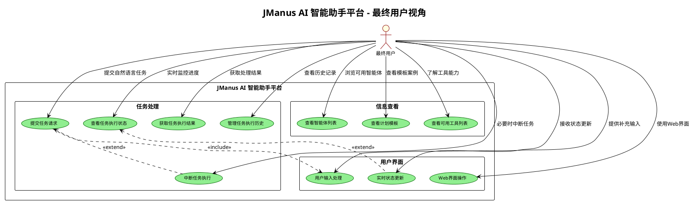
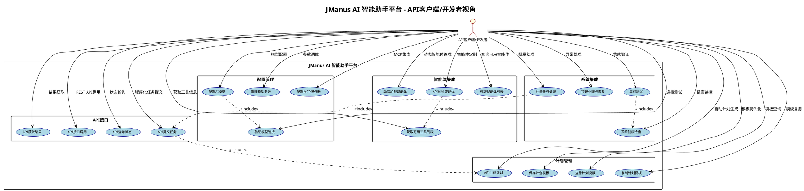
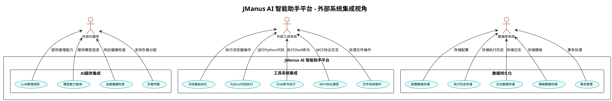

# JManus 系统用例图 (Use Case Diagram)

本文档展示 JManus AI 智能助手平台的用例图，描述系统与外部角色（用户、系统）的交互关系，便于需求分析和系统理解。

## 📋 文档汇总清单

### 🎯 用例图概览

| 项目 | 数量/类型 | 说明 | 详细明细 |
|------|-----------|------|----------|
| **总用例图数量** | 5个 | 1个总览用例图 + 4个分用户视角用例图 | 总览用例图、最终用户视角、API客户端/开发者视角、系统管理员视角、外部系统集成视角 |
| **核心用例总数** | 48个 | 覆盖全部核心功能 | 任务执行(5个)、智能体管理(6个)、计划模板(5个)、AI模型(5个)、提示词(5个)、MCP集成(5个)、工具集成(5个)、系统配置(4个)、监控运维(4个)、用户交互(4个) |
| **外部角色数量** | 6个 | 主要利益相关者 | 最终用户、API客户端/开发者、系统管理员、外部AI服务、外部工具系统、数据库系统 |
| **功能包分组** | 10个 | 按业务功能分组 | 每个功能包包含4-6个相关用例，覆盖完整业务流程 |

### 📊 包含的图表类型

| 序号 | 图表名称 | 描述 | 包含用例数量 | 主要角色 | 关系复杂度 | 锚点链接 |
|------|----------|------|--------------|----------|------------|----------|
| 1 | 总览用例图 | 展示所有角色和用例的完整视图 | 48个用例 | 6个外部角色 | ⭐⭐⭐⭐⭐ | [查看](#总览用例图) |
| 2 | 最终用户视角用例图 | 面向普通用户的功能 | 11个用例 | 1个角色 | ⭐⭐ | [查看](#1-最终用户视角用例图) |
| 3 | API客户端/开发者视角用例图 | 面向开发者的API功能 | 19个用例 | 1个角色 | ⭐⭐⭐ | [查看](#2-api客户端开发者视角用例图) |
| 4 | 系统管理员视角用例图 | 面向管理员的配置管理功能 | 33个用例 | 1个角色 | ⭐⭐⭐⭐ | [查看](#3-系统管理员视角用例图) |
| 5 | 外部系统集成视角用例图 | 展示与外部系统的集成 | 13个用例 | 3个外部系统角色 | ⭐⭐⭐ | [查看](#4-外部系统集成视角用例图) |

### 👥 外部角色统计

| 角色名称 | 英文名称 | 角色描述 | 主要用例数量 | 交互方式 | 业务重要性 |
|----------|----------|----------|--------------|----------|------------|
| **最终用户** | End User | 通过Web界面使用系统的普通用户 | 8个直接用例 | Vue3 Web界面 | ⭐⭐⭐⭐⭐ |
| **API客户端/开发者** | API Client/Developer | 通过REST API集成系统的开发者 | 6个直接用例 | REST API接口 | ⭐⭐⭐⭐ |
| **系统管理员** | System Administrator | 负责系统配置和维护的管理员 | 25个直接用例 | Web管理界面、API接口 | ⭐⭐⭐⭐⭐ |
| **外部AI服务** | External AI Services | DashScope、OpenAI等AI模型服务 | 4个被调用用例 | HTTP API调用 | ⭐⭐⭐⭐⭐ |
| **外部工具系统** | External Tool Systems | 浏览器、Python环境、MCP服务器等 | 6个被调用用例 | 命令行调用、API接口、MCP协议 | ⭐⭐⭐⭐ |
| **数据库系统** | Database System | 提供数据持久化的数据库系统 | 5个被调用用例 | JDBC连接、SQL操作 | ⭐⭐⭐⭐⭐ |

### 🎯 用例功能包统计

| 功能包名称 | 用例数量 | 主要功能 | 涉及角色 | 业务价值 | 技术复杂度 |
|------------|----------|----------|----------|----------|------------|
| **任务执行管理** | 5个 | 核心任务处理功能 | 最终用户、API客户端、数据库系统 | 系统核心价值，直接服务用户需求 | ⭐⭐⭐⭐ |
| **智能体管理** | 6个 | 动态智能体配置和管理 | 系统管理员、API客户端 | 系统灵活性和可扩展性 | ⭐⭐⭐⭐⭐ |
| **计划模板管理** | 5个 | 可重用执行计划管理 | 系统管理员、API客户端、数据库系统 | 提高执行效率和一致性 | ⭐⭐⭐ |
| **AI模型管理** | 5个 | AI模型配置和切换 | 系统管理员、外部AI服务 | 保障AI能力的稳定供给 | ⭐⭐⭐⭐ |
| **提示词管理** | 5个 | 提示词模板和版本控制 | 系统管理员、外部AI服务 | 优化AI交互效果 | ⭐⭐⭐ |
| **MCP协议集成** | 5个 | Model Context Protocol集成 | 系统管理员、外部工具系统 | 扩展外部工具生态 | ⭐⭐⭐⭐⭐ |
| **工具生态集成** | 5个 | 外部工具集成和扩展 | 外部工具系统 | 提供丰富的执行能力 | ⭐⭐⭐⭐ |
| **系统配置管理** | 4个 | 系统配置和批量操作 | 系统管理员、数据库系统 | 系统运维和管理 | ⭐⭐ |
| **监控运维** | 4个 | 系统监控和故障处理 | 系统管理员 | 保障系统稳定运行 | ⭐⭐⭐ |
| **用户交互** | 4个 | 用户界面和交互体验 | 最终用户、API客户端 | 提升用户体验 | ⭐⭐ |

### 🔗 用例关系统计

| 关系类型 | 数量 | UML符号 | 说明 | 具体实例 | 设计目的 |
|----------|------|---------|------|----------|----------|
| **包含关系 (Include)** | 6个 | `..>` | 必须执行的依赖用例 | UC01..>UC12(提交任务包含生成计划)、UC06..>UC10(创建智能体包含获取工具列表) | 强制依赖，确保完整性 |
| **扩展关系 (Extend)** | 4个 | `<..` | 可选的扩展功能 | UC02<..UC47(状态查看可扩展实时更新)、UC01<..UC05(任务提交可扩展中断功能) | 可选增强，提升用户体验 |
| **角色关联** | 48个 | `-->` | 每个角色关联3-25个用例不等 | EndUser-->UC01(用户提交任务)、Administrator-->UC06(管理员创建智能体) | 定义职责边界 |

### 🎨 用户视角特色

| 用户视角 | 特色功能 | 核心价值 | 主要用例 | 交互特点 | 技术要求 |
|----------|----------|----------|----------|----------|----------|
| **最终用户视角** | 简单易用，自然语言交互，可视化反馈 | 降低使用门槛，提升用户体验 | 任务提交、状态查看、结果获取 | 直观友好的Web界面 | 低技术门槛 |
| **开发者视角** | 完整API接口，系统集成，批量处理能力 | 支持系统集成和自动化 | API调用、智能体定制、批量处理 | 程序化接口调用 | 中等技术要求 |
| **管理员视角** | 全面配置管理，系统监控，数据管理 | 确保系统稳定运行 | 配置管理、监控运维、数据管理 | 专业管理界面 | 高技术要求 |
| **外部系统视角** | 标准协议支持，高效调用，数据一致性 | 保障系统互操作性 | 服务调用、数据存储、协议通信 | 标准化接口 | 系统级集成 |

### 📚 文档结构导航

| 章节 | 内容描述 | 包含子章节 | 页面估计 | 复杂度 | 快速链接 |
|------|----------|------------|----------|--------|----------|
| 总览用例图 | 完整功能视图 | 10个功能包+6个角色+48个用例+关系定义 | 1页 | ⭐⭐⭐⭐⭐ | [查看](#总览用例图) |
| 分用户视角用例图 | 按角色详细展示 | 4个用户视角图+各自的特色说明 | 4页 | ⭐⭐⭐⭐ | [查看](#分用户视角用例图) |
| 用例说明 | 角色职责和用例描述 | 6个角色详述+6个用例分组详述+关系说明 | 3页 | ⭐⭐⭐ | [查看](#用例说明) |
| 业务价值 | 系统价值和应用场景 | 对不同角色的价值分析 | 1页 | ⭐⭐ | [查看](#业务价值) |

---

## 总览用例图

```plantuml
@startuml
!theme plain
skinparam packageStyle rectangle
skinparam usecase {
  BackgroundColor lightblue
  BorderColor darkblue
  FontSize 11
}
skinparam actor {
  BackgroundColor lightyellow
  BorderColor darkred
  FontSize 12
}

title JManus AI 智能助手平台 - 用例图

' 定义外部角色
:最终用户: as EndUser
:API客户端/开发者: as APIClient
:系统管理员: as Administrator
:外部AI服务: as AIService
:外部工具系统: as ExternalTools
:数据库系统: as DatabaseSystem

' 系统边界
rectangle "JManus AI 智能助手平台" {

  ' ===== 任务执行相关用例 =====
  package "任务执行管理" {
    usecase "提交任务请求" as UC01
    usecase "查看任务执行状态" as UC02
    usecase "获取任务执行结果" as UC03
    usecase "管理任务执行历史" as UC04
    usecase "中断任务执行" as UC05
  }

  ' ===== 智能体管理相关用例 =====
  package "智能体管理" {
    usecase "创建智能体配置" as UC06
    usecase "编辑智能体配置" as UC07
    usecase "删除智能体配置" as UC08
    usecase "查看智能体列表" as UC09
    usecase "获取可用工具列表" as UC10
    usecase "动态加载智能体" as UC11
  }

  ' ===== 计划模板管理相关用例 =====
  package "计划模板管理" {
    usecase "生成执行计划" as UC12
    usecase "保存计划模板" as UC13
    usecase "管理计划版本" as UC14
    usecase "查看计划模板" as UC15
    usecase "复制计划模板" as UC16
  }

  ' ===== 模型配置管理相关用例 =====
  package "AI模型管理" {
    usecase "配置AI模型" as UC17
    usecase "验证模型连接" as UC18
    usecase "获取可用模型类型" as UC19
    usecase "管理模型参数" as UC20
    usecase "切换模型服务" as UC21
  }

  ' ===== 提示词管理相关用例 =====
  package "提示词管理" {
    usecase "创建提示词模板" as UC22
    usecase "编辑提示词" as UC23
    usecase "管理命名空间" as UC24
    usecase "渲染提示词模板" as UC25
    usecase "版本控制提示词" as UC26
  }

  ' ===== MCP集成相关用例 =====
  package "MCP协议集成" {
    usecase "配置MCP服务器" as UC27
    usecase "管理MCP连接" as UC28
    usecase "调用MCP工具" as UC29
    usecase "监控MCP状态" as UC30
    usecase "缓存MCP工具回调" as UC31
  }

  ' ===== 工具集成相关用例 =====
  package "工具生态集成" {
    usecase "执行浏览器操作" as UC32
    usecase "运行Python代码" as UC33
    usecase "执行Shell命令" as UC34
    usecase "处理表单输入" as UC35
    usecase "文件操作管理" as UC36
  }

  ' ===== 系统配置相关用例 =====
  package "系统配置管理" {
    usecase "管理系统配置" as UC37
    usecase "批量更新配置" as UC38
    usecase "查看配置分组" as UC39
    usecase "导入导出配置" as UC40
  }

  ' ===== 监控运维相关用例 =====
  package "监控运维" {
    usecase "系统健康检查" as UC41
    usecase "查看系统日志" as UC42
    usecase "性能监控" as UC43
    usecase "错误处理与恢复" as UC44
  }

  ' ===== 用户交互相关用例 =====
  package "用户交互" {
    usecase "Web界面操作" as UC45
    usecase "API接口调用" as UC46
    usecase "实时状态更新" as UC47
    usecase "用户输入处理" as UC48
  }
}

' ===== 角色与用例关系 =====

' 最终用户关系
EndUser --> UC01 : 提交任务
EndUser --> UC02 : 查看状态
EndUser --> UC03 : 获取结果
EndUser --> UC04 : 查看历史
EndUser --> UC05 : 中断任务
EndUser --> UC45 : 使用Web界面
EndUser --> UC47 : 查看实时状态
EndUser --> UC48 : 提供输入

' API客户端/开发者关系
APIClient --> UC01 : API提交任务
APIClient --> UC02 : API查询状态
APIClient --> UC03 : API获取结果
APIClient --> UC46 : 调用REST API
APIClient --> UC06 : API创建智能体
APIClient --> UC12 : API生成计划

' 系统管理员关系
Administrator --> UC06 : 管理智能体
Administrator --> UC07 : 编辑智能体
Administrator --> UC08 : 删除智能体
Administrator --> UC09 : 查看智能体
Administrator --> UC10 : 管理工具
Administrator --> UC11 : 动态加载
Administrator --> UC13 : 保存模板
Administrator --> UC14 : 版本管理
Administrator --> UC15 : 查看模板
Administrator --> UC16 : 复制模板
Administrator --> UC17 : 配置模型
Administrator --> UC18 : 验证连接
Administrator --> UC19 : 获取模型类型
Administrator --> UC20 : 管理参数
Administrator --> UC21 : 切换服务
Administrator --> UC22 : 创建提示词
Administrator --> UC23 : 编辑提示词
Administrator --> UC24 : 管理命名空间
Administrator --> UC25 : 渲染模板
Administrator --> UC26 : 版本控制
Administrator --> UC27 : 配置MCP服务器
Administrator --> UC28 : 管理MCP连接
Administrator --> UC30 : 监控MCP状态
Administrator --> UC37 : 管理系统配置
Administrator --> UC38 : 批量更新
Administrator --> UC39 : 查看配置分组
Administrator --> UC40 : 导入导出配置
Administrator --> UC41 : 健康检查
Administrator --> UC42 : 查看日志
Administrator --> UC43 : 性能监控
Administrator --> UC44 : 错误处理

' 外部AI服务关系
AIService <-- UC12 : 请求计划生成
AIService <-- UC18 : 连接验证
AIService <-- UC21 : 模型切换
AIService <-- UC25 : 提示词渲染

' 外部工具系统关系
ExternalTools <-- UC32 : 浏览器自动化
ExternalTools <-- UC33 : Python执行
ExternalTools <-- UC34 : Shell命令
ExternalTools <-- UC29 : MCP工具调用
ExternalTools <-- UC31 : 工具回调缓存
ExternalTools <-- UC36 : 文件操作

' 数据库系统关系
DatabaseSystem <-- UC04 : 存储历史
DatabaseSystem <-- UC13 : 保存模板
DatabaseSystem <-- UC14 : 版本管理
DatabaseSystem <-- UC37 : 配置管理
DatabaseSystem <-- UC42 : 日志存储

' ===== 用例间的包含和扩展关系 =====

' 包含关系
UC01 ..> UC12 : <<include>>
UC01 ..> UC11 : <<include>>
UC12 ..> UC25 : <<include>>
UC06 ..> UC10 : <<include>>
UC17 ..> UC18 : <<include>>
UC27 ..> UC28 : <<include>>

' 扩展关系
UC02 <.. UC47 : <<extend>>
UC01 <.. UC05 : <<extend>>
UC03 <.. UC44 : <<extend>>
UC29 <.. UC31 : <<extend>>

@enduml
```

## 分用户视角用例图

### 1. 最终用户视角用例图

**最终用户主要关注点**：
- **简单易用**：通过自然语言提交任务，无需技术背景
- **可视化反馈**：实时查看任务执行状态和进度
- **结果获取**：清晰获得任务处理结果
- **历史管理**：方便查看和管理过往任务
- **交互体验**：流畅的Web界面操作体验

### 2. API客户端/开发者视角用例图

**API客户端/开发者主要关注点**：
- **编程接口**：完整的REST API支持程序化调用
- **系统集成**：便于集成到现有系统和工作流
- **批量处理**：支持大规模任务的自动化处理
- **配置灵活性**：可编程的智能体和模型配置
- **错误处理**：完善的异常处理和恢复机制
- **监控能力**：系统健康状态和性能监控

### 3. 系统管理员视角用例图

```plantuml
@startuml
!theme plain
skinparam packageStyle rectangle
skinparam usecase {
  BackgroundColor lightsalmon
  BorderColor darkred
  FontSize 11
}
skinparam actor {
  BackgroundColor lightyellow
  BorderColor darkred
  FontSize 12
}

title JManus AI 智能助手平台 - 系统管理员视角

' 定义管理员角色
:系统管理员: as Administrator

' 系统边界
rectangle "JManus AI 智能助手平台" {

  ' ===== 智能体管理 =====
  package "智能体管理" {
    usecase "创建智能体配置" as UC06
    usecase "编辑智能体配置" as UC07
    usecase "删除智能体配置" as UC08
    usecase "查看智能体列表" as UC09
    usecase "管理工具绑定" as UC10
    usecase "智能体版本管理" as UC11_VER
  }

  ' ===== 模型配置管理 =====
  package "AI模型管理" {
    usecase "配置AI模型" as UC17
    usecase "验证模型连接" as UC18
    usecase "获取可用模型类型" as UC19
    usecase "管理模型参数" as UC20
    usecase "切换模型服务" as UC21
    usecase "模型性能监控" as UC_MODEL_MONITOR
  }

  ' ===== 提示词管理 =====
  package "提示词管理" {
    usecase "创建提示词模板" as UC22
    usecase "编辑提示词" as UC23
    usecase "管理命名空间" as UC24
    usecase "版本控制提示词" as UC26
    usecase "提示词测试" as UC_PROMPT_TEST
  }

  ' ===== MCP集成管理 =====
  package "MCP集成管理" {
    usecase "配置MCP服务器" as UC27
    usecase "管理MCP连接" as UC28
    usecase "监控MCP状态" as UC30
    usecase "MCP工具管理" as UC_MCP_TOOLS
  }

  ' ===== 系统配置 =====
  package "系统配置" {
    usecase "管理系统配置" as UC37
    usecase "批量更新配置" as UC38
    usecase "查看配置分组" as UC39
    usecase "导入导出配置" as UC40
    usecase "配置备份恢复" as UC_CONFIG_BACKUP
  }

  ' ===== 监控运维 =====
  package "监控运维" {
    usecase "系统健康检查" as UC41
    usecase "查看系统日志" as UC42
    usecase "性能监控" as UC43
    usecase "错误处理与恢复" as UC44
    usecase "用户管理" as UC_USER_MGMT
    usecase "权限管理" as UC_PERMISSION
  }

  ' ===== 数据管理 =====
  package "数据管理" {
    usecase "数据库维护" as UC_DB_MAINTENANCE
    usecase "数据备份恢复" as UC_DATA_BACKUP
    usecase "数据清理" as UC_DATA_CLEANUP
    usecase "统计报表" as UC_REPORTS
  }
}

' ===== 管理员关系 =====
Administrator --> UC06 : 创建智能体
Administrator --> UC07 : 编辑智能体
Administrator --> UC08 : 删除智能体
Administrator --> UC09 : 管理智能体
Administrator --> UC10 : 工具配置
Administrator --> UC11_VER : 版本控制
Administrator --> UC17 : 模型配置
Administrator --> UC18 : 连接测试
Administrator --> UC19 : 模型类型管理
Administrator --> UC20 : 参数调优
Administrator --> UC21 : 服务切换
Administrator --> UC_MODEL_MONITOR : 模型监控
Administrator --> UC22 : 提示词创建
Administrator --> UC23 : 提示词编辑
Administrator --> UC24 : 命名空间管理
Administrator --> UC26 : 提示词版本
Administrator --> UC_PROMPT_TEST : 提示词测试
Administrator --> UC27 : MCP配置
Administrator --> UC28 : MCP连接管理
Administrator --> UC30 : MCP监控
Administrator --> UC_MCP_TOOLS : MCP工具管理
Administrator --> UC37 : 系统配置
Administrator --> UC38 : 批量配置
Administrator --> UC39 : 配置分组
Administrator --> UC40 : 配置导入导出
Administrator --> UC_CONFIG_BACKUP : 配置备份
Administrator --> UC41 : 健康检查
Administrator --> UC42 : 日志查看
Administrator --> UC43 : 性能监控
Administrator --> UC44 : 错误处理
Administrator --> UC_USER_MGMT : 用户管理
Administrator --> UC_PERMISSION : 权限管理
Administrator --> UC_DB_MAINTENANCE : 数据库维护
Administrator --> UC_DATA_BACKUP : 数据备份
Administrator --> UC_DATA_CLEANUP : 数据清理
Administrator --> UC_REPORTS : 统计报表

' ===== 用例关系 =====
UC06 ..> UC10 : <<include>>
UC17 ..> UC18 : <<include>>
UC27 ..> UC28 : <<include>>
UC37 ..> UC39 : <<include>>
UC_CONFIG_BACKUP ..> UC40 : <<include>>
UC_DATA_BACKUP ..> UC_DB_MAINTENANCE : <<include>>

@enduml
```

**系统管理员主要关注点**：
- **全面配置管理**：智能体、模型、提示词、MCP等各种配置
- **系统监控运维**：健康检查、性能监控、日志管理
- **数据管理**：数据库维护、备份恢复、数据清理
- **用户权限管理**：用户账户和权限控制
- **版本控制**：配置、智能体、提示词的版本管理
- **故障处理**：错误诊断、恢复和预防

### 4. 外部系统集成视角用例图

**外部系统集成关注点**：
- **AI服务集成**：与各种LLM服务的稳定连接和调用
- **工具生态**：丰富的外部工具集成和协议支持
- **数据一致性**：可靠的数据存储和事务管理
- **系统互操作性**：标准协议和接口支持
- **性能优化**：高效的外部调用和数据处理

## 用例说明

### 🎭 外部角色 (Actors)

#### 1. **最终用户 (End User)**
- **角色描述**：通过Web界面使用JManus进行任务处理的普通用户
- **主要职责**：提交任务、查看执行状态、获取结果、管理个人任务历史
- **交互方式**：Vue3 Web界面

#### 2. **API客户端/开发者 (API Client/Developer)**
- **角色描述**：通过REST API集成JManus功能到自己系统的开发者
- **主要职责**：API调用、系统集成、自动化任务处理
- **交互方式**：REST API接口

#### 3. **系统管理员 (System Administrator)**
- **角色描述**：负责JManus系统配置、管理和维护的管理员
- **主要职责**：系统配置、智能体管理、模型配置、监控运维
- **交互方式**：Web管理界面、API接口

#### 4. **外部AI服务 (External AI Services)**
- **角色描述**：为JManus提供AI能力的外部服务，如DashScope、OpenAI等
- **主要职责**：提供LLM推理能力、文本生成、智能分析
- **交互方式**：HTTP API调用

#### 5. **外部工具系统 (External Tool Systems)**
- **角色描述**：被JManus集成的外部工具和服务，如浏览器、Python环境、MCP服务器等
- **主要职责**：执行具体的工具操作、提供专业能力
- **交互方式**：命令行调用、API接口、MCP协议

#### 6. **数据库系统 (Database System)**
- **角色描述**：为JManus提供数据持久化的数据库系统
- **主要职责**：数据存储、查询、事务管理
- **交互方式**：JDBC连接、SQL操作

### 🎯 核心用例分组

#### **任务执行管理**
JManus的核心功能，支持用户提交各种复杂任务，系统自动进行智能规划和执行：
- **UC01 提交任务请求**：用户通过自然语言描述任务需求
- **UC02 查看任务执行状态**：实时监控任务执行进度
- **UC03 获取任务执行结果**：获取任务完成后的结果和输出
- **UC04 管理任务执行历史**：查看和管理历史任务记录
- **UC05 中断任务执行**：在需要时停止正在执行的任务

#### **智能体管理**
动态配置和管理智能体，支持不同场景的任务执行需求：
- **UC06 创建智能体配置**：定义新的智能体及其能力
- **UC07 编辑智能体配置**：修改现有智能体的参数和工具
- **UC08 删除智能体配置**：移除不需要的智能体
- **UC09 查看智能体列表**：浏览所有可用的智能体
- **UC10 获取可用工具列表**：查看智能体可使用的工具
- **UC11 动态加载智能体**：运行时加载和初始化智能体

#### **计划模板管理**
管理可重用的执行计划模板，提高任务执行效率：
- **UC12 生成执行计划**：基于LLM生成智能执行计划
- **UC13 保存计划模板**：将成功的计划保存为模板
- **UC14 管理计划版本**：维护计划模板的版本历史
- **UC15 查看计划模板**：浏览和搜索现有模板
- **UC16 复制计划模板**：基于现有模板创建新模板

#### **AI模型管理**
配置和管理各种AI模型服务，确保系统的AI能力：
- **UC17 配置AI模型**：设置AI模型的连接和参数
- **UC18 验证模型连接**：测试AI模型服务的可用性
- **UC19 获取可用模型类型**：查看支持的AI模型类型
- **UC20 管理模型参数**：调整模型的推理参数
- **UC21 切换模型服务**：在不同的AI服务间切换

#### **MCP协议集成**
集成Model Context Protocol，连接外部工具和服务：
- **UC27 配置MCP服务器**：设置MCP服务器连接
- **UC28 管理MCP连接**：维护与MCP服务器的连接
- **UC29 调用MCP工具**：通过MCP协议调用外部工具
- **UC30 监控MCP状态**：监控MCP连接和服务状态
- **UC31 缓存MCP工具回调**：优化MCP工具调用性能

#### **工具生态集成**
集成各种外部工具，扩展系统能力：
- **UC32 执行浏览器操作**：自动化网页浏览和操作
- **UC33 运行Python代码**：执行Python脚本和计算
- **UC34 执行Shell命令**：运行系统命令和脚本
- **UC35 处理表单输入**：处理用户的表单输入需求
- **UC36 文件操作管理**：文件的读写和管理操作

### 🔗 用例关系说明

#### **包含关系 (Include)**
- 提交任务请求必须包含生成执行计划和动态加载智能体
- 生成执行计划需要包含渲染提示词模板
- 创建智能体配置需要包含获取可用工具列表
- 配置AI模型需要包含验证模型连接
- 配置MCP服务器需要包含管理MCP连接

#### **扩展关系 (Extend)**
- 查看任务执行状态可以扩展为实时状态更新
- 提交任务请求可以扩展为中断任务执行
- 获取任务执行结果可以扩展为错误处理与恢复
- 调用MCP工具可以扩展为缓存MCP工具回调

### 🎯 业务价值

#### **对最终用户**
- 简单易用的自然语言任务提交
- 实时的任务执行状态反馈
- 丰富的任务处理能力

#### **对开发者**
- 完整的REST API接口
- 灵活的智能体配置能力
- 标准化的集成方式

#### **对系统管理员**
- 全面的系统配置管理
- 完善的监控和运维功能
- 可扩展的工具生态

---

**文档版本**: 1.0  
**创建日期**: 2025年1月  
**用例总数**: 48个核心用例  
**外部角色**: 6个主要角色  
**建模工具**: PlantUML UML