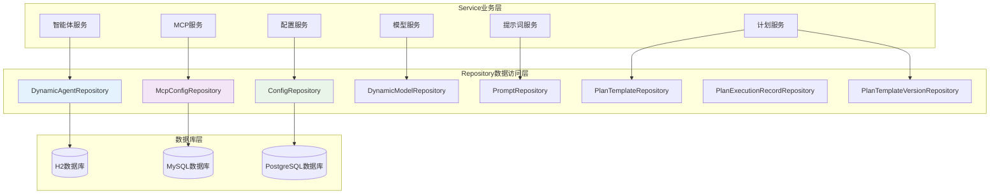
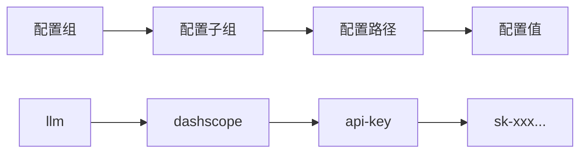
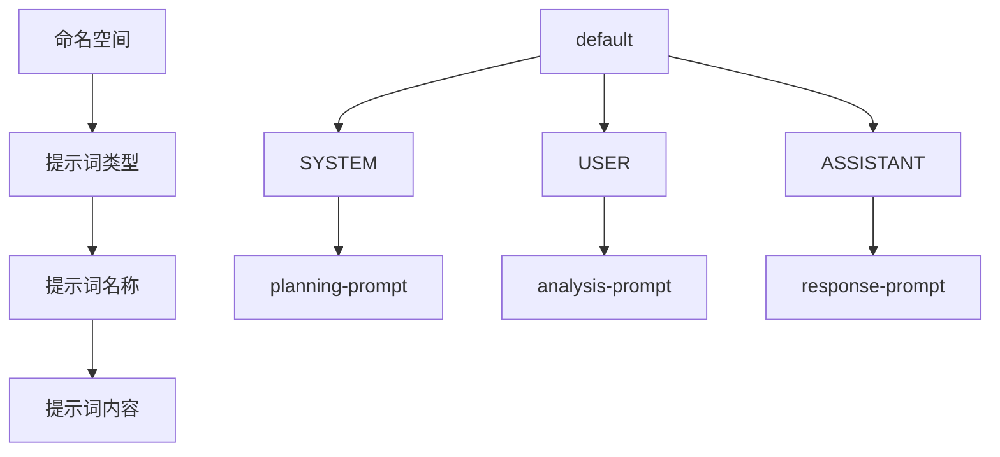
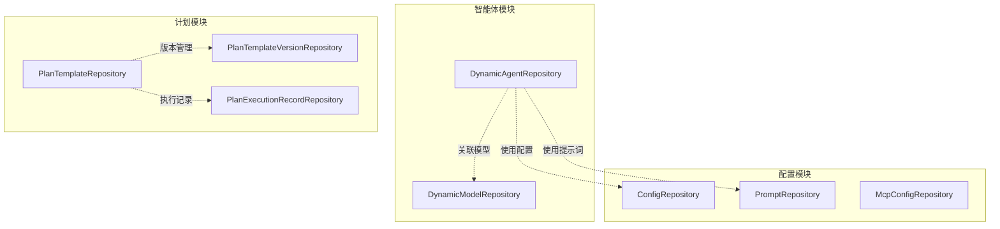
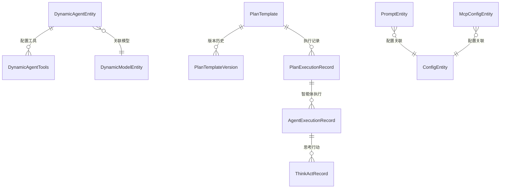

# JManus Repository层设计文档

## 1. 概述

JManus系统采用Spring Data JPA作为数据访问技术，Repository层作为数据持久化的核心，负责提供数据的CRUD操作和复杂查询功能。本文档详细描述了系统中所有Repository组件的设计和实现。

### 1.1 Repository层架构



### 1.2 Repository组件清单

| 序号 | Repository名称 | 实体类 | 主要职责 | 关键查询方法 |
|------|----------------|--------|----------|--------------|
| 1 | DynamicAgentRepository | DynamicAgentEntity | 智能体数据管理 | findByNamespaceAndAgentName, findAllByModel |
| 2 | McpConfigRepository | McpConfigEntity | MCP配置管理 | findByMcpServerName |
| 3 | ConfigRepository | ConfigEntity | 系统配置管理 | findByConfigGroup, findByConfigPath |
| 4 | DynamicModelRepository | DynamicModelEntity | AI模型配置管理 | findByModelName |
| 5 | PromptRepository | PromptEntity | 提示词管理 | findByNamespaceAndPromptName, getAllByNamespace |
| 6 | PlanTemplateRepository | PlanTemplate | 计划模板管理 | findByPlanTemplateId |
| 7 | PlanExecutionRecordRepository | PlanExecutionRecordEntity | 执行记录管理 | findByPlanId, deleteByPlanId |
| 8 | PlanTemplateVersionRepository | PlanTemplateVersion | 模板版本管理 | 版本历史查询 |

## 2. 核心Repository详细设计

### 2.1 智能体Repository

#### 2.1.1 DynamicAgentRepository

```java
package com.alibaba.cloud.ai.example.manus.dynamic.agent.repository;

import com.alibaba.cloud.ai.example.manus.dynamic.model.entity.DynamicModelEntity;
import org.springframework.data.jpa.repository.JpaRepository;
import org.springframework.stereotype.Repository;

import com.alibaba.cloud.ai.example.manus.dynamic.agent.entity.DynamicAgentEntity;

import java.util.List;

@Repository
public interface DynamicAgentRepository extends JpaRepository<DynamicAgentEntity, Long> {

    /**
     * 根据命名空间和智能体名称查找智能体
     */
    DynamicAgentEntity findByNamespaceAndAgentName(String namespace, String agentName);

    /**
     * 根据智能体名称查找智能体
     */
    DynamicAgentEntity findByAgentName(String agentName);

    /**
     * 根据命名空间查找所有智能体
     */
    List<DynamicAgentEntity> findAllByNamespace(String namespace);

    /**
     * 根据关联模型查找所有智能体
     */
    List<DynamicAgentEntity> findAllByModel(DynamicModelEntity model);
}
```

**核心功能**：
- 支持多命名空间的智能体管理
- 提供灵活的智能体查询方式
- 支持按关联模型查询智能体
- 继承JpaRepository提供基础CRUD操作

**查询性能优化**：
- `findByNamespaceAndAgentName`：复合索引优化
- `findAllByNamespace`：命名空间索引
- `findAllByModel`：外键索引优化

### 2.2 MCP配置Repository

#### 2.2.1 McpConfigRepository

```java
package com.alibaba.cloud.ai.example.manus.dynamic.mcp.repository;

import org.springframework.data.jpa.repository.JpaRepository;
import org.springframework.stereotype.Repository;

import com.alibaba.cloud.ai.example.manus.dynamic.mcp.model.po.McpConfigEntity;

@Repository
public interface McpConfigRepository extends JpaRepository<McpConfigEntity, Long> {

    /**
     * 根据MCP服务器名称查找配置
     */
    McpConfigEntity findByMcpServerName(String mcpServerName);
}
```

**核心功能**：
- MCP服务器配置的持久化管理
- 支持按服务器名称快速查找
- 提供MCP连接配置的CRUD操作

**扩展查询建议**：
```java
// 按连接类型查询
List<McpConfigEntity> findByConnectionType(McpConfigType connectionType);

// 查询活跃的MCP服务器
List<McpConfigEntity> findByIsActiveTrue();

// 按创建时间范围查询
List<McpConfigEntity> findByCreatedAtBetween(LocalDateTime start, LocalDateTime end);
```

### 2.3 系统配置Repository

#### 2.3.1 ConfigRepository

```java
package com.alibaba.cloud.ai.example.manus.config.repository;

import java.util.List;
import java.util.Optional;

import org.springframework.data.jpa.repository.JpaRepository;
import org.springframework.data.jpa.repository.Query;
import org.springframework.data.repository.query.Param;
import org.springframework.stereotype.Repository;

import com.alibaba.cloud.ai.example.manus.config.entity.ConfigEntity;

@Repository
public interface ConfigRepository extends JpaRepository<ConfigEntity, Long> {

    /**
     * 根据配置路径查找配置项
     */
    Optional<ConfigEntity> findByConfigPath(String configPath);

    /**
     * 根据配置组和子组查找配置列表
     */
    List<ConfigEntity> findByConfigGroupAndConfigSubGroup(String configGroup, String configSubGroup);

    /**
     * 根据配置组查找配置列表
     */
    List<ConfigEntity> findByConfigGroup(String configGroup);

    /**
     * 检查配置路径是否存在
     */
    boolean existsByConfigPath(String configPath);

    /**
     * 根据配置路径删除配置
     */
    void deleteByConfigPath(String configPath);

    /**
     * 获取所有配置组
     */
    @Query("SELECT DISTINCT c.configGroup FROM ConfigEntity c ORDER BY c.configGroup")
    List<String> findAllGroups();
}
```

**核心功能**：
- 分层配置管理（组、子组、路径）
- 自定义JPQL查询
- 配置存在性检查
- 按路径删除配置

**配置管理模式**：


### 2.4 模型管理Repository

#### 2.4.1 DynamicModelRepository

```java
package com.alibaba.cloud.ai.example.manus.dynamic.model.repository;

import com.alibaba.cloud.ai.example.manus.dynamic.model.entity.DynamicModelEntity;
import org.springframework.data.jpa.repository.JpaRepository;
import org.springframework.stereotype.Repository;

@Repository
public interface DynamicModelRepository extends JpaRepository<DynamicModelEntity, Long> {

    /**
     * 根据模型名称查找模型
     */
    DynamicModelEntity findByModelName(String modelName);
}
```

**核心功能**：
- AI模型配置的持久化
- 按模型名称快速查找
- 支持多种AI模型提供商

**模型数据初始化**：
```java
@Service
public class ModelDataInitialization implements IModelDataInitialization {

    @Value("${spring.ai.openai.base-url}")
    private String baseUrl;

    @Value("${spring.ai.openai.api-key}")
    private String apiKey;

    @Value("${spring.ai.openai.chat.options.model}")
    private String model;

    private final DynamicModelRepository repository;

    @PostConstruct
    public void init() {
        if (repository.count() == 0) {
            DynamicModelEntity dynamicModelEntity = new DynamicModelEntity();
            dynamicModelEntity.setBaseUrl(baseUrl);
            dynamicModelEntity.setApiKey(apiKey);
            dynamicModelEntity.setModelName(model);
            dynamicModelEntity.setModelDescription("base model");
            dynamicModelEntity.setType(ModelType.GENERAL.name());
            repository.save(dynamicModelEntity);
        }
    }
}
```

### 2.5 提示词Repository

#### 2.5.1 PromptRepository

```java
package com.alibaba.cloud.ai.example.manus.dynamic.prompt.repository;

import com.alibaba.cloud.ai.example.manus.dynamic.prompt.model.po.PromptEntity;
import org.springframework.data.jpa.repository.JpaRepository;
import org.springframework.stereotype.Repository;

import java.util.List;

@Repository
public interface PromptRepository extends JpaRepository<PromptEntity, Long> {

    /**
     * 根据命名空间和提示词名称查找提示词
     */
    PromptEntity findByNamespaceAndPromptName(String namespace, String promptName);

    /**
     * 根据提示词名称查找提示词
     */
    PromptEntity findByPromptName(String promptName);

    /**
     * 根据命名空间获取所有提示词
     */
    List<PromptEntity> getAllByNamespace(String namespace);
}
```

**核心功能**：
- 多命名空间提示词管理
- 支持提示词模板化
- 提供灵活的查询方式

**提示词分类管理**：


### 2.6 计划管理Repository

#### 2.6.1 PlanTemplateRepository

```java
package com.alibaba.cloud.ai.example.manus.planning.repository;

import java.util.Optional;

import org.springframework.data.jpa.repository.JpaRepository;
import org.springframework.stereotype.Repository;

import com.alibaba.cloud.ai.example.manus.planning.model.po.PlanTemplate;

@Repository
public interface PlanTemplateRepository extends JpaRepository<PlanTemplate, String> {

    /**
     * 根据计划模板ID查找计划模板
     */
    Optional<PlanTemplate> findByPlanTemplateId(String planTemplateId);

    /**
     * 根据计划模板ID删除计划模板
     */
    void deleteByPlanTemplateId(String planTemplateId);
}
```

#### 2.6.2 PlanTemplateVersionRepository

```java
package com.alibaba.cloud.ai.example.manus.planning.repository;

import java.util.List;

import org.springframework.data.jpa.repository.JpaRepository;
import org.springframework.data.jpa.repository.Query;
import org.springframework.data.repository.query.Param;
import org.springframework.stereotype.Repository;

import com.alibaba.cloud.ai.example.manus.planning.model.po.PlanTemplateVersion;

@Repository
public interface PlanTemplateVersionRepository extends JpaRepository<PlanTemplateVersion, Long> {

    /**
     * 根据计划模板ID查找所有版本
     */
    List<PlanTemplateVersion> findByPlanTemplateIdOrderByVersionDesc(String planTemplateId);

    /**
     * 根据计划模板ID和版本号查找特定版本
     */
    Optional<PlanTemplateVersion> findByPlanTemplateIdAndVersion(String planTemplateId, String version);

    /**
     * 获取计划模板的最新版本
     */
    @Query("SELECT v FROM PlanTemplateVersion v WHERE v.planTemplateId = :planTemplateId ORDER BY v.createdAt DESC LIMIT 1")
    Optional<PlanTemplateVersion> findLatestVersion(@Param("planTemplateId") String planTemplateId);
}
```

**核心功能**：
- 计划模板版本控制
- 支持版本历史查询
- 提供最新版本快速访问

### 2.7 执行记录Repository

#### 2.7.1 PlanExecutionRecordRepository

```java
package com.alibaba.cloud.ai.example.manus.recorder.repository;

import com.alibaba.cloud.ai.example.manus.recorder.entity.PlanExecutionRecordEntity;
import org.springframework.data.jpa.repository.JpaRepository;
import org.springframework.stereotype.Repository;

@Repository
public interface PlanExecutionRecordRepository extends JpaRepository<PlanExecutionRecordEntity, String> {

    /**
     * 根据计划ID查找执行记录
     */
    PlanExecutionRecordEntity findByPlanId(String planId);

    /**
     * 根据计划ID删除执行记录
     */
    PlanExecutionRecordEntity deleteByPlanId(String planId);
}
```

**Repository实现类**：
```java
@Component
public class RepositoryPlanExecutionRecorder implements PlanExecutionRecorder {

    private static final Logger logger = LoggerFactory.getLogger(RepositoryPlanExecutionRecorder.class);

    @Resource
    private PlanExecutionRecordRepository planExecutionRecordRepository;

    @Override
    public void setThinkActExecution(PlanExecutionRecord planExecutionRecord, Long agentExecutionId,
            ThinkActRecord thinkActRecord) {
        if (planExecutionRecord != null) {
            for (AgentExecutionRecord agentRecord : planExecutionRecord.getAgentExecutionSequence()) {
                if (agentExecutionId.equals(agentRecord.getId())) {
                    addThinkActStep(agentRecord, thinkActRecord);
                    // 更新数据库记录
                    savePlanExecutionRecord(planExecutionRecord);
                    break;
                }
            }
        }
    }

    private void savePlanExecutionRecord(PlanExecutionRecord record) {
        try {
            PlanExecutionRecordEntity entity = convertToEntity(record);
            planExecutionRecordRepository.save(entity);
        } catch (Exception e) {
            logger.error("Failed to save plan execution record", e);
        }
    }
}
```

## 3. Repository层交互关系

### 3.1 Repository依赖图



### 3.2 数据关联关系



## 4. 查询优化和性能

### 4.1 索引设计

| Repository | 字段 | 索引类型 | 用途 |
|------------|------|----------|------|
| DynamicAgentRepository | namespace, agentName | 复合唯一索引 | 快速查找智能体 |
| DynamicAgentRepository | model_id | 外键索引 | 按模型查询 |
| ConfigRepository | configPath | 唯一索引 | 配置路径查找 |
| ConfigRepository | configGroup | 普通索引 | 按组查询 |
| PromptRepository | namespace, promptName | 复合唯一索引 | 提示词查找 |
| McpConfigRepository | mcpServerName | 唯一索引 | 服务器名称查找 |
| PlanExecutionRecordRepository | planId | 唯一索引 | 执行记录查找 |

### 4.2 查询性能优化

#### 4.2.1 分页查询示例

```java
// 分页查询智能体
public interface DynamicAgentRepository extends JpaRepository<DynamicAgentEntity, Long> {
    
    @Query("SELECT a FROM DynamicAgentEntity a WHERE a.namespace = :namespace")
    Page<DynamicAgentEntity> findByNamespace(@Param("namespace") String namespace, Pageable pageable);
    
    @Query("SELECT a FROM DynamicAgentEntity a WHERE a.agentName LIKE %:keyword%")
    Page<DynamicAgentEntity> searchByKeyword(@Param("keyword") String keyword, Pageable pageable);
}
```

#### 4.2.2 批量操作优化

```java
// 批量更新配置
@Modifying
@Query("UPDATE ConfigEntity c SET c.configValue = :value WHERE c.configGroup = :group")
int updateConfigValueByGroup(@Param("group") String group, @Param("value") String value);

// 批量删除过期记录
@Modifying
@Query("DELETE FROM PlanExecutionRecordEntity p WHERE p.createdAt < :expireDate")
int deleteExpiredRecords(@Param("expireDate") LocalDateTime expireDate);
```

### 4.3 缓存策略

```java
// 启用二级缓存
@Entity
@Cacheable
@org.hibernate.annotations.Cache(usage = CacheConcurrencyStrategy.READ_WRITE)
public class DynamicModelEntity {
    // 实体定义
}

// Repository层