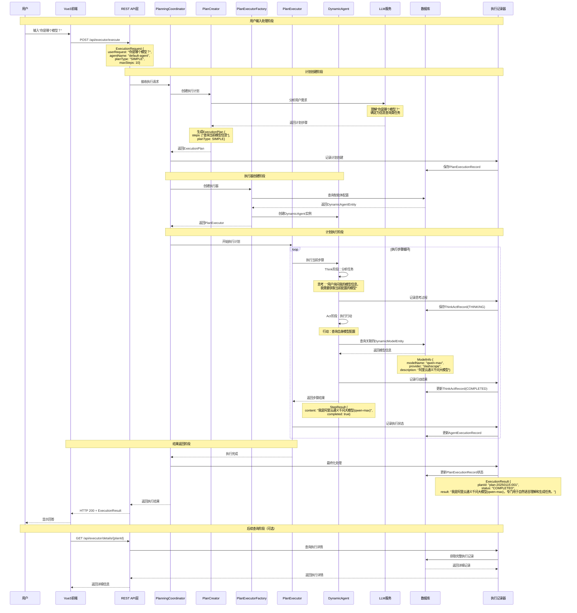

# JManus 简单对话处理流程分析

## 用例场景

用户在JManus系统首页输入："你是哪个模型？"，系统需要识别用户意图并返回当前使用的AI模型信息。

## 系统处理流程时序图



## 详细推演过程

### 1. 用户输入阶段
- **用户操作**: 在JManus前端界面输入"你是哪个模型？"
- **前端处理**: Vue3前端捕获输入，构造API请求
- **请求数据**:
  ```json
  {
    "userRequest": "你是哪个模型？",
    "agentName": "default-agent",
    "planType": "SIMPLE",
    "maxSteps": 10,
    "terminateColumns": []
  }
  ```

### 2. 计划创建阶段
- **API接收**: ManusController接收POST请求
- **协调器启动**: PlanningCoordinator开始处理
- **LLM分析**: PlanCreator调用LLM分析用户需求
  - 识别为信息查询类任务
  - 不需要复杂的工具调用
  - 生成简单的执行步骤

### 3. 智能体加载阶段
- **配置查询**: 从数据库加载DynamicAgentEntity
- **模型关联**: 获取智能体关联的AI模型配置
- **实例创建**: 创建DynamicAgent实例

### 4. 执行阶段
#### Think阶段
- **意图理解**: 智能体分析用户询问模型信息的意图
- **策略制定**: 决定通过查询自身配置获取模型信息

#### Act阶段
- **信息查询**: 访问DynamicModelEntity获取模型详情
- **响应生成**: 基于模型信息生成友好的回答

### 5. 记录保存阶段
- **执行记录**: 保存完整的执行过程到数据库
- **状态跟踪**: 更新各阶段的执行状态
- **结果存储**: 保存最终的回答结果

### 6. 响应返回阶段
- **结果封装**: 将执行结果封装为API响应
- **前端展示**: Vue3前端接收并显示回答给用户

## 涉及的核心组件

### 数据库表
1. **plan_execution_record**: 记录整个计划的执行过程
2. **agent_execution_record**: 记录智能体的执行状态
3. **think_act_record**: 记录具体的思考和行动步骤
4. **dynamic_agent**: 智能体配置信息
5. **dynamic_model**: AI模型配置信息

### 核心类
1. **PlanningCoordinator**: 计划协调器，管理整个执行流程
2. **PlanCreator**: 计划创建器，基于LLM生成执行计划
3. **DynamicAgent**: 动态智能体，执行具体的思考和行动
4. **PlanExecutionRecorder**: 执行记录器，保存所有执行细节

## 预期结果

用户最终会收到类似以下的回答：
> "我是阿里云通义千问大模型(qwen-max)，专门用于自然语言理解和生成任务。我可以帮助您处理各种文本相关的工作，包括问答、分析、创作等。"

整个处理过程大约耗时1-3秒，所有执行细节都会被完整记录在数据库中，便于后续的审计和分析。